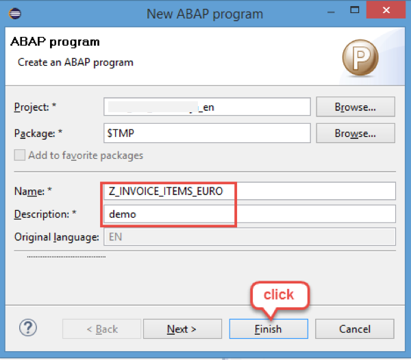
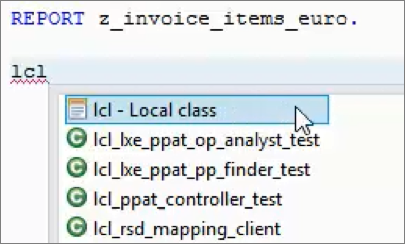
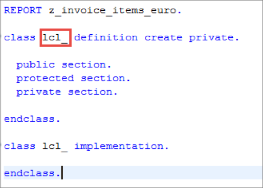
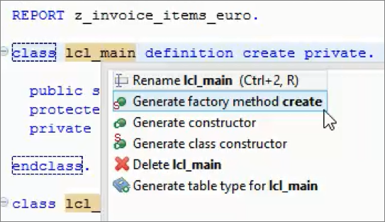
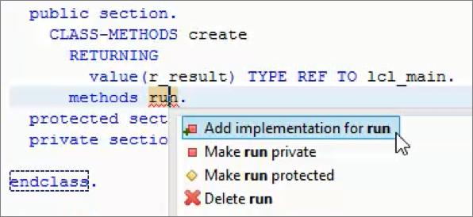
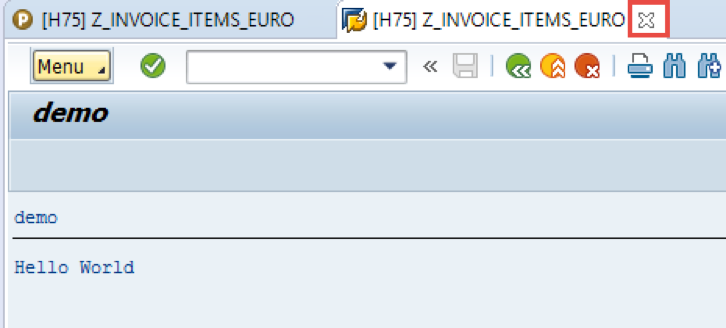
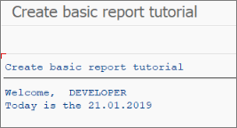

# Create and Run an ABAP Application
<!-- description --> Create and run an ABAP application based on tables from the sample EPM data model.

## Prerequisites  
- You have a valid instance of an on-premise AS ABAP server, version 7.51 or higher (some ABAP Development Tools may not be available in earlier versions)
- **Tutorial**: [Create an ABAP Project in ABAP Development Tools (ADT)](abap-create-project)

## You will learn  
- How to create and run an ABAP application

## Intro
This mission is based on tables of the SAP NetWeaver Demo sample EPM Model, so that you can complete the tutorial on any SAP NetWeaver `7.5x` system.

For more information, see [The SAP NetWeaver Enterprise Procurement Model – An Introduction](https://help.sap.com/viewer/a602ff71a47c441bb3000504ec938fea/7.52.2/en-US/57e9f59831e94311852a2af18ab733b5.html)

---

### Create new ABAP program

In the toolbar, choose **New** > **ABAP Program...**:


A wizard appears to create a new ABAP Program. Enter **`z_invoice_items_euro`** in the name field. Enter a meaningful text in the **description field**. Choose **Finish** to create the report.
Afterwards an editor will be opened which shows the empty report.




### Create ABAP local class


1. Type `lcl` and choose `Ctrl+Space` to get code completion proposals. Select the code template for the insertion of a local class by choosing `lcl - Local class` or choose `Enter` if the right entry is already selected.

    

2. Adjust the name of the local class to `lcl_main` using inline editing.

    


### Create CREATE method

Position the cursor in the class definition statement and choose **Ctrl+1** to open the Quick Fix menu. Choose **Generate factory method create** to create a static factory method.




### Implement RUN method

1. Add the definition of an additional instance method **run** by entering **`methods run.`** in the public section.

2. Then position the cursor on the method name and choose **Ctrl+1** to open the Quick-Fix menu. Choose **Add implementation for run**.

    

3. Implement a simple **WRITE** statement in the method **run**.

    


### Make ABAP program runnable

1. Add a **START-OF-SELECTION event** to your report

2. Create an instance of the local class `lcl_main`.

3. Call the **run** method.
That is, enter the following code:

    ```ABAP
    START-OF-SELECTION.
        lcl_main=>create( )->run( ).
    ```

    

Class methods are called using `=>` ; instance methods are called using `->`.


### Save and activate ABAP program

Save and activate your program by choosing **Save** and **Activate** in the toolbar.


### Run the ABAP program

Choose **F8** to run your program. An embedded SAP GUI will open inside an Eclipse editor. After checking the output of the report choose **Close**.




### Output system variables

You will now enhance the program to output your user name and today's date. Change the `WRITE` statement to:

   `WRITE: 'Welcome, ', sy-uname, / 'Today is the', sy-datum.`


`sy- ` is the table containing all the system fields. For the complete list, see the [ABAP keyword documentation: ABAP System Fields](https://help.sap.com/doc/abapdocu_752_index_htm/7.52/en-US/index.htm?file=ABENSYSTEM_FIELDS.htm).

`/` is simply the new line character. (See also [ABAP keyword documentation: WRITE](https://help.sap.com/doc/abapdocu_752_index_htm/7.52/en-US/index.htm?file=abapwrite-.htm).)


### Run the ABAP program
Again, choose **F8** to run your program. Your output should now look something like this:




### Check your code

Your code should look like this:

```ABAP
*&---------------------------------------------------------------------*
*& Report zjp_basic_app
*&---------------------------------------------------------------------*
*&
*&---------------------------------------------------------------------*
REPORT z_invoice_items_euro.

class lcl_main definition create private.

  public section.
    methods run.
    CLASS-METHODS create
      RETURNING
        value(r_result) TYPE REF TO lcl_main.

  protected section.
  private section.

endclass.

class lcl_main implementation.

  method create.
    create object r_result.
  endmethod.

  method run.
    WRITE: 'Welcome, ', sy-uname, / 'Today is the', sy-datum.

  endmethod.

endclass.

START-OF-SELECTION.
    lcl_main=>create( )->run( ).

```


### Test yourself


