<!--DONE with E1Y-->
# Connect SAP Business Application Studio and SAP S/4HANA Cloud System
<!-- description --> Connect SAP Business Application Studio and an SAP S/4HANA Cloud system using SAML assertion authentication to develop custom UIs.

## Prerequisites
 - You have an **SAP S/4HANA Cloud system** and a business user with **Communication Management** authorizations (this requires a business role with unrestricted write access containing business catalog `SAP_CORE_BC_COM` ).
 - You have an **SAP Business Technology Platform trial account** with an SAP Business Application Studio subscription

## You will learn
- How to create an HTTP destination on SAP Business Technology Platform with SAML assertion authentication to an SAP S/4HANA Cloud system
- How to create a communication system for an SAP Business Application Studio subaccount in an SAP S/4HANA Cloud system

**Prerequisites for SAP BTP customer account**

To follow this tutorial, you can also use your customer account. However, for the customer account subaccount, you have to do the following additionally beforehand:

  - Set up mutual trust between the SAP BTP subaccount and the Identity Provider, see

    - [ABAP Environment Documentation: Setup of a Custom Identity Service](https://help.sap.com/viewer/65de2977205c403bbc107264b8eccf4b/Cloud/en-US/550251abaf49432bbaa65147b65a1f39.html)

    - [Tutorial: SAP Business Technology Platform Neo Environment](abap-custom-ui-trust-settings) which is showing the process in SAP BTP Neo Environment instead of here needed Cloud Foundry environment. Nevertheless it's that similar, that in can help, you only have to omit setting the subaccount as service provider

    - [SAP BTP Documentation: Trust and Federation with Identity Providers](https://help.sap.com/viewer/65de2977205c403bbc107264b8eccf4b/Cloud/en-US/cb1bc8f1bd5c482e891063960d7acd78.html)  

  - Assign the developer users permission for SAP Business Application Studio, see [ABAP Environment Documentation: Assigning Permissions for SAP Business Application Studio](https://help.sap.com/viewer/65de2977205c403bbc107264b8eccf4b/Cloud/en-US/a08c1cb7def34798891b0a1ac6ddbd96.html)

Alternatively, see [Integrating SAP Business Application Studio](https://help.sap.com/viewer/0f69f8fb28ac4bf48d2b57b9637e81fa/latest/en-US/22bc724fd51a4aa4a4d1c5854db7e026.html) documentation for this tutorial's content with a customer account.

## Additional Information

>Tutorial last updated with SAP S/4HANA Cloud Release 2302

---

### Create destination to SAP S/4HANA Cloud system

SAP Business Application Studio requires connection information to request custom business object data from your SAP S/4HANA Cloud system and to deploy a UI into this system. That information is stored in the SAP Business Application Studio subaccount as a so-called destination. To create that destination, do the following:

Although this tutorial describes the flow with a trial account, the sequence is the same for a customer account after entering the subaccount of your choice.

1.  In your web browser, open the SAP BTP Trial cockpit <https://account.hanatrial.ondemand.com> and **Go To Your Trial Account**, which is a so-called global account.

    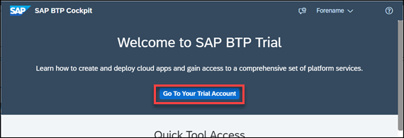

2.  On your global account page, select default subaccount `trial`.

    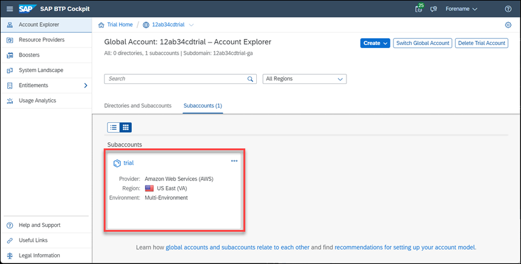

3.  In the navigation pane expand the **Connectivity** section.

    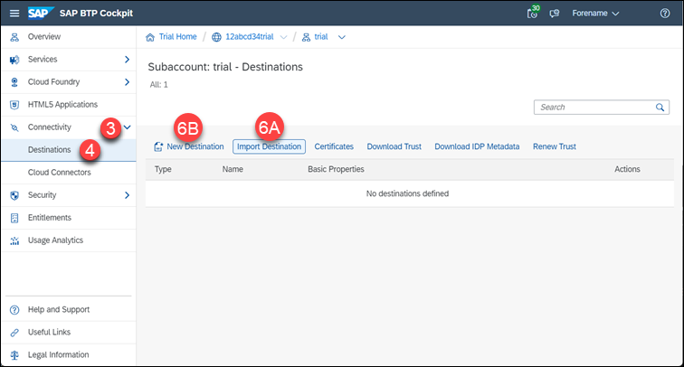

4.  Select **Destinations**.

5.  To simplify the destination creation and to reduce the risk of errors, this tutorial provides a template text file for the destination. You can download [`YOUR_SYSTEMS_ID_SAML_ASSERTION_trial_s4hc_template_destination.txt`](https://raw.githubusercontent.com/sap-tutorials/abap-core-development/master/tutorials/abap-custom-ui-bas-connect-s4hc/YOUR_SYSTEMS_ID_SAML_ASSERTION_trial_s4hc_template_destination.txt) locally.

6.  Create the destination either by uploading the text file via **Import Destination** (A) or if you want to input everything manually via **New Destination** (B).

7.  In case of import (A) adapt the `Name` and `Description` to your needs and provide the mandatory value for `URL` and `Audience` as shown below.

    In case of completely manual configuration (B) set the values as shown below.

    |  Field Name     | Value
    |  :------------- | :-------------
    |  Name           | **`<YOUR_SYSTEMS_ID>_SAML_ASSERTION`**
    |  Type           | **`HTTP`**
    |  Description    | **`SAML Assertion Destination to SAP S/4HANA Cloud system <YOUR_SYSTEMS_ID>`**
    |  URL          | In the SAP S/4HANA Cloud system, navigate to the **Communication Systems** app and copy the **Host Name** from **Own SAP Cloud System** = `Yes`

 and paste it with prefix `https://` for example `https://my12345-api.s4hana.ondemand.com.`
    |  Proxy Type   | **`Internet`**
    |  Authentication | **`SAMLAssertion`**
    |  Audience   | Enter the URL of your system and remove `-api`, for example `https://my12345.s4hana.ondemand.com`.
    |  `AuthnContextClassRef` | **`urn:oasis:names:tc:SAML:2.0:ac:classes:PreviousSession`**

    Select **New Property** and maintain the following **Additional Properties** and values.

    |  Field Name     | Value          | Remark
    |  :------------- | :------------- | :-------------
    |  HTML5.DynamicDestination           | **`true`**   |&nbsp;
    |  HTML5.Timeout           | **`60000`**   | value stated in milliseconds. 60000 equals 1 minute. Required as deployment needs longer than the standard of 30 seconds.
    |  `WebIDEEnabled`    | **`true`**   |&nbsp;
    |  `WebIDEUsage`          | **`odata_abap,dev_abap`**   |&nbsp;
    |  `nameIDFormat`     | **`urn:oasis:names:tc:SAML:1.1:nameid-format:emailAddress`**  | Required in case your subaccount sends the e-mail address as SAML Subject Name Identifier for authentication (configured as **Subject Name Identifier** in its SAP Cloud Identity Service Application, see [Tutorial: SAP Business Technology Platform Neo Environment](abap-custom-ui-trust-settings)), although SAP S/4HANA Cloud system expects user login by default. **That is the case with a trial Account.** This also requires the e-mail address to be maintained for SAP S/4HANA Cloud system business users.

8.  Make sure that the **Use default JDK truststore** checkbox is ticked.

    

9.  Click **Save**.

### Download SAP BTP certificate

On the SAP S/4HANA Cloud system side, you need to allow SAP Business Application Studio to make inbound calls.

To set SAP Business Application Studio as a trusted caller in the SAP S/4HANA Cloud system, you first have to download the public key of the SAP Business Application Studio subaccount.

To do this, in the Destinations section, select **Download Trust**.

An untyped file with name `pk-\<your subaccounts ID\>` (for example `pk_9zy8xw7v-6u54-3tsr-21qp-1pqr234st56uv;`) is downloaded. Save this file for later.

### Create communication system in SAP S/4HANA Cloud system

Regarding the overall trust settings, you will now make your SAP S/4HANA Cloud system trust your SAP Business Technology Platform subaccount.

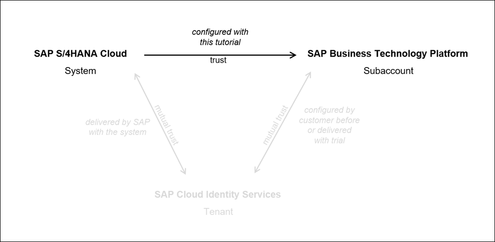

That enables its SAP Business Application Studio to request data from the SAP S/4HANA Cloud system during Custom UI development and finally to deploy that UI to the SAP S/4HANA Cloud system. Both processes are so called inbound requests to the SAP S/4HANA Cloud system.

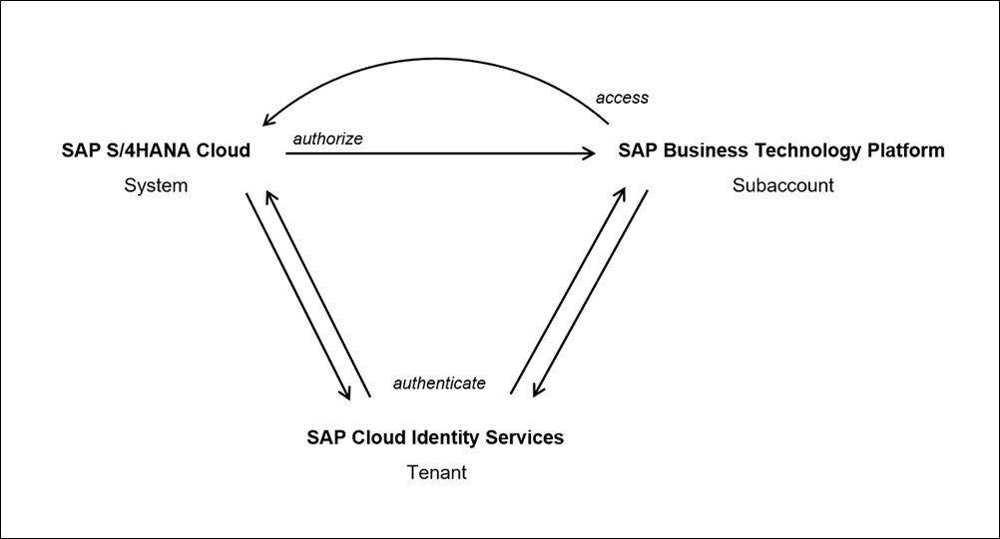

With the downloaded public key from the SAP Business Application Studio subaccount, you can now maintain it as a communication system and by that as a trusted caller in the SAP S/4HANA Cloud system.

- Log on to your SAP S/4HANA Cloud system with the business user that is authorized for communication management.

- Start typing **Communication Systems** in the Launchpad search and open the App from the results.

    

- Select **New**.

    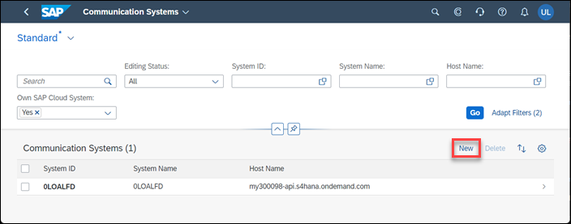

- Enter a System ID and System Name, for example `BAS_<YOUR SUBACCOUNTS_SUBDOMAIN>` like `BAS_12AB34CDTRIAL` and choose **Create**.

    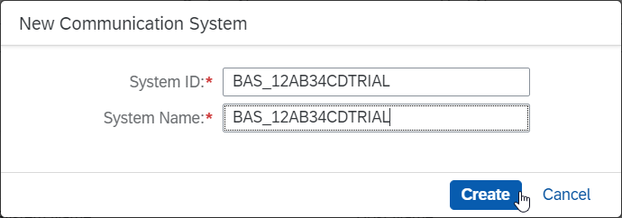

### Configure communication system

This is how you have to configure the communication system that represents the SAP Business Application subaccount as a trusted caller.

- Navigate to **General > Technical Data**

    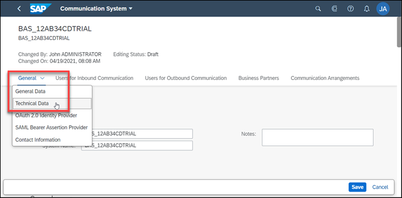

- Tick the **Inbound Only** checkbox.

    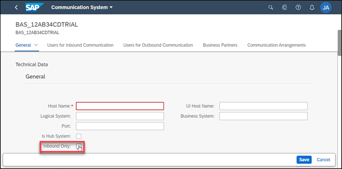

- Navigate to **General > SAML Bearer Assertion Provider** and slide the button to **ON**.

    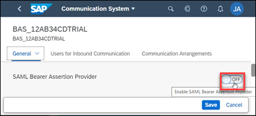

- Choose **Upload Signing Certificate**, browse for the SAP BTP certificate and upload it.

    

- Set the **Provider Name** by inserting the CN attribute of the Signing Certificate Subject.

    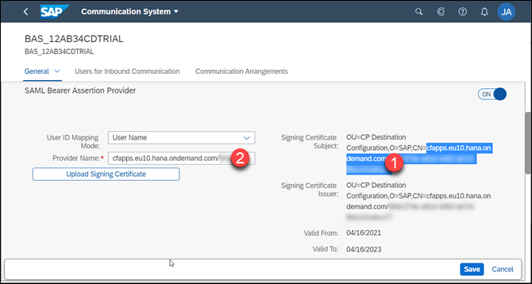

- Choose **Save**.

The connection is now set up and you can make use of the custom business object OData services of the SAP S/4HANA Cloud system in SAP Business Application Studio.  

### Test yourself

---
