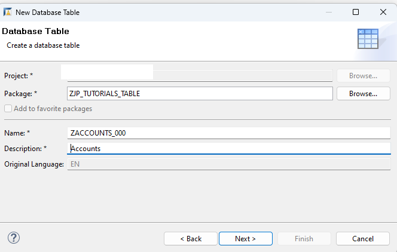
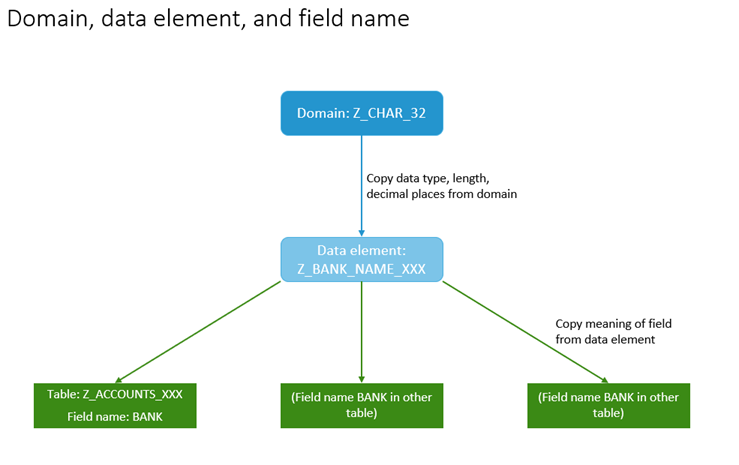
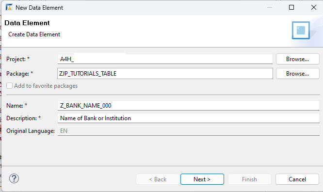
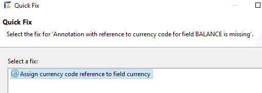
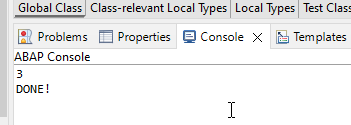

# Create an ABAP Database Table and Relevant ABAP Dictionary Objects
<!-- description --> Create a database table from scratch using the ABAP Development Tools (ADT); use different Data Dictionary objects to define the fields; then fill the table with test data.

## Prerequisites  
- You have a valid instance of one of the following:
    - SAP Business Technology Platform (BTP) ABAP Environment. For more information, see **Tutorial**: [Create Your First ABAP Console Application](abap-environment-console-application), steps 1-2. 
    - On-premise, .e.g. [ABAP Cloud Developer Trial, 2022](https://community.sap.com/t5/technology-blogs-by-sap/abap-cloud-developer-trial-2022-available-now/ba-p/13598069)
- **Tutorial**: [Create an ABAP Project in ABAP Development Tools (ADT)](abap-create-project)
- On this instance, you have pulled the SAP ABAP Flight Reference Scenario. To pull this reference scenario from `Github`, see:
 [Downloading the ABAP Flight Reference Scenario](https://help.sap.com/docs/ABAP_PLATFORM_NEW/fc4c71aa50014fd1b43721701471913d/def316685ad14033b051fc4b88db07c8.html)


## You will learn  
- How to create a table in ABAP, representing a table in your database
- How to create a reusable **domain**, which provides technical attributes for data elements
- How to create an elementary data type, or **data element**
- How to fill the table with three rows of test data

## Intro
Tables are defined independently of the database in the ABAP Dictionary. When you activate the table in the Data Dictionary, the table is created in the underlying database.

The table in this tutorial will store bank account details for customers. The table will have the following columns (or **fields**):

- `client` (key field)
- `account_number` (key field)
- `bank_name` (key field)
- `bank_customer_id`
- `city`
- `balance`
- `currency`
- `account_category`
- `lastchangedat`

> Throughout this tutorial, replace `###` or `000` with your initials or group number.


### Create table

Create a table in your package:

1. Select (right-click) the package and choose **New > Other ABAP Repository Object** from the context menu:

    <!-- border -->
    

2. Enter the filter text **Table > Database table**, then choose **Next**.

3. Enter a name such as `ZACCOUNTS_###` - always replacing `###` with your initials or group number - and a description, then choose **Next**.

    <!-- border -->
    

4. Accept the proposed transport request and choose Finish.

The code for the table appears in a new editor. Ignore the annotations at the top for now.

<!-- border -->


### Understand table fields

In the next step, you will define the table fields. First you need to understand your options:

**Built-in ABAP types and new types**

There are 3 ways to create a field for a database table:

  - **Built-in type**: The quickest: You specify a (pre-defined) primitive type, length, and description, but no more. You cannot then reuse this field. For more information, see [ABAP Keyword Documentation: Predefined Dictionary Types](https://help.sap.com/doc/abapdocu_752_index_htm/7.52/en-US/index.htm?file=abenddic_builtin_types.htm).

  - Use an **existing data element**: The most powerful: A data element describes both the technical and semantic attributes of a field, such as a currency, or a customer name. You can define properties such as search help and (translatable) column header, and then use the same data element in many contexts. You often define the technical attributes of the data element in a domain, so they can be reused.

  - Create a **new data element**: If you want to reuse the benefits of a data element - that is, semantic attributes, such as reuse of translatable column headers - but a suitable one does not exist yet.

    <!-- border -->
    

In this tutorial, you will create one domain and one data element. For the other fields, you will use a built-in type or existing data element.

**System clients**

One key field has been added automatically:

`client : abap.clnt;`

This specifies that the table is client-specific.
Tables can be cross-client or client-specific. Each client is a self-contained unit within an organization, such as a subsidiary. For client-specific tables, the client is the first key field in the table.

The field is also specified as `not null`. This means that the type-dependent initial value is automatically assigned to this field for all newly created records.


### Add field account number using primitive type

Now you will add the key field **`account_number`**, based on a primitive type.

1. Enter the following (including the period), then choose **Code completion (Ctrl+Space)**:

    ```ABAP
      key account_number : abap.

    ```

2. From the dropdown list, choose `numc(len)` and specify `len` as 8. Also, specify this key field as not null:
  `key account_number : abap.numc(8) not null;`


### Add field city using existing data element

1. In the editor, enter the name for your field, followed by a colon:  **city:**. Ignore the error for now.

2. Enter the type, by entering **`/DMO/C`** and using auto-complete (**`Ctrl+Space`**).

3. Then add a semi-colon:

    ```ABAP
    city: /dmo/city;

    ```


### Add field bank using new data element

Now add the key field **`bank_name`**, based on a new data element, `z_bank_name_###`. You will get an error, which you will also fix in this step.

1. Enter the following: 

    ```ABAP
    
    key field bank_name           : z_bank_name_###;

    ```

2. Select the new data element and choose **Get Quick Fix (Ctrl+1)**. From the list, choose **Create data element …** :

    <!-- border -->
    

3. The Create data element wizard appears. Enter a name and description and choose **Next**:

    <!-- border -->
    

4. Accept the default transport request and choose **Finish**:

5. You want your data element to have a character type. Enter the following:

    - Category  : **Predefined Type**
    - Data Type : **`CHAR`**
    - Length    : **`55`**

6. Now enter the field labels and lengths:

    <!-- border -->
    

7. Save and activate the data element (`Ctrl+S, Ctrl+F3`).

8. Go back to your table, **`ZACCOUNTS_###`**. Run a syntax check  with **`Ctrl+F2`**. The error should disappear.


### Add all other fields

  Now add other fields, so your code looks as follows. The field `Balance` will cause an error. Ignore this for now.

  ```ABAP

      define table ZACCOUNTS_TABLE_### {

      key client         : abap.clnt not null;
      key account_number : abap.numc(8) not null;
      key bank_name      : z_bank_name_###;
      bank_customer_id   : /dmo/customer_id not null;
      city               : /dmo/city;
      balance            : abap.curr(16,2);
      currency           : /dmo/currency_code;
      account_category   : abap.numc(2);
      lastchangedat      : timestampl;

      }

  ```

  2. Then choose Save (`Ctrl+S`) but **do not** activate your table yet.


### Fix the error with the field `Balance`

You will now fix the error caused by the field `Balance`:

1. Place your cursor on the error symbol (it will change from an arrow to a pointing finger). Then click on it:

    <!-- border -->
    

2. The quick fix proposal appears. Choose (double-click on) the proposal **Assign currency code reference to field currency**

    <!-- border -->
    
  The error message disappears.

3. Save your changes (`Ctrl+S`), but again, do not activate the table yet.


### Change technical settings

Before you activate the table, change the technical settings at the top as follows (or copy the code at the end of this step):

1. The label is derived from the description you entered; leave this.

2. **`EnhancementCategory`** : Place your cursor immediately after the hash symbol (#), delete the existing text, then choose **Auto-complete (`Ctrl+Space`)**:

    <!-- border -->
    

3. Then choose `#EXTENSIBLE_CHARACTER_NUMERIC` from the dropdown list. Your table contains both character-type and numeric-type fields but does not contain any deep structures (such as a structure included within a table row).

4. Complete the other settings as follows (or copy the code below).
    - **`tableCategory`** : `#TRANSPARENT` = your table represents a table in the database.
      Tables are defined independently of the database in the ABAP Dictionary. When you activate the table in the Data Dictionary, the table is created in the underlying database. There is no need for any code to define the data in the database, nor for any vendor-specific code. Your database tables will be created in any database supported by the ABAP server.

    - **`deliveryClass`** : `#A` = application table, which stores master data and transaction data (default)

    - **`dataMaintenance`** : `#RESTRICTED`

```ABAP
@EndUserText.label : 'Bank Accounts'
@AbapCatalog.enhancementCategory : #EXTENSIBLE_CHARACTER_NUMERIC
@AbapCatalog.tableCategory : #TRANSPARENT
@AbapCatalog.deliveryClass : #A
@AbapCatalog.dataMaintenance : #RESTRICTED
```


### Save and activate table code

Now, save (`Ctrl+S`) and activate (`Ctrl+F3`) your table. Your code should look like this:

```ABAP
@EndUserText.label : 'Table of Bank Accounts'
@AbapCatalog.enhancementCategory : #EXTENSIBLE_CHARACTER_NUMERIC
@AbapCatalog.tableCategory : #TRANSPARENT
@AbapCatalog.deliveryClass : #A
@AbapCatalog.dataMaintenance : #RESTRICTED
define table zaccounts_### {
  key client         : abap.clnt not null;
  key account_number : abap.numc(8) not null;
  bank_customer_id   : /dmo/customer_id not null
  bank_name          : z_bank_name_###;
  city               : /dmo/city;

  @Semantics.amount.currencyCode : 'zaccounts_###.currency'
  balance            : abap.curr(16,2);
  
  currency           : /dmo/currency_code;
  account_category   : abap.numc(2);
  lastchangedat      : timestampl;

}

```


### Test yourself


### Fill table: Create class

Finally, you will fill the table with three rows of test data:

1. First create the ABAP Class, by selecting your package and choosing **New > ABAP Class** from the context menu:

    

2. Enter a name **`ZCL_FILL_ACCOUNTS_###`** and description for your class (replacing `###` with your group number or initials).

    <!-- border -->
    

3. Assign a transport request and choose **Finish**.

The class appears in a new editor.


### Add interface

1. Add the following interface to your class:

    ```ABAP
     interfaces if_oo_adt_classrun.
    ```

    This interface provides a light-weight solution for executing an ABAP program without launching a full user interface.
    It also lets you display text or data in the ABAP Console.

2. Add the implementation for the **`main`** method of this interface by selecting the interface name and choosing **Add implementation...** from the context menu.

    <!-- border -->
    


### Copy code

1. Add the following code to the method implementation:

    ```ABAP
    DATA: lt_accounts type table of ZACCOUNTS_###.

    "read current timestamp
    GET TIME STAMP FIELD DATA(zv_tsl).

    "fill internal table
    lt_accounts = VALUE #(

        ( client ='100' account_number ='00000001' bank_customer_id ='100001' bank_name ='Volksbank' city = 'Gaertringen' balance ='200.00 ' currency ='EUR' account_category ='01' lastchangedat = zv_tsl )
        ( client ='100' account_number ='00000002' bank_customer_id ='200002' bank_name ='Sparkasse' city ='Schwetzingen' balance ='500.00 ' currency ='EUR' account_category ='02' lastchangedat = zv_tsl )
        ( client ='100' account_number ='00000003' bank_customer_id ='200003' bank_name ='Commerzbank' city ='Nuernberg' balance ='150.00 ' currency ='EUR' account_category ='02' lastchangedat = zv_tsl )
    ).

    "Delete possible entries; insert new entries
    DELETE FROM ZACCOUNTS_###.

    INSERT ZACCOUNTS_### from table @lt_accounts.

    "Check result in console
    out->write( sy-dbcnt ).
    out->write(  'DONE!' ).

    ```

2. Save and activate ( **`Ctrl+S, Ctrl+F3`** ) your code.

3. Run your class by choosing **Run as Console Application (F9)**.

The output should look roughly like this.

<!-- border -->


### Check your table in Data Preview

Select your table from the Project Explorer and choose **Open With > Data Preview** from the context menu (**F8**).

<!-- border -->


Your table should look like this:

<!-- border -->


You can also right click on the table and choose **Copy All Rows as ABAP Value Statement** from the context menu. You can then paste it into other code.

<!-- border -->


### More Information
- SAP Help Portal: [Database Tables](https://help.sap.com/viewer/ec1c9c8191b74de98feb94001a95dd76/7.51.11/en-US/cf21ea43446011d189700000e8322d00.html)

- ABAP Keyword Documentation: [Domains](https://help.sap.com/doc/abapdocu_752_index_htm/7.52/en-US/index.htm?file=abenddic_domains.htm)

- ABAP Keyword Documentation: [Data Elements](https://help.sap.com/doc/abapdocu_751_index_htm/7.51/en-US/index.htm?file=abenddic_data_elements.htm)

- ABAP Keyword Documentation: [Glossary](https://help.sap.com/doc/abapdocu_752_index_htm/7.52/en-US/index.htm?file=abenclient_glosry.htm)

- ABAP for Cloud Keyword Documentation: [Glossary](https://help.sap.com/doc/abapdocu_cp_index_htm/CLOUD/en-US/index.htm?file=abenclient_glosry.htm)

---
