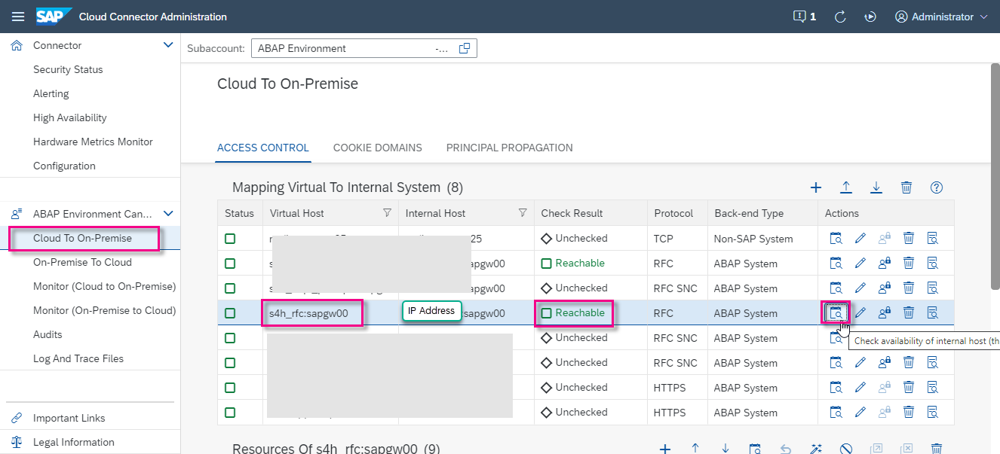
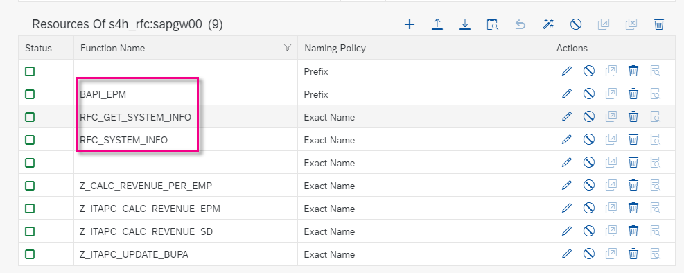
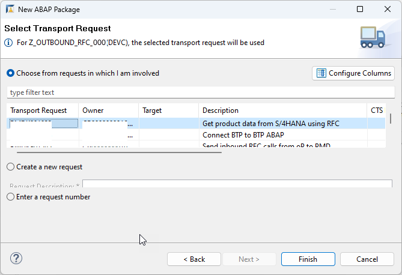
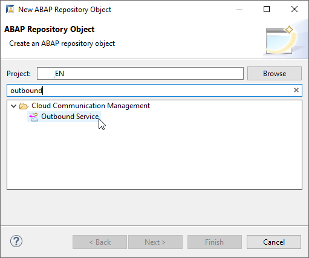
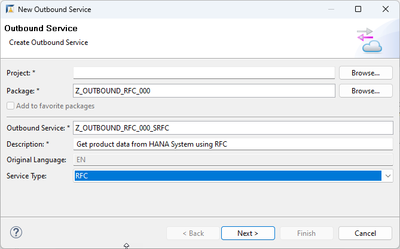
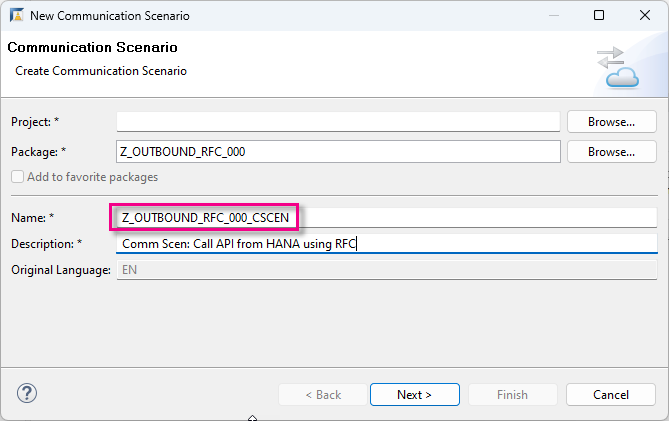
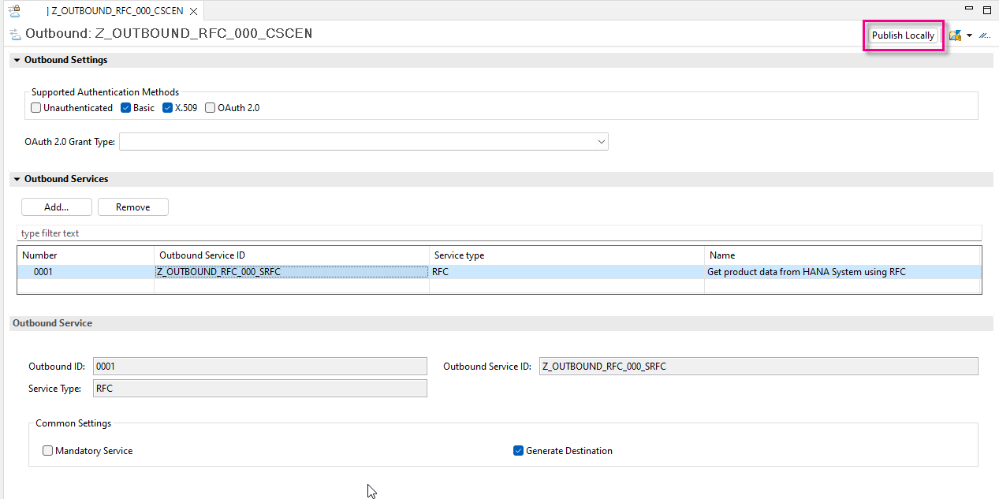
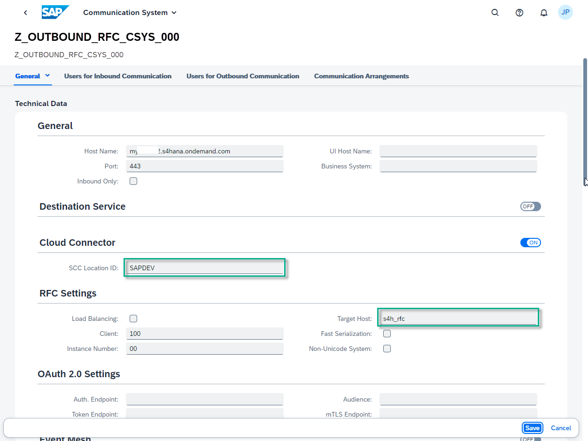
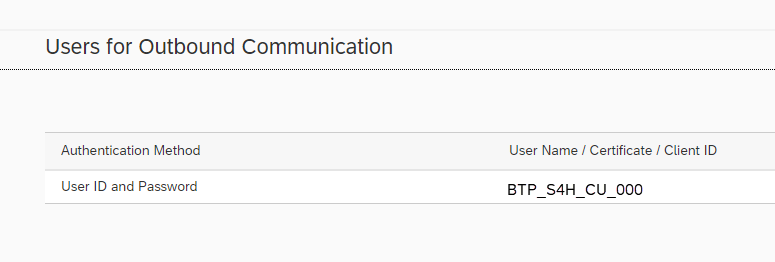
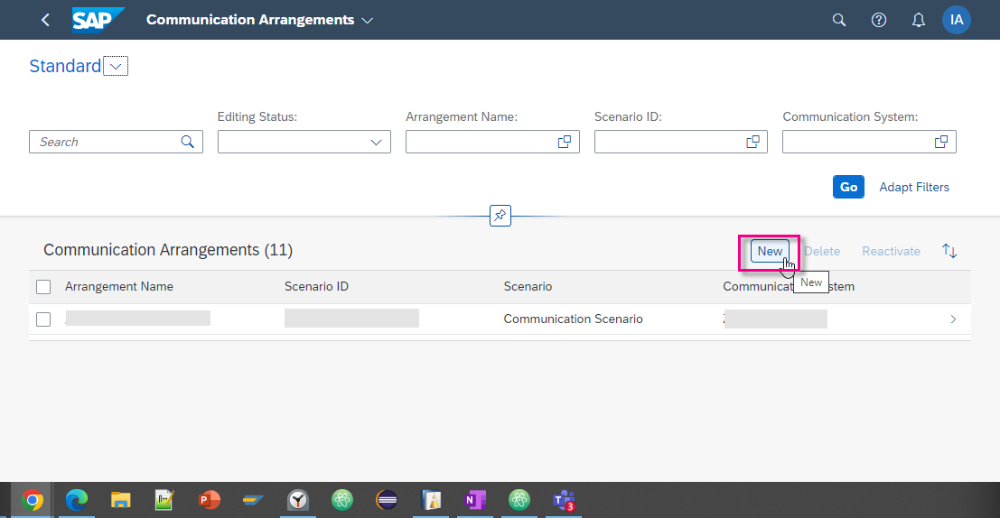

## Prerequisites

- **IMPORTANT**: This tutorial cannot be completed on a trial account. If you want to explore some of the concepts of this mission on a trial account, using OData or SOAP rather than RFC, see the following workshop: [SAP BTP, ABAP Environment: Connectivity and Integration](https://github.com/SAP-samples/teched2020-DEV268).
- You have set up SAP Business Technology Platform (BTP), ABAP Environment, for example by using the relevant booster: [Using a Booster to Automate the Setup of the ABAP Environment](https://help.sap.com/viewer/65de2977205c403bbc107264b8eccf4b/Cloud/en-US/cd7e7e6108c24b5384b7d218c74e80b9.html)
- **Tutorial**: [Set Up SAP BTP, ABAP Environment and create Your First Console Application](abap-environment-trial-onboarding), for a licensed user, steps 1-2
-	You have developer rights to an ABAP on-premise system, such as:
    - [AS ABAP developer edition, latest version](https://blogs.sap.com/2019/07/01/as-abap-752-sp04-developer-edition-to-download/) or:
    - [SAP S/4HANA 1809 fully activated appliance](https://blogs.sap.com/2018/12/12/sap-s4hana-fully-activated-appliance-create-your-sap-s4hana-1809-system-in-a-fraction-of-the-usual-setup-time/) or:
    - [The SAP Gateway Demo System (ES5)](https://blogs.sap.com/2017/12/05/new-sap-gateway-demo-system-available/)
- You have configured **SAP Cloud Connector**, connecting your BTP and on-premise systems and have added the appropriate resources
- You have assigned the business role **`SAP_BR_DEVELOPER`** to your user in both systems; you will need it to create communication artifacts

  
## You will learn 
  
  - How to create a secure RFC connection between your SAP BTP, ABAP Environment and an on-premise SAP System, e.g. SAP S/4HANA
  - How to test the connection using an ABAP handler class

This tutorial mission was written for SAP BTP ABAP Environment. However, you should also be able to use it in SAP S/4HANA Cloud Environment in the same way.

Throughout this tutorial, replace `000` with your initials or group number.

**The problem:**

There are two problems when setting up connectivity between the SAP BTP, ABAP Environment and an on-premise ABAP System:

- The ABAP Environment "lives" in the Internet, but customer on-premise systems are behind a firewall
- Remote Function Call (RFC) is not internet-enabled

**The solution:**

Set up a secure connection from the on-premise system to the SAP BTP, ABAP Environment.


<!--
**Technical information:** 
1. The ABAP environment tenant requests to open the tunnel connection through the Connectivity service.
2. The Connectivity service tells the Cloud Connector to open the connection to this specific ABAP environment tenant using the admin connection.
3. The Cloud Connector opens a tunnel connection to the ABAP environment tenant using its public tenant URL.
4. After the tunnel is established, it can be used for actual data connection using the RFC or HTTP(S) protocols. -->

<!-- border -->
<!-- LATER  -->

---


### Check SAP Cloud Connector Configuration

First, you need to connect your ABAP on-premise system to your BTPsub-account by means of SAP Cloud Connector.

1. In your browser, log on to SAP Cloud Connector:
    - Address = e.g. `https://localhost:<port>` (Default = **`8443`**)
    - User = Administrator
    - Initial password = manage (You will change this when you first log in)

2. Your configuration should look like this. 

    <!-- border -->
    

  Note down the **Location ID**, e.g. **`SAPDEV`** as here. **You will need it later.**


### Check that On-Premise System has been added

1. In the menu in the left pane, expand the sub-account and choose **Cloud To On-Premise > Access Control**.
    
2. Note down the **Virtual Host, e.g. `s4h_rfc:sapgw<instance>`** as here. This represents an external hostname, so that you can hide the internal hostname from the outside world. **You will need this external hostname and port later, when creating a destination from SAP BTP cockpit**.

3. Check that **Result** = **`Reachable`**. If not, check that you chose the correct port, or whether an internal firewall is preventing communication.

    <!-- border -->
    

4. Check that the list of resources should looks roughly like this.

    <!-- border -->
    


### Check connectivity in SAP BTP cockpit (optional)

In the SAP BTP cockpit of your Cloud Foundry sub-account, choose **Cloud Connectors**:

<!-- border -->


> The **Location ID** points to the correct SAP Cloud Connector (located in the on-Premise system); The **Virtual host** points to the on-Premise connection mapped in SAP Cloud Connector. Later, in your **Communication System** in Fiori Launchpad, you will use these values, as **SCC Location ID** and **Target Host** respectively.


### Create package in ADT

Now, in SAP BTP ABAP Environment, you need to create the necessary ABAP artifacts in ABAP Development Tools (ADT), starting with a package.

1. In ABAP Development Tools (ADT), select the ABAP Cloud Project and choose **New > ABAP Package** from the context menu.

2. Enter the following and choose **Next**:
    - Name = **`Z_OUTBOUND_RFC_000`**
    - Description = **Get product data from S/4HANA using RFC**
    - Package type = **Development**

    <!-- border -->
     

3. Choose **Create new transport request**, enter a description, such as **Get product data from S/4HANA using RFC**, then choose **Finish**.

    <!-- border -->
     


### Create outbound service

Next, you will establish outbound communication from the BTP instance to the S/4HANA instance.

1. Select your ABAP package and choose **New > Other Repository Object** from the context menu; then enter **Outbound Service**, then choose **Next**.

    <!-- border -->
    
    </br>
    <!-- border -->
    

2. Enter the following and choose **Next**.
    - Outbound service: **`Z_OUTBOUND_RFC_000`**. The **`SRFC`** suffix will be added automatically.
    - Description: **Get product data from S/4HANA using RFC**
    - Service type: **RFC Service**

    <!-- border -->
    

3. Choose the transport request you just created, then choose **Finish**.

The outbound service appears. Add the relevant RFC, **`RFC_GET_SYSTEM_INFO`**, then choose **Save** from the main toolbar.

  <!-- border -->
  <!--  -->


### Create communication scenario

1. Still in ADT, choose **Cloud Communication Management > New > Communication Scenario** from the context menu, then choose **Next**.

    <!-- border -->
    

2. Enter the following and choose **Next**.
    - Name: **`Z_OUTBOUND_RFC_000_CSCEN`**
    - Description: **`Comm Scen: Call API from S/4HANA using RFC`**

    <!-- border -->
     

3. Choose the transport request you just created, then choose **Finish**.

    The communication scenario appears in a new editor. Ensure the following have been entered:

    - Communication Scenario Type: **Customer Managed**
    - Allowed Instances: **One instance per scenario and communication system**
        
4. On the **Outbound** tab, add your service by choosing **Add**.

5. Choose **Browse**, select your outbound service **`Z_OUTBOUND_RFC_000_SRFC`**, then choose **Finish**. The service type **RFC** is entered automatically.

6. Choose **Finish**. Your communication scenario should look like this.

    Make sure that **Supported Authentication Methods > Basic** is ticked, since you will use this method later.

    <!-- border -->
     

7. Leave the other default settings, choose **Save**, then choose **Publish locally**.


### Create communication system

Now, you need to create the necessary communication artifacts in Fiori Launchpad (of the BTP instance), starting with the communication system.
This artifact specifies the URL of the API (minus the HTTP(S) protocol) and port.

1. In the Fiori Launchpad home page, choose **Communication Systems**, then choose **New**.

    <!-- border -->
    [step4a-comm-system](step4a-comm-system.png)

    <!-- border -->
    

2. Enter the following and choose **Create**.

    - System ID: **`Z_OUTBOUND_RFC_CSYS_000`**
    - System Name: **`Z_OUTBOUND_RFC_CSYS_000`**

3. In **General** and below, enter:

    |  Field Name             | Value
    |  :----------------------| :-------------
    |  Host name | *the host name of your ABAP on-premise system, found in the URL of that system's Fiori Launchpad, e.g.: `myhost.s4hana.ondemand.com`*
    |  Port | Default = **443**
    | Destination | **Off**
    | Cloud Connector | **On**
    | SCC Location ID: |**`SAPDEV`**
  
4. In **RFC Settings**, enter:

    | Load Balancing | Off
    |  :----------------------| :-------------
    | Target Host | **`s4h_rfc`**
    | Client | *Client of your ABAP on-premise system, also found in the URL e.g. 100*
    | Instance Number | Default = 00

    <!-- border -->
        

5. Under **Users for Outbound Communication**, enter the following, then choose **Close**:
    - Authentication method: **User Name and Password** (basic authentication)
    - User name: *Your user name from the on-premise system* 
    - Password: *Your password from the on-premise system*

    <!-- border -->
    

6. Leave the other default settings as they are and choose **Save**.


### Create communication arrangement

Next, you will create communication arrangement, pointing to the communication scenario and communication system.

1. Choose **Communication Arrangements**, then choose **New**.

    <!-- border -->
    

2. Choose your communication scenario, **`Z_OUTBOUND_RFC_000_CSCEN`**. This name is also entered automatically for the communication arrangement. You can accept this default.

    <!-- border -->
    

    <!-- border -->
    

3. Choose the communication system you created, **`Z_OUTBOUND_RFC_CSYS_000`**.
    The other details, e.g. **Communication User**, **RFC Outbound Service**, and **RFC Function Module** are entered automatically.

4. Check the connection.


### Create ABAP class for RFC connection in SAP BTP, ABAP Environment

1. In ABAP Development Tools (ADT), in **Project Explorer**, open your ABAP Environment instance.
For more information, see [Set Up SAP BTP, ABAP Environment and create Your First Console Application](abap-environment-trial-onboarding).

2. In the project, create a new ABAP package.

3. Create a new ABAP class: Choose **File > New > Other... > ABAP Class**.

4. Enter the following for your class, then choose **Next**. 
    - Name: **`ZCL_SYSTEM_INFO_RFC_000`**
    - Description for your class, e.g. **Test RFC BTP to on-premise** 
    - Interface: **`if_oo_adt_classrun`**. *This enables you to run the class in the console.*

    Replace `000` with your group number or initials.

5. Create or assign a transport request.


### Create variables

First, you need to create the types and variables that specify your remote connection information.
Since the structure **`rfcsi`** is not a released object in SAP BTP, ABAP Environment, or in S/4HANA, Cloud edition, you need to create appropriate types for the variable **`lv_result`**. To generate these types for other remote function modules, use the transaction **`ACO_PROXY`**.

1. In the Public section of your class definition, add the following:

    ```ABAP
      types:
        RFCPROTO TYPE C LENGTH 000003 ##TYPSHADOW .
      types:
        RFCCHARTYP TYPE C LENGTH 000004 ##TYPSHADOW .
      types:
        RFCINTTYP TYPE C LENGTH 000003 ##TYPSHADOW .
      types:
        RFCFLOTYP TYPE C LENGTH 000003 ##TYPSHADOW .
      types:
        RFCDEST TYPE C LENGTH 000032 ##TYPSHADOW .
      types:
        RFCCHAR8 TYPE C LENGTH 000008 ##TYPSHADOW .
      types:
        SYSYSID TYPE C LENGTH 000008 ##TYPSHADOW .
      types:
        RFCDBHOST TYPE C LENGTH 000032 ##TYPSHADOW .
      types:
        SYDBSYS TYPE C LENGTH 000010 ##TYPSHADOW .
      types:
        SYSAPRL TYPE C LENGTH 000004 ##TYPSHADOW .
      types:
        RFCMACH TYPE C LENGTH 000005 ##TYPSHADOW .
      types:
        SYOPSYS TYPE C LENGTH 000010 ##TYPSHADOW .
      types:
        RFCTZONE TYPE C LENGTH 000006 ##TYPSHADOW .
      types:
        SYDAYST TYPE C LENGTH 000001 ##TYPSHADOW .
      types:
        RFCIPADDR TYPE C LENGTH 000015 ##TYPSHADOW .
      types:
        SYKERNRL TYPE C LENGTH 000004 ##TYPSHADOW .
      types:
        SYHOST TYPE C LENGTH 000032 ##TYPSHADOW .
      types:
        RFCSI_RESV TYPE C LENGTH 000012 ##TYPSHADOW .
      types:
        RFCIPV6ADDR TYPE C LENGTH 000045 ##TYPSHADOW .
      types:
        BEGIN OF RFCSI                         ,
              RFCPROTO                       TYPE RFCPROTO                      ,
              RFCCHARTYP                     TYPE RFCCHARTYP                    ,
              RFCINTTYP                      TYPE RFCINTTYP                     ,
              RFCFLOTYP                      TYPE RFCFLOTYP                     ,
              RFCDEST                        TYPE RFCDEST                       ,
              RFCHOST                        TYPE RFCCHAR8                      ,
              RFCSYSID                       TYPE SYSYSID                       ,
              RFCDATABS                      TYPE SYSYSID                       ,
              RFCDBHOST                      TYPE RFCDBHOST                     ,
              RFCDBSYS                       TYPE SYDBSYS                       ,
              RFCSAPRL                       TYPE SYSAPRL                       ,
              RFCMACH                        TYPE RFCMACH                       ,
              RFCOPSYS                       TYPE SYOPSYS                       ,
              RFCTZONE                       TYPE RFCTZONE                      ,
              RFCDAYST                       TYPE SYDAYST                       ,
              RFCIPADDR                      TYPE RFCIPADDR                     ,
              RFCKERNRL                      TYPE SYKERNRL                      ,
              RFCHOST2                       TYPE SYHOST                        ,
              RFCSI_RESV                     TYPE RFCSI_RESV                    ,
              RFCIPV6ADDR                    TYPE RFCIPV6ADDR                   ,
        END OF RFCSI                          ##TYPSHADOW .

    ```

2. In the class implementation, in the method **`if_oo_adt_classrun~main`**, add the following:
   
    ```ABAP
    DATA(lo_destination) = cl_rfc_destination_provider=>create_by_comm_arrangement(

                              comm_scenario          = 'Z_OUTBOUND_RFC_000_CSCEN'   " Communication scenario
                              service_id             = 'Z_OUTBOUND_RFC_000_SRFC'         " Outbound service
                              comm_system_id         = 'Z_OUTBOUND_RFC_CSYS_000'    " Communication system

                          ).

    DATA(lv_destination) = lo_destination->get_destination_name( ).

    DATA lv_result type rfcsi.

    ```


### Call remote function from on-premise system

```ABAP
CALL function 'RFC_SYSTEM_INFO'
destination lv_destination
  IMPORTING
    RFCSI_EXPORT      = lv_result.

```


### Output result

Output the result of the RFC call to the ABAP Console

```ABAP
out->write( lv_result ).
```


### Wrap method in an exception

Wrap the whole method in an exception using TRY...CATCH.

```ABAP
catch cx_root into data(lx_root).
  out->write( lx_root->get_text( ) ).
endtry.

```    


### Check your code

Your code should look roughly like this:

```ABAP
CLASS ZCL_A4C_RFC_000 DEFINITION
  public
  final
  create public .

public section.
  interfaces if_oo_adt_classrun.

    types:
    RFCPROTO TYPE C LENGTH 000003 ##TYPSHADOW .
  types:
    RFCCHARTYP TYPE C LENGTH 000004 ##TYPSHADOW .
  types:
    RFCINTTYP TYPE C LENGTH 000003 ##TYPSHADOW .
  types:
    RFCFLOTYP TYPE C LENGTH 000003 ##TYPSHADOW .
  types:
    RFCDEST TYPE C LENGTH 000032 ##TYPSHADOW .
  types:
    RFCCHAR8 TYPE C LENGTH 000008 ##TYPSHADOW .
  types:
    SYSYSID TYPE C LENGTH 000008 ##TYPSHADOW .
  types:
    RFCDBHOST TYPE C LENGTH 000032 ##TYPSHADOW .
  types:
    SYDBSYS TYPE C LENGTH 000010 ##TYPSHADOW .
  types:
    SYSAPRL TYPE C LENGTH 000004 ##TYPSHADOW .
  types:
    RFCMACH TYPE C LENGTH 000005 ##TYPSHADOW .
  types:
    SYOPSYS TYPE C LENGTH 000010 ##TYPSHADOW .
  types:
    RFCTZONE TYPE C LENGTH 000006 ##TYPSHADOW .
  types:
    SYDAYST TYPE C LENGTH 000001 ##TYPSHADOW .
  types:
    RFCIPADDR TYPE C LENGTH 000015 ##TYPSHADOW .
  types:
    SYKERNRL TYPE C LENGTH 000004 ##TYPSHADOW .
  types:
    SYHOST TYPE C LENGTH 000032 ##TYPSHADOW .
  types:
    RFCSI_RESV TYPE C LENGTH 000012 ##TYPSHADOW .
  types:
    RFCIPV6ADDR TYPE C LENGTH 000045 ##TYPSHADOW .
  types:
    BEGIN OF RFCSI                         ,
          RFCPROTO                       TYPE RFCPROTO                      ,
          RFCCHARTYP                     TYPE RFCCHARTYP                    ,
          RFCINTTYP                      TYPE RFCINTTYP                     ,
          RFCFLOTYP                      TYPE RFCFLOTYP                     ,
          RFCDEST                        TYPE RFCDEST                       ,
          RFCHOST                        TYPE RFCCHAR8                      ,
          RFCSYSID                       TYPE SYSYSID                       ,
          RFCDATABS                      TYPE SYSYSID                       ,
          RFCDBHOST                      TYPE RFCDBHOST                     ,
          RFCDBSYS                       TYPE SYDBSYS                       ,
          RFCSAPRL                       TYPE SYSAPRL                       ,
          RFCMACH                        TYPE RFCMACH                       ,
          RFCOPSYS                       TYPE SYOPSYS                       ,
          RFCTZONE                       TYPE RFCTZONE                      ,
          RFCDAYST                       TYPE SYDAYST                       ,
          RFCIPADDR                      TYPE RFCIPADDR                     ,
          RFCKERNRL                      TYPE SYKERNRL                      ,
          RFCHOST2                       TYPE SYHOST                        ,
          RFCSI_RESV                     TYPE RFCSI_RESV                    ,
          RFCIPV6ADDR                    TYPE RFCIPV6ADDR                   ,
    END OF RFCSI                          ##TYPSHADOW .


protected section.
private section.
ENDCLASS.

CLASS ZCL_A4C_RFC_000 IMPLEMENTATION.
  METHOD IF_OO_ADT_CLASSRUN~MAIN.
    TRY.
        DATA(lo_destination) = cl_rfc_destination_provider=>create_by_comm_arrangement(

            comm_scenario          = 'Z_OUTBOUND_RFC_000_CSCEN'   " Communication scenario
            service_id             = 'Z_OUTBOUND_RFC_000_SRFC'    " Outbound service
            comm_system_id         = 'Z_OUTBOUND_RFC_CSYS'        " Communication system

        ).

        DATA(lv_destination) = lo_destination->get_destination_name( ).

        DATA lv_result TYPE RFCSI.
        DATA msg TYPE c LENGTH 255.

        CALL FUNCTION 'RFC_SYSTEM_INFO'
          DESTINATION lv_destination
          IMPORTING
            rfcsi_export          = lv_result
          EXCEPTIONS
            system_failure        = 1 MESSAGE msg
            communication_failure = 2 MESSAGE msg
            OTHERS                = 3.

        CASE sy-subrc.
          WHEN 0.
            out->write( lv_result ).
          WHEN 1.
            out->write( | EXCEPTION SYSTEM_FAILURE | && msg ).
          WHEN 2.
            out->write( | EXCEPTION COMMUNICATION_FAILURE | && msg ).
          WHEN 3.
            out->write( | EXCEPTION OTHERS | ).
        ENDCASE.

      CATCH cx_root INTO DATA(lx_root).
        out->write( lx_root->get_text( ) ).
    ENDTRY.
    
  ENDMETHOD.

ENDCLASS.

```


### Test the class

1. Save and activate the class, using **`Ctrl+S, Ctrl+F3`**.

2. Run the class by choosing **`F9`**. The ABAP Console output should look roughly like this:
3. 
   <!-- border -->
   


### Test yourself


### Add error handling to the class for the RFC connection

1. Go back to your RFC class. 

    In the method implementation for `if_oo_adt_classrun~main`, add a DATA statement (before you call the function):

    ```ABAP
    
    DATA msg TYPE c LENGTH 255.
    
    ```

2. Now, in the function call for `RFC_SYSTEM_INFO`, remove the period (.) after the IMPORTING parameter and add the following exception parameters to the function call `RFC_SYSTEM_INFO`:

    ```ABAP

    EXCEPTIONS
      system_failure        = 1 MESSAGE msg
      communication_failure = 2 MESSAGE msg
    OTHERS                    = 3.

    ```

2. Now evaluate `sy-subrc` by changing **`out->write( lv_result ).`** to include the following `CASE...ENDCASE` statement:

    ```ABAP

    CASE sy-subrc.
       WHEN 0.
         out->write( lv_result ).
       WHEN 1.
         out->write( | EXCEPTION SYSTEM_FAILURE | && msg ).
       WHEN 2.
         out->write( | EXCEPTION COMMUNICATION_FAILURE | && msg ).
       WHEN 3.
         out->write( | EXCEPTION OTHERS | ).
    ENDCASE.

    ```


### More Information

This tutorial is based on an excellent blog post by André Fischer:

- [How to call a remote function module in your on-premise SAP system...](https://blogs.sap.com/2019/02/28/how-to-call-a-remote-function-module-in-your-on-premise-sap-system-from-sap-cloud-platform-abap-environment/)

For information on **`ACO_PROXY`**, see:

- SAP Help Portal: [RFC: Generating Static Proxies](https://help.sap.com/docs/ABAP_PLATFORM_NEW/753088fc00704d0a80e7fbd6803c8adb/b450522405e0423c948c7d369d869b9d.html?locale=en-US)

For OData services in general:

- Mission: [Take a Deep Dive into OData](mission.scp-3-odata)

For SAP Gateway in general, see:

- [OData service development with SAP Gateway using CDS](https://blogs.sap.com/2016/06/01/odata-service-development-with-sap-gateway-using-cds-via-referenced-data-sources/) - pertains to on-premise Systems, but contains lots of useful background information on the relationships between CDS views and OData services

For connectivity in this context, see:
- SAP Help Portal: [SAP Cloud Connector](https://help.sap.com/docs/connectivity/sap-btp-connectivity-cf/cloud-connector)

- SAP Help Portal: [RFC Communication via Communication Arrangements](https://help.sap.com/docs/btp/sap-business-technology-platform/rfc-communication-via-communication-arrangements)

For SAP Business Technology Platform (BTP):

- SAP Help Portal: [What is SAP Business Technology Platform (BTP)](https://help.sap.com/docs/btp/sap-business-technology-platform/btp-basic-platform-concepts)

- SAP Help Portal: [Getting Started With a Customer Account](https://help.sap.com/docs/btp/sap-business-technology-platform/getting-started-with-customer-account-in-abap-environment) - If you use the booster, these steps are performed automatically for you, but you may be interested in the background information


---
