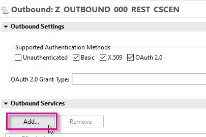
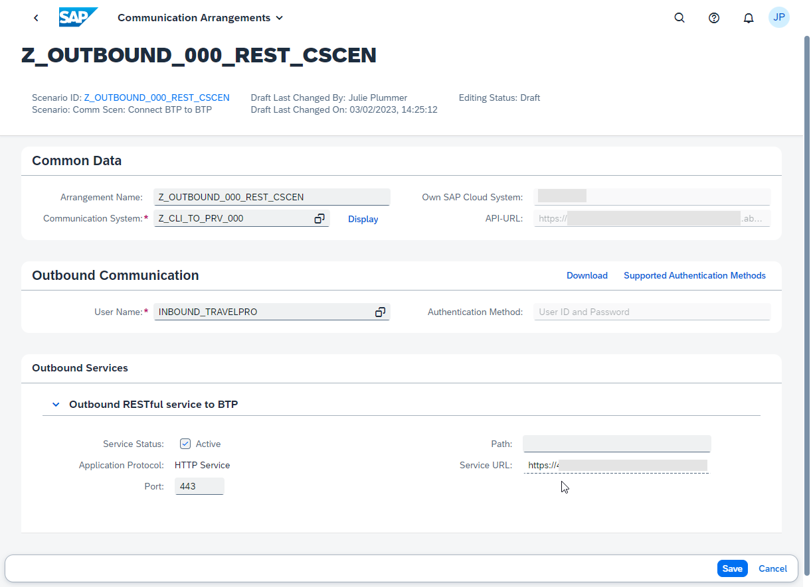
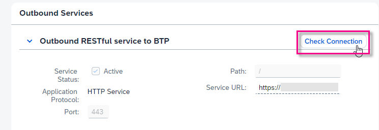
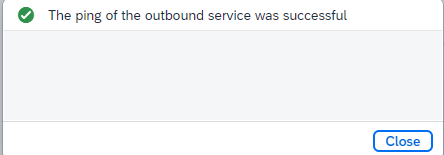

<<<<<<< HEAD
# Create Communication Objects for a Remote OData Service
=======
# Create Communication Objects for a Remote OData Service from an SAP BTP ABAP Environment Service
>>>>>>> 59f95048a11e62962d5c8eb49e89b6f027533a25
<!-- description --> Create an inbound communication scenario, arrangement, system, and user in the provisioning system of SAP BTP, ABAP Environment.

## Prerequisites
- **IMPORTANT**: This tutorial cannot be completed on a trial account
<<<<<<< HEAD
- You have set up 2 instances of SAP Business Technology Platform, ABAP Environment, a **provisioning system** and a **client system**, for example by using the relevant booster: [Using a Booster to Automate the Setup of the ABAP Environment](https://help.sap.com/viewer/65de2977205c403bbc107264b8eccf4b/Cloud/en-US/cd7e7e6108c24b5384b7d218c74e80b9.html)
=======
- **IMPORTANT**: This tutorial is part of a mission. You must complete this part first; otherwise, you may experience errors or unexpected behavior. The link to the mission is available at the top right of the screen, immediately above the list of steps
- You have set up 2 instances of SAP Business Technology Platform, ABAP Environment, a **provisioning system** and a **consuming system**, for example by using the relevant booster: [Using a Booster to Automate the Setup of the ABAP Environment](https://help.sap.com/viewer/65de2977205c403bbc107264b8eccf4b/Cloud/en-US/cd7e7e6108c24b5384b7d218c74e80b9.html)
>>>>>>> 59f95048a11e62962d5c8eb49e89b6f027533a25
- **Tutorial**: [Create Your First Console Application](abap-environment-trial-onboarding), for a licensed user, steps 1-2, for both instances
- In the provisioning system:
    - The business catalog **`SAP_CORE_BC_COM`** is assigned to your user
    - The ABAP Flight Reference Scenario is available. To pull this reference scenario from `Github`, see [ Downloading the ABAP Flight Reference Scenario](https://help.sap.com/viewer/923180ddb98240829d935862025004d6/Cloud/en-US/def316685ad14033b051fc4b88db07c8.html)
    - You have exposed the data definition **` /DMO/TRAVEL_U`** as an OData service, using a service definition and service binding
- You have read [Developing a UI Service with Access to a Remote Service](https://help.sap.com/viewer/923180ddb98240829d935862025004d6/Cloud/en-US/f4969e551d3049c59715210cbeb4ef56.html) and its [Scenario Description](https://help.sap.com/viewer/923180ddb98240829d935862025004d6/Cloud/en-US/4f539da657fe427f868a95c0bc1b3cfa.html), since this mission is based on this tutorial series
- Optional: You have installed the [Postman API Platform](https://www.getpostman.com/)

## You will learn
- In the **provisioning** system: How to expose a CDS view as an OData service using a **Service Binding**
- How to wrap this OData service in an inbound communication scenario, so that it can be accessed from another instance of SAP BTP, ABAP environment
- How to make the provisioning system available for connection from other ABAP systems
- How to test your service URL in Postman (optional)
<<<<<<< HEAD
- In the **client** system: How to create a new destination with an HTTP connection, pointing to the provisioning system

## Intro
This involves some overhead for one consumer; however, the advantage is that you can add several consumer systems, or users (for example, with different authentication) pointing to the same HTTP service, wrapped in the same Communication Scenario.

<!-- border -->

.
.

**Mission Scenario**:

You want to get data that is only available in a remote instance of SAP BTP, ABAP Environment ( **provisioning system** ) and display it in a second instance ( **client system** ).
=======
- In the **consuming** system: How to create a new destination with an HTTP connection, pointing to the provisioning system

This approach involves some overhead for one consumer; however, the advantage is that you can add several consumer systems, or users (for example, with different authentication) pointing to the same HTTP service, wrapped in the same Communication Scenario.

This tutorial mission was written for SAP BTP ABAP Environment. However, you should also be able to use it in SAP S/4HANA Cloud Environment in the same way.

**Mission Scenario**:

You want to get data that is only available in a remote instance of SAP BTP, ABAP Environment ( **provisioning system** ) and display it in a second instance ( **consuming system** ).
>>>>>>> 59f95048a11e62962d5c8eb49e89b6f027533a25

You need to:

1. Create inbound communication artifacts for an OData Service in the **provisioning system**
<<<<<<< HEAD
2. Create a Service Consumption Model, and save this locally as a `$metadata` XML file; From this you will create proxy artifacts in the client system, representing the remote service, and use this model to generate an **abstract entity**
3. Create a Remote Client Proxy
4. Build a new OData service in the client system, using a CDS custom entity and query implementation class
5. Finally, display the remote data in Fiori Elements preview in your browser

<!-- border -->

---

### Create inbound Communication Scenario

1. In your **provisioning** system, select your package, then choose **New > Other Repository Object...** from the context menu.

    <!-- border -->

2. Add the filter **`scen`**, then choose **Communication Scenario**, then choose **Next**.

    <!-- border -->

3. Add a Name: **`Z_WRAP_TRAVEL_XXX`** and Description, **Inbound for Travel Remote Service**, choose a transport request, then choose **Finish**.

Your Communication Scenario appears in a new editor.

<!-- border -->

You can also see this scenario in the Project Explorer.

<!-- border -->
=======
2. Create outbound communication artifacts for an OData Service in the **consuming system**
3. Create a **Service Consumption Model**, and save this locally as a `$metadata` XML file; from this you will create proxy artifacts in the consuming system, representing the remote service, and use this model to generate an **abstract entity**
4. Create a Remote consuming Proxy
5. Build a new OData service in the consuming system, using a CDS custom entity and query implementation class
6. Finally, display the remote data in Fiori Elements preview in your browser

> Throughout this tutorial, replace `XXX` or `000` with your initials or group number.

<!-- border -->

<!-- border -->

---

### Create package in provisioning system
You start in your **provisioning** system by creating the ABAP artifacts in ABAP Development Tools (ADT), starting with a package.

1. select the ABAP Cloud Project and choose **New > ABAP Package** from the context menu.

2. Enter the following and choose **Next**:
    - Name = **`Z_PRV_2_CON_000`**
    - Description = **Connect 2 instances of BTP ABAP**
    - Package type = **Development**

3. Choose **Create new transport request**, enter a description, such as **Connect 2 instances of BTP ABAP**, then choose **Finish**.

### Create inbound Communication Scenario
1. Choose **New > Other Repository Object...** from the context menu.

    <!-- border -->
    

2. Add the filter **`scen`**, then choose **Communication Scenario**, then choose **Next**.

    <!-- border -->
    

3. Enter the following, choose a transport request, then choose **Finish**.
        - Name: **`Z_WRAP_TRAVEL_PRV`**
        - Description **Inbound for Travel Remote Service**

        > `PRV` is the System ID of the consuming system, i.e. the second instance.

Your Communication Scenario appears in a new editor.

<!-- border -->

You can also see this scenario in the Project Explorer.

<!-- border -->

>>>>>>> 59f95048a11e62962d5c8eb49e89b6f027533a25

### Point to OData service binding

1. On the **Inbound** tab, choose **Add...**.

<<<<<<< HEAD
    <!-- border -->

2. **IMPORTANT**: Choose **Browse**. You cannot simply enter the name. Then add a filter, such as **`Z_BIND_T`**, select your service - with the ending `IWSG`, then choose **Finish**.

    <!-- border -->

3. Your service appears. Choose **Publish Locally**.

    <!-- border -->
=======
    <!-- border -->
    

2. **IMPORTANT**: Choose **Browse**. You cannot simply enter the name. Then add a filter, such as **`Z_BIND_T`**, select your service - with the ending `IWSG`, then choose **Finish**.

    <!-- border -->
    

3. Your service appears. Choose **Publish Locally**.

    <!-- border -->
    
>>>>>>> 59f95048a11e62962d5c8eb49e89b6f027533a25

### Create Communication System

<<<<<<< HEAD
1. From the Dashboard Home screen, choose From **Communication Management > Communication Systems**.

    <!-- border -->

2. Choose **New**.

    <!-- border -->

3. Enter a System ID, **`ZTRAVEL_XXX`**, and accept the default (identical) System name, then choose **Create**.

    <!-- border -->

4. In **Technical Data**:

- Switch **Destination Service** to **OFF**.

- In **Host Name**, enter the base URL of your provisioning system **without the protocol** - i.e. the URL should have the form **`<GUID>.abap.<region>.hana.ondemand.com`**. Again, you can find the URL for the dashboard by selecting your system (that is, ABAP Project in Project Explorer), then choosing **Properties > ABAP Development** from the context menu.

- **Business System** = dummy

    <!-- border -->

5. Scroll down to **Users for Inbound Communication**, then create a new user by choosing the **+** icon.

    <!-- border -->

6. Choose **New User** and the **Authentication Method: User name and password**.

    <!-- border -->

7. Enter a name, **`Z_TRAVELPRO_XXX`**, and description, then choose **Propose password**, then choose **Create > OK > Save**. `XXX` is the name of the provisioning system, that is, this system. **IMPORTANT**: Save the proposed password to a text file, since you will need it later.

8. Save your changes.
=======
1. Open the dashboard for your system in a browser. You can find the URL for the dashboard by selecting your system (that is, ABAP Project in Project Explorer), then choosing **Properties > ABAP Development** from the context menu.

    <!-- border -->
    

2. From the Dashboard Home screen, choose From **Communication Management > Communication Systems**.

    <!-- border -->
    

3. Choose **New**.

    <!-- border -->
    

4. Enter a System ID, **`ZTRAVEL_PRV`**, and accept the default (identical) System name, then choose **Create**.

    <!-- border -->
    

5. In **Technical Data**:

    - Switch **Destination Service** to **OFF**.

    - In **Host Name**, enter the base URL of your provisioning system in the form **`<GUID>.abap.<region>.hana.ondemand.com`**. Again, you can find the URL for the dashboard by selecting your system (that is, ABAP Project in Project Explorer), then choosing **Properties > ABAP Development** from the context menu.

        > IMPORTANT:  
         
        Remove the protocol (e.g. `https://`) from the start and `/` from the end of the host name.
         
        Make sure the domain starts with `abap`, not `abap-web`

    - Business System = **dummy**

    - Port = **443**

        <!-- border -->
        

6. Scroll down to **Users for Inbound Communication**, then create a new user by choosing the **+** icon.

    <!-- border -->
    

7. Choose **New User** and the **Authentication Method: User name and password**.

    <!-- border -->
    

8. Enter a name, **`INBOUND_TRAVELPRO_PRV`**, and description, then choose **Propose password**, then choose **Create > OK > Save**. `PRV` is the name of the provisioning system, that is, this system. 

    > **IMPORTANT**: Save the proposed password to a text file, since you will need it later.

9. Save your changes.
>>>>>>> 59f95048a11e62962d5c8eb49e89b6f027533a25

### Create inbound communication arrangement

<<<<<<< HEAD
1. Open the dashboard for your system in a browser. You can find the URL for the dashboard by selecting your system (that is, ABAP Project in Project Explorer), then choosing **Properties > ABAP Development** from the context menu.

    <!-- border -->

2. From **Communication Management**, choose **Communication Arrangement**. Then choose **New**.

    <!-- border -->

3. Choose your scenario, **`Z_WRAP_TRAVEL_XXX`** from the drop-down list. Accept the default (identical) Arrangement name.

    <!-- border -->

4. From the dropdown list, choose your communication system **`ZTRAVEL_XXX`**

    <!-- border -->

5. Save your changes.
=======
1. From **Communication Management**, choose **Communication Arrangement**. Then choose **New**.

    <!-- border -->
    

2. Choose your scenario, **`Z_WRAP_TRAVEL_PRV`** from the drop-down list. Accept the default (identical) Arrangement name.

    <!-- border -->
    

3. From the dropdown list, choose your communication system **`ZTRAVEL_PRV`**

    <!-- border -->
    

4. Save your changes.
>>>>>>> 59f95048a11e62962d5c8eb49e89b6f027533a25

Your Communication Arrangement should look roughly like this.
The Service URL / Service Interface = < Base URL of provisioning system > + relative path of your Inbound Service, here `/sap/opu/odata/sap/Z_BIND_TRAVELS_XXX`.

<<<<<<< HEAD
<!-- border -->
=======
<!-- border -->

>>>>>>> 59f95048a11e62962d5c8eb49e89b6f027533a25

### Optional: Check service URL in Postman

1. Open Postman. In the **Authorization** tab, enter your authorization credentials:

    - Type = Basic Auth.
<<<<<<< HEAD
    - Username = `INBOUND_TRAVELPRO_XXX`
=======
    - Username = `INBOUND_TRAVELPRO_PRV`
>>>>>>> 59f95048a11e62962d5c8eb49e89b6f027533a25
    - Password = The generated password you noted down

2. Stick with the default **GET** and paste the complete path of your service, Base URL and relative path, into the input field, then choose **Send**.

3. The response appears in the **Body** field, along with the status **200 OK**.

<<<<<<< HEAD
    <!-- border -->

### Create destination in client system

You will now open the client system and create a destination service instance there. This must be created at subaccount (not Space) level.

1. In the **client** system, open the SAP BTP Cockpit of your Cloud Foundry subaccount and choose **Destinations**, then choose **New Destinations**.

    <!-- border -->

2. Enter the following values. Note the name, since you will be using it later:

    |  Field Name     | Value
    |  :------------- | :-------------
    |  Name           | **`SID_XXX_HTTP`**, where `SID` = your provisioning system
    |  Type           | **`HTTP`**
    |  Description    | Connect \<your_client_system> to \<your_provisioning_system>
    |  URL    | <URL of inbound service **without** relative path (see below)>
    | Proxy Type | Internet
    | Authentication | **`BasicAuthentication`**
    | User | **`INBOUND_TRAVELPRO_XXX`** (i.e. from the communication system)
    | Password | The generated password you noted down

    <!-- border -->

3. Check the connection:

    <!-- border -->
=======
    <!-- border -->
    

### Create package in in consuming system

Now, in your **consuming** system by creating the ABAP artifacts in ABAP Development Tools (ADT), starting with a package.

1. select the ABAP Cloud Project and choose **New > ABAP Package** from the context menu.

2. Enter the following and choose **Next**:
    - Name = **`Z_PRV_2_CON_000`**
    - Description = **Connect 2 instances of BTP ABAP**
    - Package type = **Development**

3. Choose **Create new transport request**, enter a description, such as **Connect 2 instances of BTP ABAP**, then choose **Finish**.

### Create outbound Communication Service

1. Select your package and choose **New > Other Repository Object...** from the context menu.

    <!-- border -->
    

2. Add the filter **outbound**, choose **Outbound Service**, then choose **Next**.

3. Enter the following, then choose **Next**.
    - Outbound Service: **`Z_OUTBOUND_BTP_000`**
    - Description: **Outbound RESTful service to BTP**
    - Service Type: **HTTP Service**

Your service appears in a new editor. The system adds the suffix **`_REST`** automatically.

### Create outbound Communication Scenario

1. Select your package and choose **New > Other Repository Object...** from the context menu.

2. Add the filter **`scen`**, choose **Communication Scenario**, then choose **Next**.

3. Enter the following, choose a transport request, then choose **Finish**.
        - Name: **`Z_OUTBOUND_000_REST_CSCEN`**
        - Description **Comm Scen: Connect BTP to BTP**
        
    Your Communication Scenario appears in a new editor.
    <!-- border -->
    

4. On the **Outbound** tab, add the authorization type **Basic**.

5. Then choose **Add**.

    <!-- border -->
    

6. Browse for your service, **`Z_OUTBOUND_BTP_000_REST`**, (the service type is added automatically), then choose **Finish**.

    The **Communication Scenario** appears in a new editor.

7. Choose **Save**, then choose **Publish locally**.

    <!-- border -->
    

### Create communication system

1. In Fiori launchpad in the consuming system, open the app **Communication Systems**, then choose **New**.

    <!-- border -->
    
     
    <!-- border -->
       

2. Enter a system ID, then accept the (identical) system name:
    - **`Z_CLI_TO_PRV_000`**

3. In **Technical Data**:
    - Switch **Destination Service** to **OFF**.

    - In **Host Name**, enter the base URL of your provisioning system in the form **`<GUID>.abap.<region>.hana.ondemand.com`**. Again, you can find the URL for the dashboard by selecting your system (that is, ABAP Project in Project Explorer), then choosing **Properties > ABAP Development** from the context menu.

        > IMPORTANT:  
         
        Remove the protocol (e.g. `https://`) from the start and `/` from the end of the host name.
         
        Make sure the domain starts with `abap`, not `abap-web`

    - Port = **443**

    <!-- border -->
      

4. In **Users for Outbound Communication**, add a new user by choosing the **+** symbol.

    <!-- border -->
    

5. Choose the authentication method **User Name and Password**. 

6. From the dropdown, choose the user from the provisioning system, **`INBOUND_TRAVELPRO`**; paste the password you generated previously; then choose **Create**.

    <!-- border -->
    

7. Choose **Save**.

### Create communication arrangement

1. Similarly, open the app **Communication Arrangements**, then choose **New**.

2. From the dropdown, choose your **Communication Scenario**, **`Z_OUTBOUND_000_REST_CSCEN`**; accept the generated (identical) **Arrangement Name**, then choose **Create**.

    <!-- border -->
    

3. From the dropdown, select your **Communication System**. 

    <!-- border -->
    

4. The system fills in the **User Name** and **Outbound Service** automatically. Choose **Save**.

    <!-- border -->
    

5. In the **Outbound Services** panel, check the connection.

    <!-- border -->
    

You should get a result like this.

<!-- border -->

>>>>>>> 59f95048a11e62962d5c8eb49e89b6f027533a25

### Test yourself

<<<<<<< HEAD

### More Information
[Postman: Video Tutorials](https://www.youtube.com/playlist?list=PLM-7VG-sgbtAgGq_pef5y_ruIUBPpUgNJ)

=======
### More Information
[Postman: Video Tutorials](https://www.youtube.com/playlist?list=PLM-7VG-sgbtAgGq_pef5y_ruIUBPpUgNJ)

SAP Help Portal:[Service Consumption via Communication Arrangements](https://help.sap.com/docs/btp/sap-business-technology-platform/service-consumption-via-communication-arrangements)

>>>>>>> 59f95048a11e62962d5c8eb49e89b6f027533a25
---
