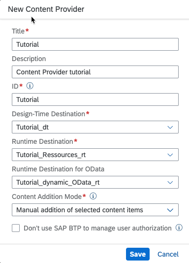

# Create a Content Provider in Launchpad Service
<!-- description --> Create a content provider in order to create a Launchpad site.

## Prerequisites
 - **Authorizations:** Your user needs to be a subaccount administrator with Role Collection `Launchpad_Admin` assigned.

## You will learn
  - How to create a Content Provider
  - How to add content in the Content Explorer
  - How to create a Launchpad site

---

### Create Content Provider

- From the subaccount, navigate to `Services` ->  `Instances and Subscriptions` and search for the Launchpad Service in the Search box

- Access Launchpad Service.

- Go to Provider Manager.

- Create a new Content Provider.

    <!-- border -->

- Add Title, Description, ID and the Destinations created in tutorial ["Create destinations in SAP BTP cockpit"](abap-environment-content-provider-destinations) accordingly.

    <!-- border -->

- Click "Save".

> In the `Status` column of the table the status will be set to `Created` as soon as the creation is finished.

### Choose content in the Content Manager

    - Navigate to the Content Manager.

    - Open Tab `Content Explorer`. Here all the created Content Providers are listed.

    - Click on the Content Provider created in Step 1.

    - Mark the item with Title "Administrator" and click "Add to My Content".

    <!-- border -->

### Create Launchpad Site

    - Navigate to the Site Directory.

    - Click `Create Sites`.

    - Choose a site name and click "Create".

    - Click `Edit` and click into the box to `Search for items to assign`.

    <!-- border -->

    - Choose the `Administrator` role (click on `+`).

    - Click `Save`.

    - Copy and store the URL of the Launchpad for later use.

    <!-- border -->

> Now you assigned the Business Role, which you exposed to the Launchpad Service, to your Launchpad Site. With it all the apps that are related to this Business Role will be available in the Launchpad Site. Also a Role Collection is created, which is named in this format: `<Content Provider name>_<Business Role name>`

### Add Role Collection to user

> In order to be able to access the Launchpad Site you have to assign the Role Collection created in the last step, to the SAP BTP ABAP environment user in the SAP BTP cockpit.

- Open the BTP Cockpit.

- Go to the Subaccount, of the Launchpad Service.

- Navigate to the `Users` menu.

- Search for and mark the BTP user of the SAP BTP, ABAP environment user used in tutorial ["Create communication between SAP BTP, ABAP environment and SAP BTP"](abap-environment-content-provider-communication)

- Click on `Assign Role Collection` in the `Role Collection` section (might be hidden behind the `...`, dependent on the window size).

- Assign the created authorization to the user.

<!-- border -->

### Access Launchpad Site

Now access the Launchpad Site via the URL stored in "Step 3" with the SAP BTP user you assigned the Role Collection to in "Step 4".

---
