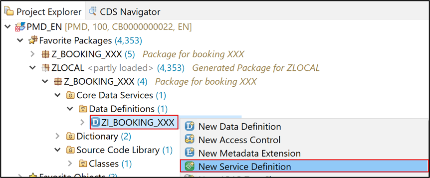
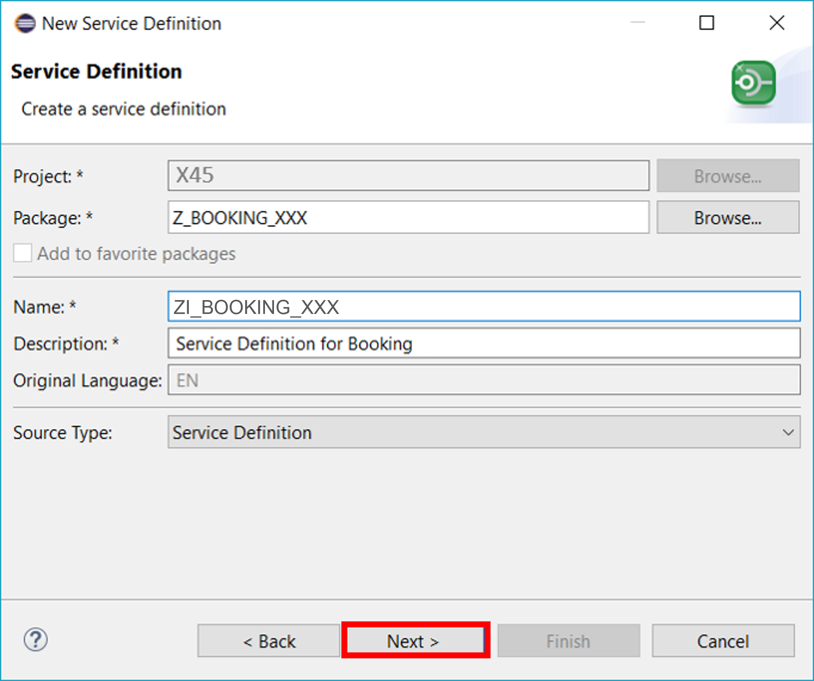
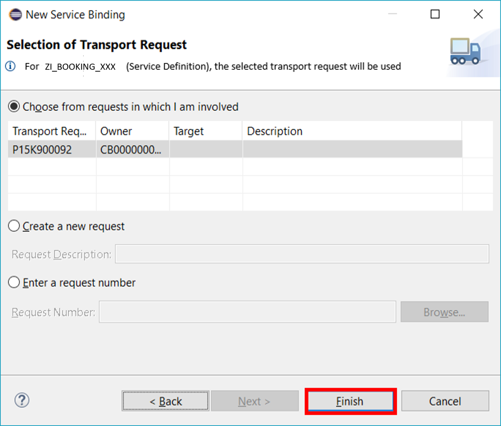
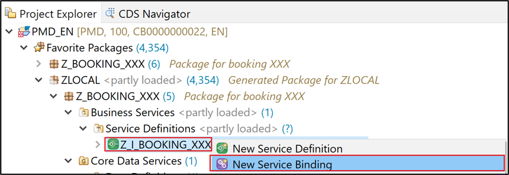
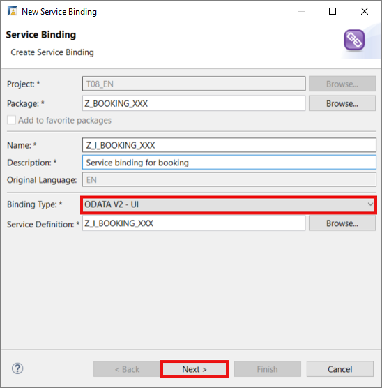
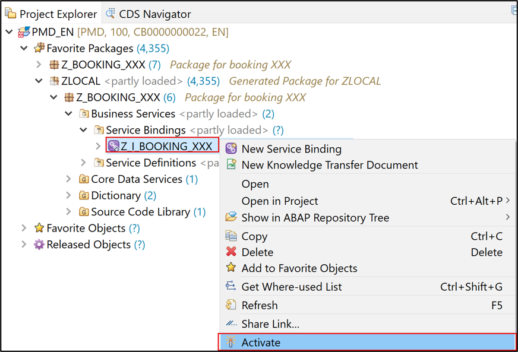
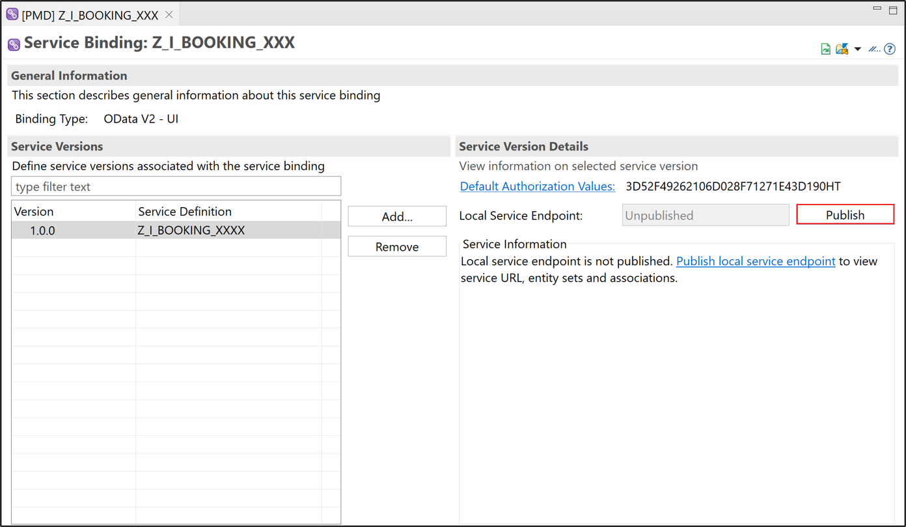
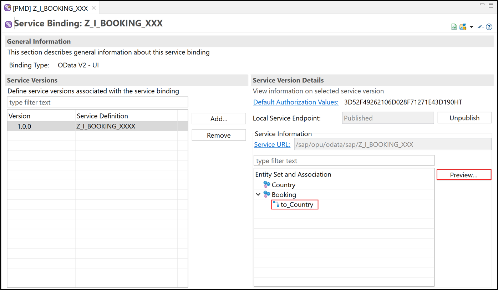
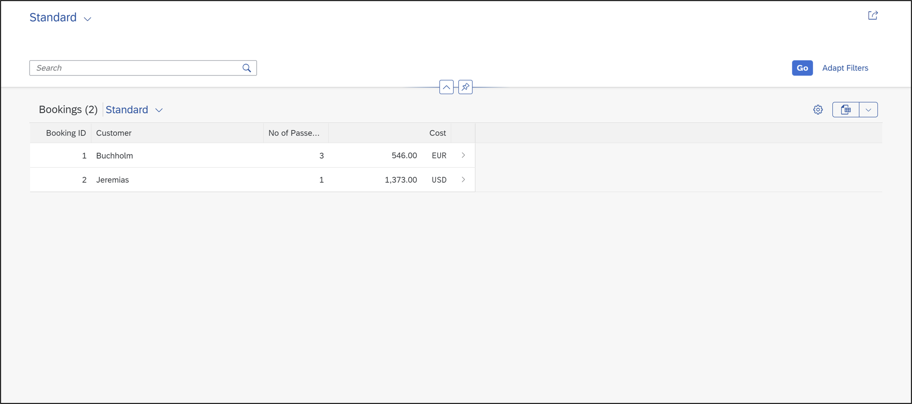

# Create and Expose Core Data Services Based on a Database Table
<!-- description --> Build a list report app with the ABAP RESTful Application Programming Model (RAP) for SAP Fiori and test your UI for demo usage.

## Prerequisites  
- SAP BTP, ABAP Environment user
- Business Catalog `SAP_CORE_BC_EXT_TST` assigned to your business user
- Initial development setup

## You will learn
- How to create a database table
- How to create Core Data Services

## Intro
In this tutorial, wherever `###` appears, use a number (e.g. `000`).

---

### Create data definition

  1. Select to your ABAP package created in tutorial **Create Simple Database Table for ABAP Environment** and create a Core Data Services (CDS) data definition. Therefore right-click on your package **`ZR_BOOKINGTP_###`** and select **New** > **Other Repository Object**.

      

  1. Search for **data definition**, select it and click **Next**.

      

  2. Enter a name and a description for your data definition `ZR_BOOKINGTP_###`.

      

  3. Select a new transport request and click **Next**.

      

  4. Select **Define View template** and press **Finish**.

      

  5. Specify the `sql view name` in the view definition as **`ZV_BOOKING_###`**.

      

  6. Specify your data source after the select from statement as **`zabooking_###`**.

      

  7. Specify your data definition as shown below. The keyword key is used to specific a key element and the keyword as is used to define alias names. The two associations `I_Country` and `I_Currency` are defined and exposed in the projection. The element `CurrencyCode` is specified as currency key for the element Cost which is an amount field. The view entity is specified as searchable using the view annotation `@Search.searchable: true` and the element `CustomerName` is specified as default search element using the element annotation `@Search.defaultSearchElement: true`.

    ```ABAP
    @AbapCatalog.sqlViewName: 'ZV_BOOKINGTP_###'
    @AbapCatalog.compiler.compareFilter: true
    @AbapCatalog.preserveKey: true
    @AccessControl.authorizationCheck: #CHECK
    @EndUserText.label: 'Data definition for booking'
    @Search.searchable : true
    define view ZR_BOOKINGTP_###
      as select from zabooking_### as Booking
      association [0..1] to I_Country  as _Country  on $projection.Country = _Country.Country
      association [0..1] to I_Currency as _Currency on $projection.Currencycode = _Currency.Currency
    {
      key booking            as Booking,
          @Search.defaultSearchElement: true
          customername       as Customername,
          numberofpassengers as Numberofpassengers,
          emailaddress       as Emailaddress,
          country            as Country,
          dateofbooking      as Dateofbooking,
          dateoftravel       as Dateoftravel,
          @Semantics.amount.currencyCode: 'CurrencyCode'
          cost               as Cost,
          @Semantics.currencyCode: true
          currencycode       as Currencycode,
          lastchangedat      as Lastchangedat,
          _Country,
          _Currency
    }
    ```
  8. Save and activate.

      


### Add UI annotation

  1. Go back to the data definition and used the **`@UI`** annotations to add the UI-specific semantics. Add following UI annotation in front of your data definition.

      

    ```ABAP
    @UI: {
      headerInfo: {
      typeName: 'Booking',
      typeNamePlural: 'Bookings',
      title: { type: #STANDARD, value: 'Booking' }
      }
    }
    ```

  2. Replace your code with following:

    ```ABAP
    @AbapCatalog.sqlViewName: 'ZV_BOOKINGTP_###'
    @AbapCatalog.compiler.compareFilter: true
    @AbapCatalog.preserveKey: true
    @AccessControl.authorizationCheck: #CHECK
    @EndUserText.label: 'Data definition for booking'
    @Search.searchable : true

    @UI: {
      headerInfo: {
      typeName: 'Booking',
      typeNamePlural: 'Bookings',
      title: { type: #STANDARD, value: 'Booking' }
      }
    }

    define view ZR_BOOKINGTP_###
      as select from zabooking_### as Booking
      association [0..1] to I_Country  as _Country  on $projection.Country = _Country.Country
      association [0..1] to I_Currency as _Currency on $projection.Currencycode = _Currency.Currency
    {
      key booking            as Booking,
          @Search.defaultSearchElement: true
          customername       as Customername,
          numberofpassengers as Numberofpassengers,
          emailaddress       as Emailaddress,
          country            as Country,
          dateofbooking      as Dateofbooking,
          dateoftravel       as Dateoftravel,
          @Semantics.amount.currencyCode: 'CurrencyCode'
          cost               as Cost,
          @Semantics.currencyCode: true
          currencycode       as Currencycode,
          lastchangedat      as Lastchangedat,
          _Country,
          _Currency
    }
    ```

  3. Save and activate your data definition.

      


### Create service definition

  1. Right-click on your data definition **`ZR_BOOKINGTP_###`** and select **New Service Definition**

      

  2. Create a service definition and call it **`ZUI_BOOKING_###`**.

      
 
  3. Click **Finish** to complete your transport request.

      

  4. Expose the **`ZR_BOOKINGTP_###`** and the **`I_Country`** view entities.

    ```ABAP
    @EndUserText.label: 'Service definition for booking'

    define service ZUI_BOOKING_### {
      expose ZR_BOOKINGTP_### as Booking;
      expose I_Country as Country;
    }
    ```

  5. Save and activate your service definition. 

      


### Create service binding

  1. Right-click on your service definition **`ZUI_BOOKING_###`** and select **New Service Binding**.

      

  2. Create a service binding and name it **`ZUI_BOOKING_###`**.
     Make sure that **`OData V4 - UI`** is selected as binding type.

      
      Click **Next >**.

  3. Click **Finish** to complete your transport request.

      


### Publish service binding

1. **Activate** your service binding.

    

2. Click **Publish**.

      


### Open SAP Fiori elements view


  1. In your service binding, check your result. Select **`to_Country`** and click **Preview**.

      

  2. Login with your username and password.

      

  3. Click on **GO**.

      

  4.  Check your result.

      


### Test yourself

Write following UI annotation as a header Information:

- `typeName`: `Test`
- `typeNamePlural`: `Tests`
- `title`:
  - `type`: `#STANDARD`
  - `value`: `testyourself`


