# Create SAP Fiori Launchpad Space and Page Templates
<!-- description --> Deliver predefined SAP Fiori Launchpad spaces and pages for your app by developing templates.

## You will learn
- How to create a space template
- How to create a page template
- How to scope page and space template 
- How to authorize business users for space app
- How to use predefined spaces and pages


## Prerequisites
- You need an SAP BTP, ABAP environment license.
- You have followed the group [Build an SAP Fiori elements App Using the ABAP RESTful Application Programming Model (RAP) – Beginner [RAP100]](group.abap-build-fiori-element-rap) in a licensed system.
- You have followed the group [Create, Deploy and Integrate an SAP Fiori elements App into SAP Fiori Launchpad for SAP BTP, ABAP Environment [RAP100]](group.abap-create-fiori-element-btp) in a licensed system.
  - To manage the predefined launchpad pages and spaces in Fiori Launchpad and maintain business roles, you need to have a role with business catalogs **User Interface - Fiori Launchpad Design** (ID: `SAP_CORE_BC_UI_FLD`) and **Identity and Access Management - Role Management** (ID: `SAP_CORE_BC_IAM_RM`)
  

---

Replace ### with your own ID.

### Create launchpad page template

 1. Open your package **`ZRAP100_###`** in ADT, right-click **Fiori User Interface** and select **New** > **Launchpad Page Template**.

     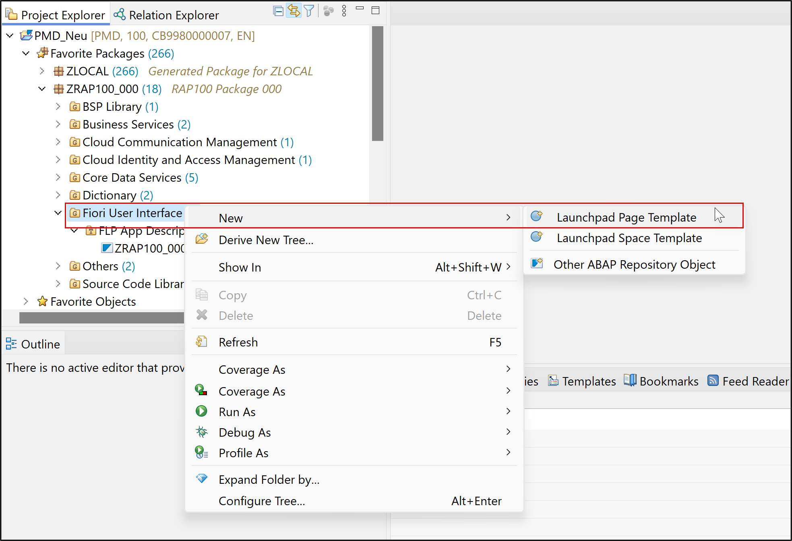

 2. Create a new launchpad page template:    
    - Name: `ZRAP100_TRAVEL_###` 
    - Description: Page for travel ###
    - Title in Launchpad: Travel App ###
                 
     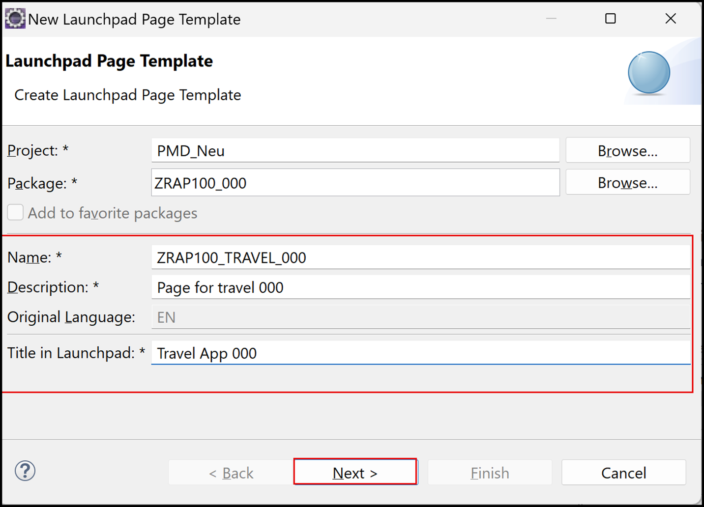
      
     Click **Next >**.

 3. Select your transport request and click **Finish**.

     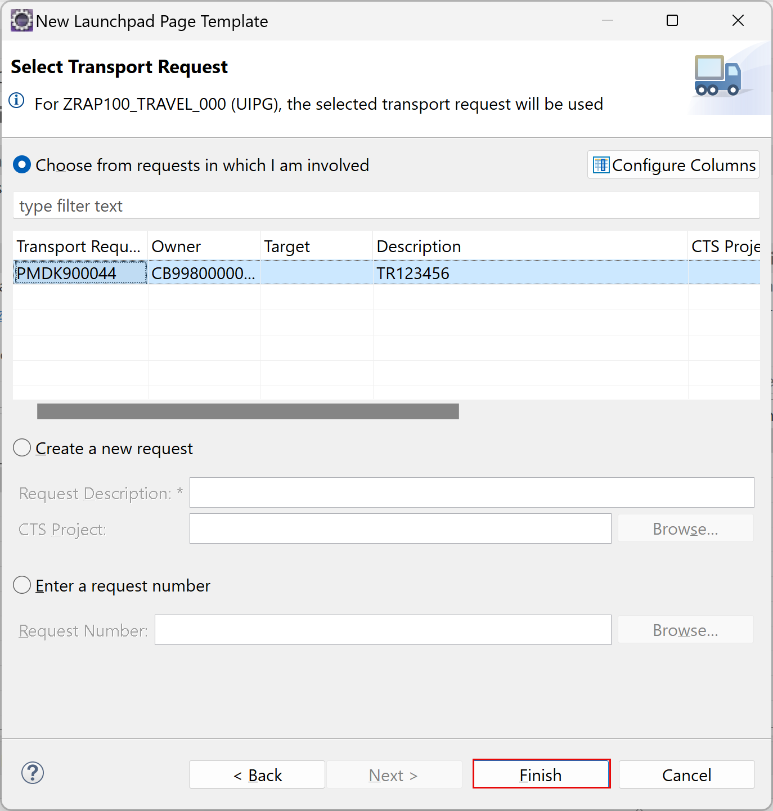

 4. In your launchpad page template right-click the list area in sections and select **Add Child** > **Section**.

     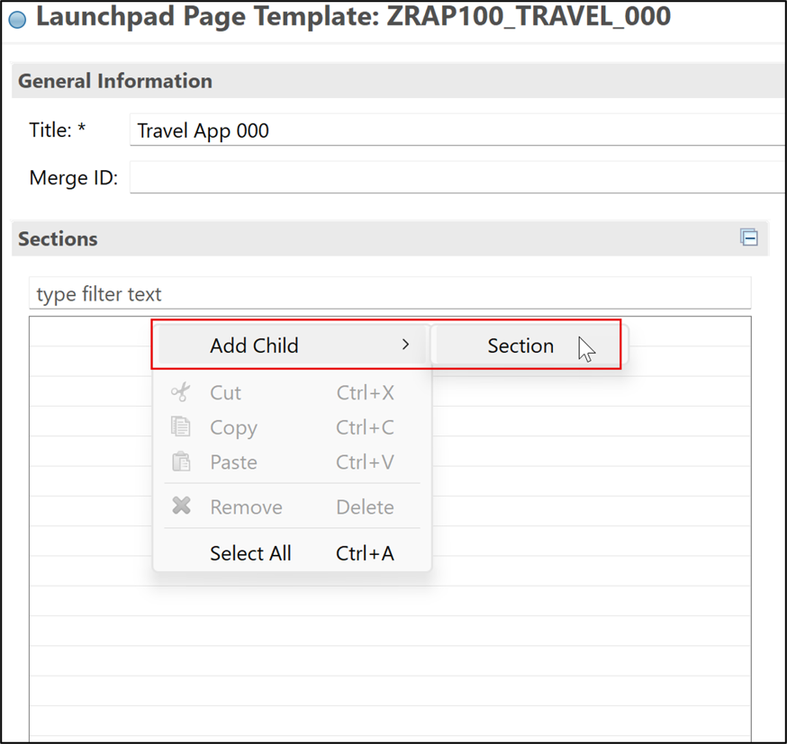

 5. Create a new section:
     - ID: `SECTION_###`
     - Title: Section ###

 6. Right-click **`SECTION_###`** and select **Add Child** > **Visualizations**.

     

 7. Right-click **Visualizations** and select **Add Child** > **Visualization**.

     

 8. Create a new visualization and add the launchpad app descriptor item assignment: 
     - ID: `APP_DESCRIPTOR_ITEM_###`
     - Type: Launchpad App Descriptor Item Assignment
     - Display Format: Standard Tile
     - Launchpad App Descriptor Item ID:`ZRAP100_###_UI5R` 
     - Title ID: <your_title_id>

     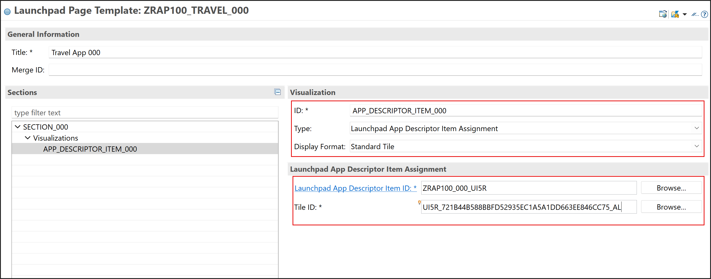

     You can press `CTRL` + Space to load the existing data, to fill in your field entries.

 9. Activate your launchpad page template.

### Check Template availability in manage launchpad pages app

  1. Click the symbol to open the launchpad page template.

      

  2. The launchpad page template will not be loaded. The page template needs to be scoped still in order to be able to use it.
  
      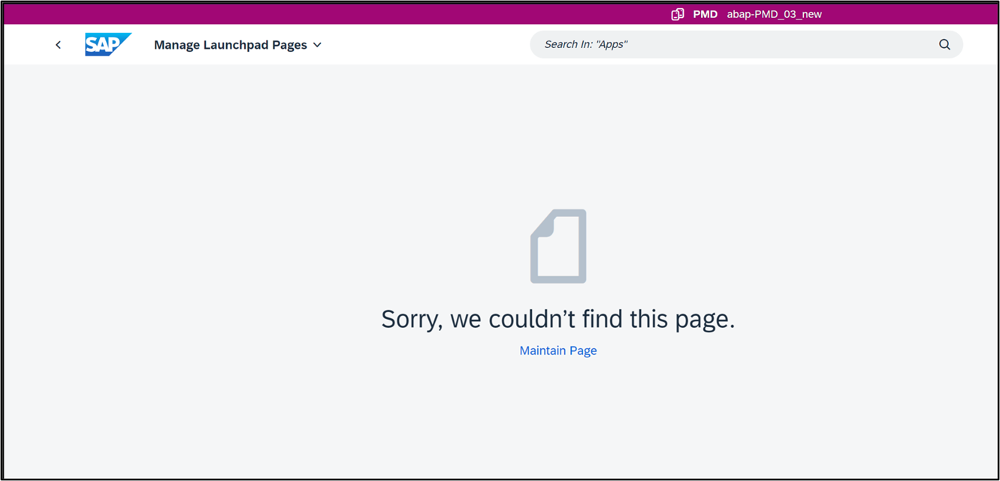


### Scope page and space templates

For more information see documentation [SAP BTP, ABAP environment > Development in the ABAP Environment > UI Development > SAP Fiori Applications in the ABAP Environment > Scoping Space and Page Templates](https://help.sap.com/docs/sap-btp-abap-environment/abap-environment/scoping-space-and-page-templates).

  1. Right-click **Classes** and select **New ABAP Class**.

      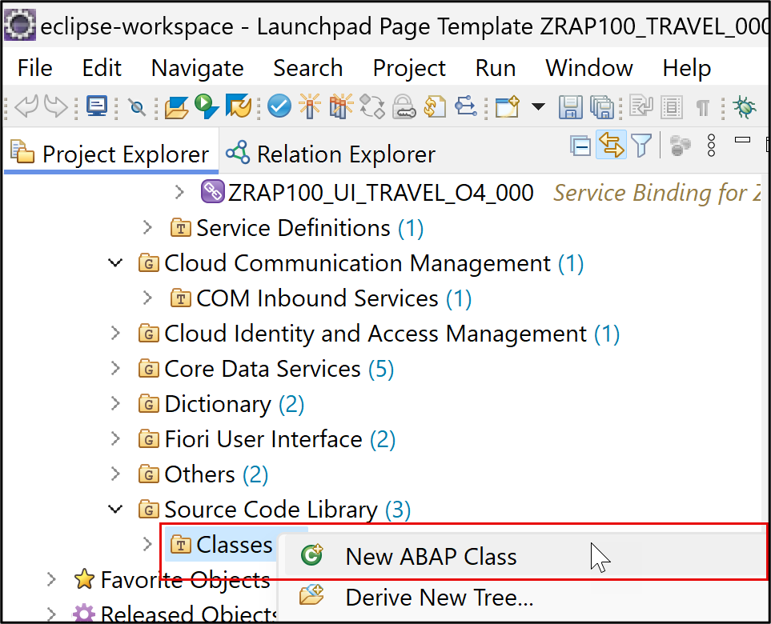

  2. Create a new class:
    - ID: `ZCL_SCOPE_PAGE_SPACE_###`
    - Title: Class for calling the scoping API
  
      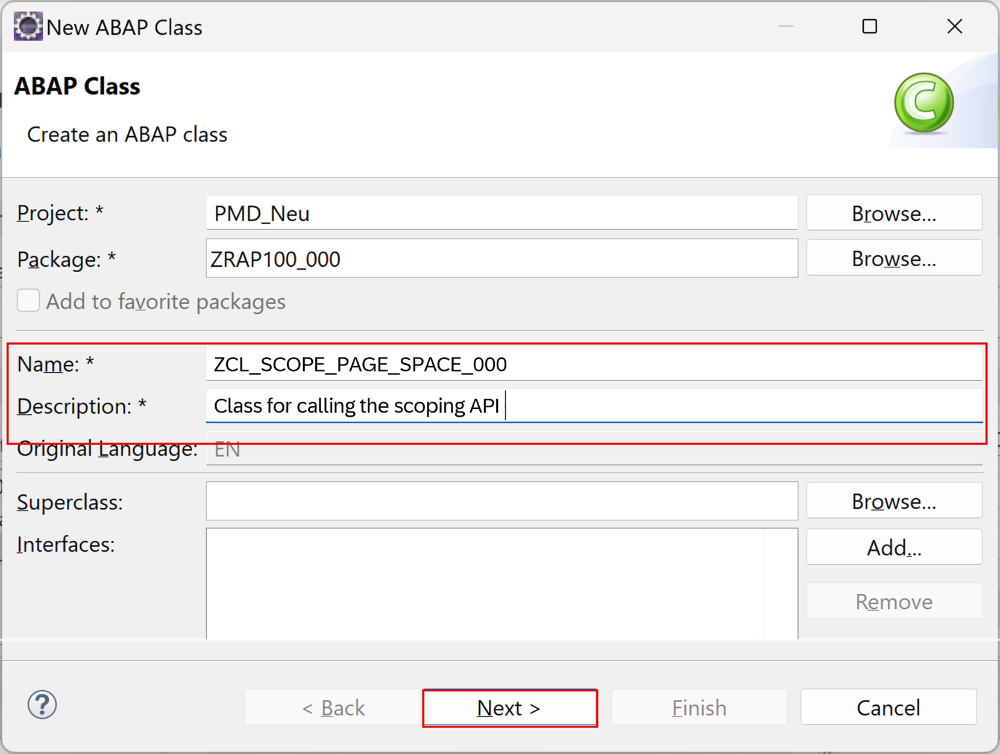

      Click **Next >**.

  3. **Finish** the ABAP class creation wizard after transport request selection.

      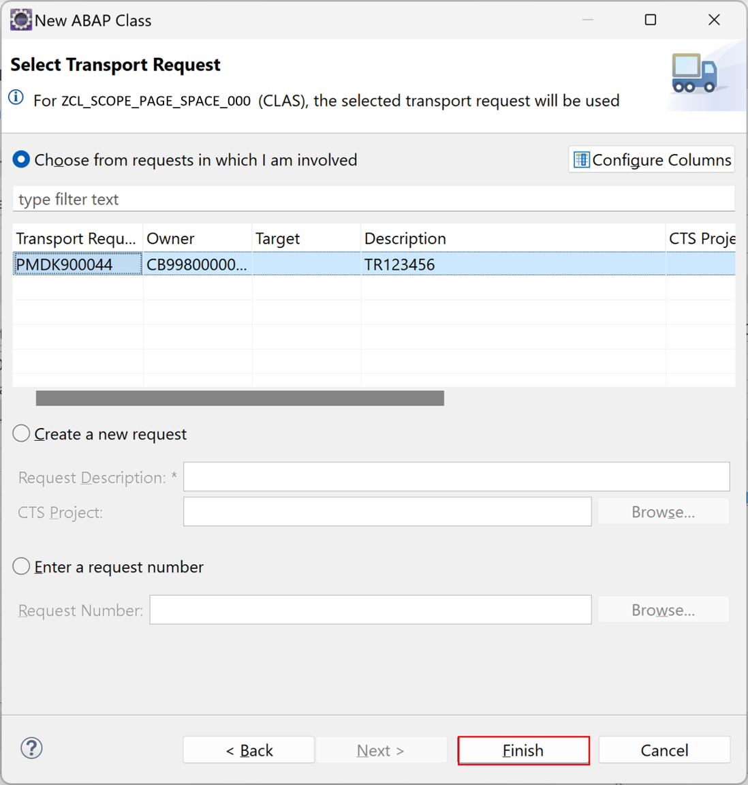

  4. The snippet scopes the page template. Scoping a space template is still commented out. Therefore copy and paste the code snippet in your class. Change ### with your own ID.
    
    ```ABAP
    CLASS zcl_scope_page_space_### DEFINITION
    PUBLIC
    FINAL
    CREATE PUBLIC .

    PUBLIC SECTION.
        INTERFACES if_oo_adt_classrun.
    PROTECTED SECTION.
    PRIVATE SECTION.
    ENDCLASS.


    CLASS zcl_scope_page_space_### IMPLEMENTATION.
    METHOD if_oo_adt_classrun~main.


        DATA(lo_scope_api) = cl_aps_bc_scope_change_api=>create_instance( ).

        lo_scope_api->scope(
        EXPORTING it_object_scope = VALUE #(
        pgmid = if_aps_bc_scope_change_api=>gc_tadir_pgmid-R3TR
        scope_state = if_aps_bc_scope_change_api=>gc_scope_state-ON

    * Space template
    *   ( object = if_aps_bc_scope_change_api=>gc_tadir_object-UIST obj_name = 'ZRAP100_TRAVEL_###' )

    * Page template
        ( object = if_aps_bc_scope_change_api=>gc_tadir_object-UIPG obj_name = 'ZRAP100_TRAVEL_###' )
        )

                iv_simulate = abap_false
                iv_force = abap_false
        IMPORTING et_object_result = DATA(lt_results)
                et_message = DATA(lt_messages) ).
    ENDMETHOD.

    ENDCLASS.   
    ```

  5. Save and activate.
   
  6. Right-click `ZCL_SCOPE_PAGE_SPAGE_###` and select **Run As** > **ABAP Application (Console)** or press F9 to run your application.

      
 

### Open launchpad page template

  1. Click the symbol to open the launchpad page template in manage launchpad pages app. The link can be found in the upper right corner of the editor.

      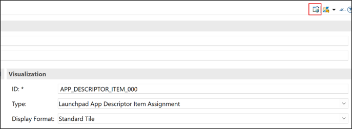

  2. Now the launchpad page template will be loaded with the page and section content. 
  
      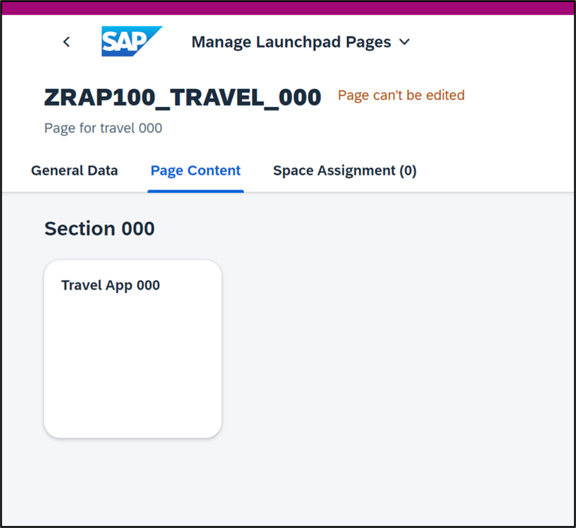

  3. Navigate to the **Home** screen, select **Administration** > **Launchpad**.

      

  4. Open the **Manage Launchpad Pages** app.

      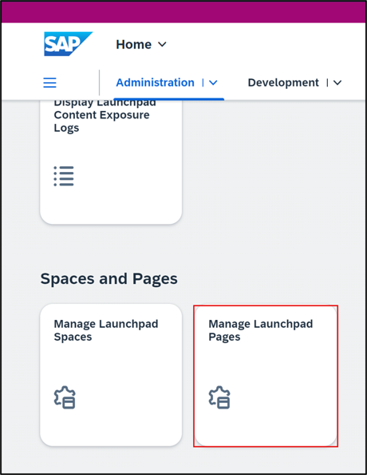

  5. Select **Predefined** and search for `ZRAP100_Travel_###`. Now you can see your launchpad page template under the predefined tab.
   
      


### Create launchpad space template

  1. Open your package **`ZRAP100_###`** and right-click **Fiori User Interface** and select **New** > **Launchpad Space Template**.

      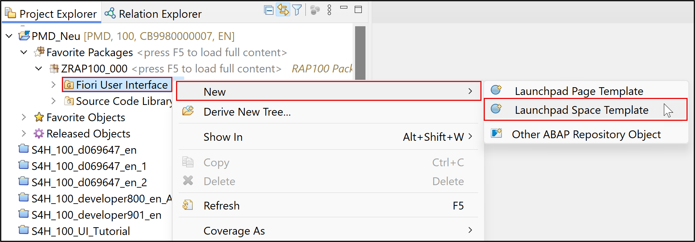

  2. Create a new launchpad space template:  
     - Name: `ZRAP100_TRAVEL_###`
     - Description: Space for travel ###
     - Title in Launchpad: Travel App ###

     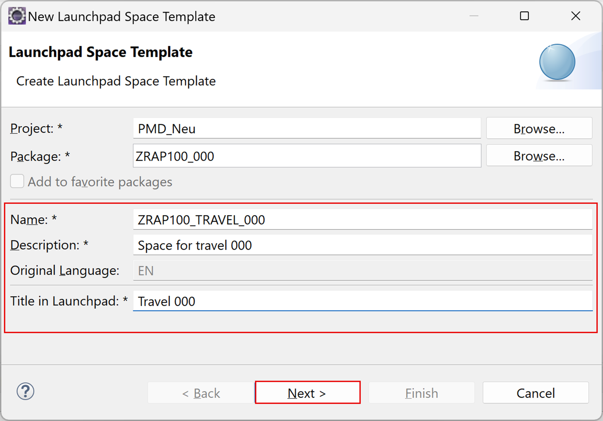

     Click **Next >**.

  3. Select your transport request and click **Finish**.

      

  4. Add general information:
     - Sort Priority: 100 

     

     A higher sort priority number will let the space appear more on the right side of the tab overview on the home screen in SAP Fiori launchpad.

     Click **Add** and select `ZRAP100_TRAVEL_###` as launchpad page template.

  5. Activate your changes.


### Check template availability in manage launchpad spaces app

  1. In your SAP Fiori launchpad, navigate to the **Home** screen > **Administration** > **Launchpad**.

      

  2. Open the **Manage Launchpad Spaces** app.
  
      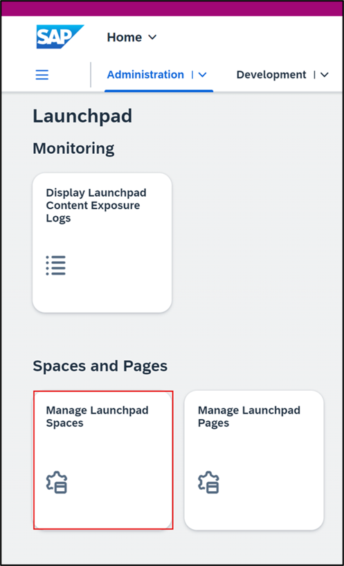

  3. Select **Predefined** and search for `ZRAP100_Travel_###`. 

      

     You will not be able to find an entry. The page template needs to be scoped still in order to be able to use it.

### Scope space template

  1. Open your ABAP class `ZCL_SCOPE_PAGE_SPACE_###` and uncomment the following line:

    ```ABAP
    ( object = if_aps_bc_scope_change_api=>gc_tadir_object-UIST obj_name = 'ZRAP100_TRAVEL_000' )
    ```

  2. Save and activate.
   
  3. Right-click `ZCL_SCOPE_PAGE_SPAGE_###` and select **Run As** > **ABAP Application (Console)** or press F9 to run your application.

      
  
### Check launchpad space 


  1. Refresh your **Manage Launchpad Spaces** page and search for `ZRAP100_Travel_###` under **Predefined**.

     

     Now you are able to see the launchpad space.


### Develop authorization template for space

 Until now no business user can see the created predefined space and its page in their SAP Fiori Launchpad. An administrator could add the space to an existing business role like the one created before in tutorial [Integrate List Report into ABAP Fiori Launchpad](abap-environment-abap-flp).

 Here we show how to provide authorization via a business role template instead. This has following advantages:

 - Administrators do not have to build a business role on their own.
 - Delivered changes can be applied with app support to inheriting business roles and their assigned business users.

  1. As Developer in ADT, right-click the **Identity and Access Management** folder in your project and choose **New** > **Business Role Template**

     <!-- border -->
     

  2. Enter **Name** `ZRAP100_BRT_###`, **Description** `Business Role Template for Travel Solution ###` and finish the wizard.

     <!-- border -->
     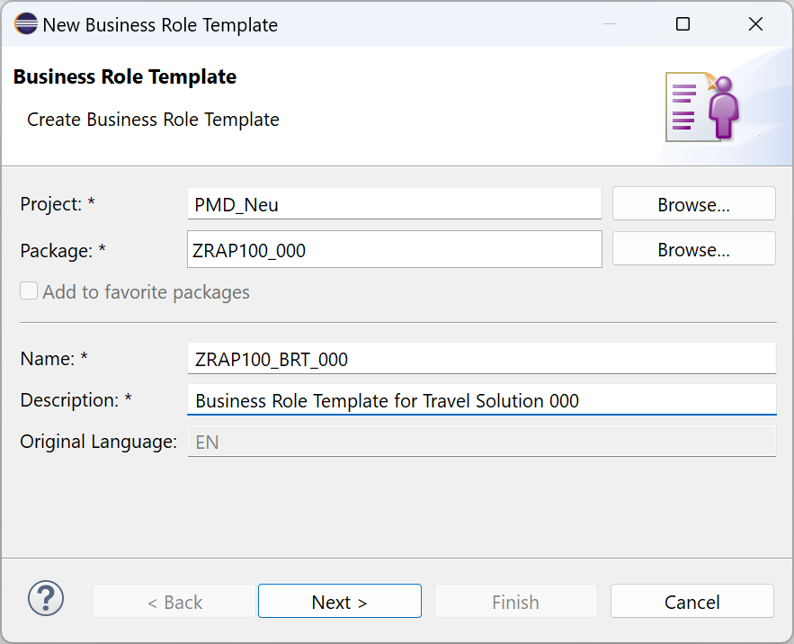

  3. Right-click the **Identity and Access Management** folder in your project again and choose **New** > **`Business Role Templ. - Launchpad Space Templ. Assignment`** now.
      
     <!-- border -->
     

  4. Enter **Name** `ZRAP100_BRT_SPT_###`, **Description** `Assignment of space template to business role template ###`, finish the wizard and save (Ctrl + S).

     <!-- border -->
     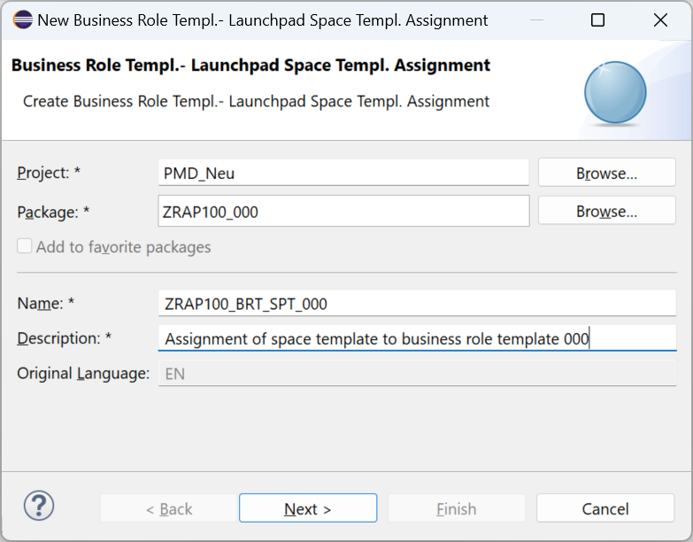

  5. In the editor of the Assignment enter **Business Role Template** `ZRAP100_BRT_###`, **Launchpad Space Template** `ZRAP100_TRAVEL_###` and save (Ctrl + S).

     <!-- border -->
     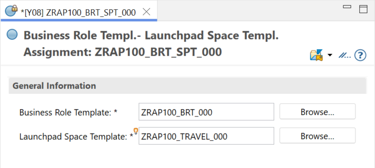

  6. Switch back to the editor of the business role template and press **Publish locally**
  
### Authorize business user for space
 
 Once a business role template was provided as part of a solution, an administrator can create a role which is based on a template and also can get updated with app support from that if updates were delivered. For further information see documentation [SAP Business Technology Platform (SAP BTP) > SAP Business Technology Platform > Administration and Operations > Administration and Operations in the ABAP Environment > SAP Fiori Apps in the ABAP Environment > Identity and Access Management > Business Role Templates](https://help.sap.com/docs/btp/sap-business-technology-platform/business-role-templates).

  1. As Administrator in SAP Fiori Launchpad open App **Maintain Business Roles**.

  2. Click the **Create From Template** button.

     <!-- border -->
     

  3. Use the value help for **Template** to set `ZRAP100_BRT_###`, delete `T` from the defaulted  **Name**, delete `Template` from the defaulted **Description**, leave all the other defaulted values and press **OK**. 

     <!-- border -->
     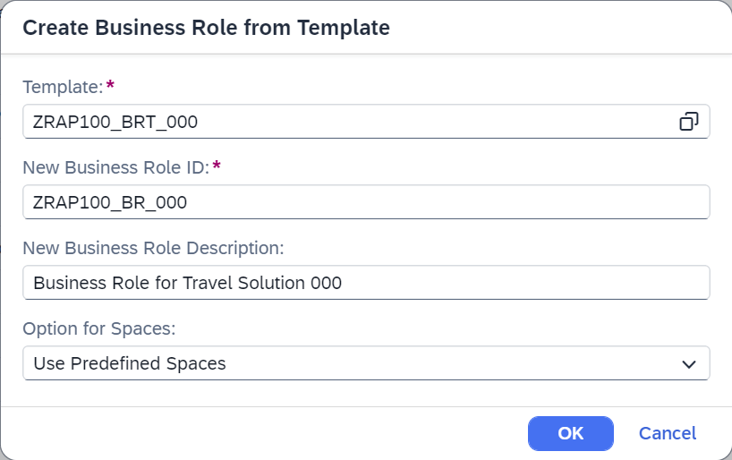

  4. In the business role editor under **General Role Details** > **Access Categories** > **Write, Read, Value Help** set the value **Unrestricted**.

     <!-- border -->
     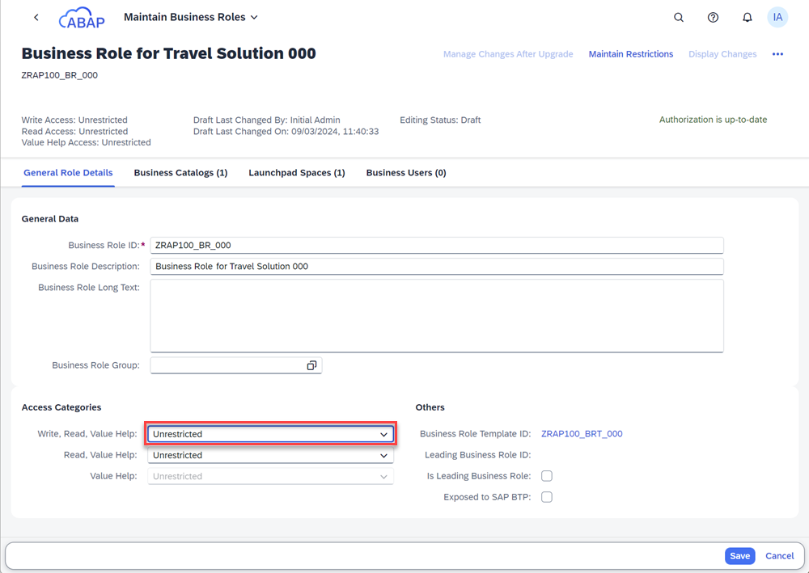

  5. Afterwards switch to the **Business Users** tab, add your user and **Save** the business role.

     <!-- border -->
     

 
### Open predefined space in SAP Fiori launchpad
 
  1. Go to your **Home** screen and select **`Travel ###`**.
   
      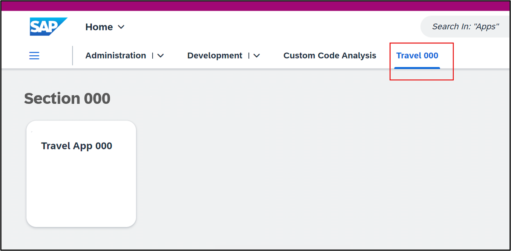

     You can see the page with its section and app now.

### Test yourself


### More Information
Here you can find more information about [Working with Launchpad Page Templates (UIPG)](https://help.sap.com/docs/abap-cloud/abap-development-tools-user-guide/working-with-page-templates-uipg), [Working with Launchpad Space Templates (UIST)](https://help.sap.com/docs/abap-cloud/abap-development-tools-user-guide/working-with-space-templates-uist) and [Scoping Space and Page Templates](https://help.sap.com/docs/sap-btp-abap-environment/abap-environment/scoping-space-and-page-templates).


