# Inspect Your Class in the ABAP Debugger
<!-- description --> Work with ABAP classes in the ABAP Debugger in (ADT) for both a console application and SAP Fiori application.

## Prerequisites
One of the following applies:
- You have completed the **Mission**: [Get Data from a Remote System Using a Custom Entity](mission.abap-env-connect-onpremise) (option: **Mission** below)
- The **`BAPI_EPM_PRODUCT_GET_LIST`** is available in your system (option: **Standalone** below)


## You will learn
  - How to debug an ABAP Console application in ABAP Development Tools (ADT)


## Intro
This tutorial will make you familiar with the relevant tools, whether you are an ABAP newbie, experienced in SAPUI5 development, or an ABAP developer who is new to ADT / SAP Cloud Platform, ABAP Environment.


---


### Open your class

[OPTION BEGIN [Mission]]

Open the class you created previously in the tutorial [Call a Remote Function Module (RFC): Test the Connection to the Remote System](abap-environment-test-rfc) **`ZCL_OUTPUT_TEST_000`**.

[OPTION END]


[OPTION BEGIN [Standalone]]

1. Create an ABAP class.

2. Add the following code:

    ```ABAP
    CLASS ZCL_OUTPUT_TEST_000 DEFINITION
    PUBLIC
    FINAL
    CREATE PUBLIC .

    PUBLIC SECTION.

    INTERFACES if_oo_adt_classrun .
    PROTECTED SECTION.
    PRIVATE SECTION.
    ENDCLASS.


    CLASS ZCL_OUTPUT_TEST_000 IMPLEMENTATION.
    METHOD if_oo_adt_classrun~main.

        DATA lt_products TYPE standard table of bapi_epm_product_header .
    *      DATA lv_max_rows TYPE bapi_epm_max_rows.
        DATA lv_max_rows TYPE int8.
        DATA msg TYPE c LENGTH 255.

        " get products
        CALL FUNCTION 'BAPI_EPM_PRODUCT_GET_LIST'
            DESTINATION 'NONE'

    *        EXPORTING
    *           max_rows =

            TABLES
            headerdata    = lt_products
    *          selparamproductid     = lt_filter_ranges_productid
    *          selparamsuppliernames = lt_filter_ranges_supplier
    *          selparamcategories    = lt_filter_ranges_category
    *          return                = lt_return

            .

        " output list of products or error
        CASE sy-subrc.
            WHEN 0.
                out->write( lt_products ).
            WHEN 1.
                out->write( |EXCEPTION SYSTEM_FAILURE | && msg ).
            WHEN 3.
                out->write( |EXCEPTION OTHERS| ).
            ENDCASE.

    ENDMETHOD.

    ENDCLASS.

    ```

3. Format, save, and activate your class ( `Shift + F1, Ctrl + S, Ctrl + F3` ).
   
[OPTION END]


### Change ABAP Debugger setting to user

1. In the Project Explorer, select your project and choose **Properties** from the context menu.

    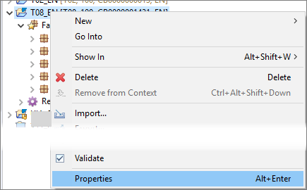

2. Choose  **ABAP Development > Debug**.

3. Change the setting **Breakpoint activation ...** to **User** and enter your logon user.

    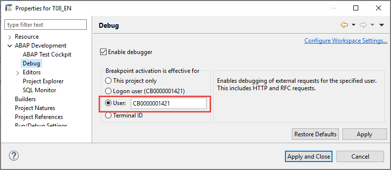

4. Choose **Apply and Close**.
Your class, which includes an RFC request, that is an external request to a different system / project. This enables you to debug the class.

Note that breakpoints in the ABAP Development Tools (ADT) are by default external user breakpoints. For more information, see: [Breakpoints - Characteristics](https://help.sap.com/viewer/5371047f1273405bb46725a417f95433/Cloud/en-US/4ec121276e391014adc9fffe4e204223.html?q=external)


### Add dummy code and breakpoints

1. In your class, right at the start of the method, add some simple code, e.g.

    ```ABAP
    IF 0 = 1.
    ENDIF.
    ```

2. At the statement `IF 0 = 1.`, set a breakpoint by double-clicking the ruler.

    

3. Repeat this - add the same code, then add a breakpoint - right at the end of the code, just before `ENDTRY`.


### Run your application

1. Run your application in the console by choosing **`F9`**.

2. As soon as the first breakpoint is reached, a pop-up window suggests that you switch to the **Debug** perspective. Choose **Switch**.

    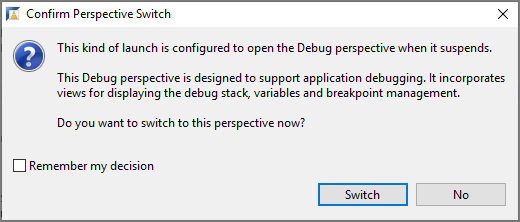

The Debugger perspective opens.

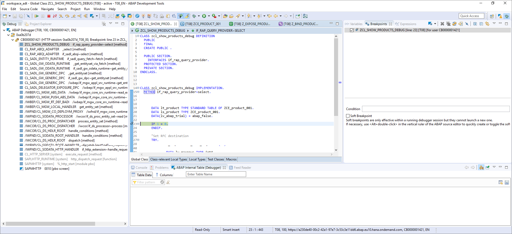


### Add variable to list

1. Switch to the **Variables** tab (to the right of the Class Editor).

2. Add the system field **`SY-TABIX`** to the list, by clicking: **` < Enter Variable > `**

    This field is filled by the runtime system. You can then use them in programs to query the system status.

    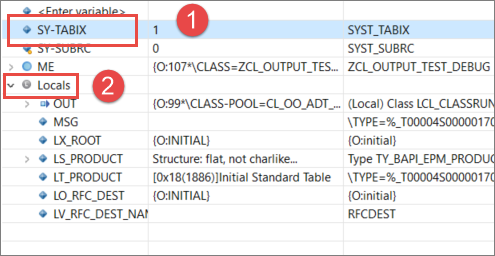

    For a list of system variables, see: [ABAP System Fields](https://help.sap.com/doc/saphelp_nw70ehp3/7.03.19/en-US/7b/fb96c8882811d295a90000e8353423/frameset.htm)

3. Expand **Locals**.

4. Select the internal table **`lt_product`** and choose **Show in Table View** from the context menu.

    

The internal table appears in a new tab in the bottom panel.

    


### Step through the program

1. Switch to the Class Editor. You have 4 options for stepping through the program.

    - Step Into (`F5`)	Execute the next single ABAP instruction in the program in the debugger. Step into a called procedure.

    - Step Over (`F6`)	Execute the next ABAP statement. If the next step is a procedure call, run the entire procedure.

    - Step Return (`F7`)	Run until the current procedure returns to its caller or until the program ends.

    - Run to Line (`Shift F8`)	Run to the statement on which the cursor is positioned.

    


2. Step through the first few lines of the program line by line using **`F5`** - **UNTIL** you get to the statement `DATA(lo_destination) = cl_rfc_destination_provider=>create_by_cloud_destination...`.

3. Since this statement calls a system class, which you **do not** want to debug it. Execute these two `DATA` statements using **`F6`**.

4. When you get to `CALL FUNCTION`, **STOP**.
You cannot execute this remote function in the Debugger, but you cannot debug it. If you choose `F5`, the Debugger will hang. You will have to terminate the Debugger session.
Therefore, simply execute this using `F7`.

Look at the **Table View**. `lt_product` is filled with the data from the BAPI.


However, in the **Variables View**, `ls_product` is still empty. `SY-TABIX` = 25, the total rows in the table imported.

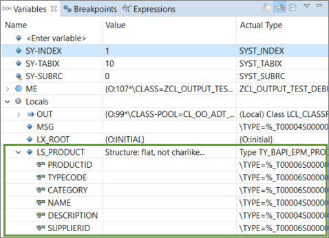


### Step through LOOP statement

1. Proceed until you get to the statement `LOOP AT lt_product INTO ls_product.`.

2. Step through the `LOOP...ENDLOOP.` using `F5`. Note that the variable `SY-TABIX` starts at **1**, then increments by 1 for each loop pass.

3. Exit the Debugger by choosing **Terminate** from the main tool bar.

    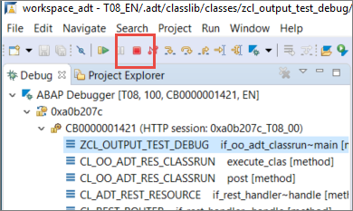


### Set breakpoint for an ABAP statement

To jump straight from your first breakpoint to the `CASE` statement:

1. Choose **Run > ABAP Breakpoints > Add Statement Breakpoint...**

    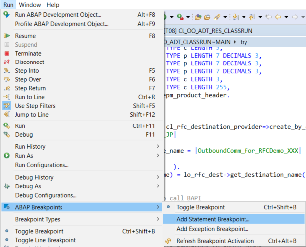

2. Enter `CASE`, keep the setting **Soft Breakpoint** (so that you debug `CASE ` statements only in your own class, not the whole stack), then choose **OK**.

    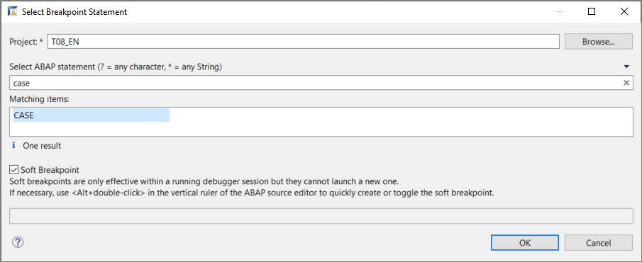

3. Run the Debugger again by choosing `F9`.


### Set `watchpoint` for variable with a condition

You may want to stop, not at a specific statement, but when a variable hits a specific value.
To do this, run the Debugger again and proceed as follows:


1. For clarity, you may wish to deactivate your `CASE` statement breakpoint in the **Breakpoints View**.

    

2. In the **Class Editor**, select the field `ls_product-suppliername` and choose **Set `Watchpoint`** from the context menu.

    

3. In the **Breakpoints View**, choose the `watchpoint` and enter the condition **`LS_PRODUCT-SUPPLIERNAME = 'AVANTEL'`**. Do not forget the single quotation marks.

    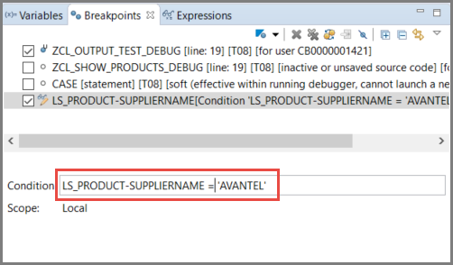  

4. If you switch to the **Variables View**, you can monitor the values of the variable as you step through the loop.

    

5. When the Debugger hits the correct row in the table, it stops.

    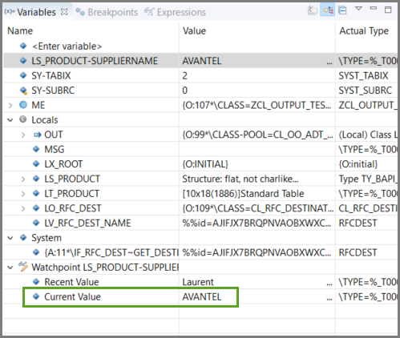

6. When you are satisfied, terminate the Debugger.

You can define a wide range of complex conditions for breakpoints and `watchpoint`. For more information, see [SAP Help Portal: SAP Cloud Platform: ABAP Development User Guide: Adding Conditions to Breakpoints](https://help.sap.com/viewer/5371047f1273405bb46725a417f95433/Cloud/en-US/162f24582b7540d2b1dc05a87b4874da.html)


### Set `watchpoint` for  variable with condition for table row index

You can also specify a specific value for a different variable.

1. Start the Debugger again. Unlike a breakpoint, a `watchpoint` lasts only for the current Debugger session.

2. In the **Class Editor**, select `ls_product-suppliername` and choose **Set `Watchpoint`** again.

    

3. In the **Breakpoints View**, choose the `watchpoint` again. This time, enter the condition `SY-TABIX = 4`.

    

4. When the Debugger hits the correct row in the table, it stops.

    


### Open ABAP Debugger from Fiori Elements Preview

Note: You can only complete this step if you have completed the mission, [Get Data from a Remote System Using a Custom Entity](abap-environment-rfc-custom-entity).

You can now test the class you created in the tutorial [Remote Function Module (RFC) - Get Data from an On-Premise System Using a Custom Entity](abap-environment-rfc-custom-entity), **`ZCL_PRODUCT_VIA_RFC_000`**. you can start the ABAP Debugger for it as follows:

1. Open your custom entity.

2. Open your service binding and choose **Preview**.

    

3. Log in using your ABAP Environment user and password.

    The SAP Fiori elements preview then appears.

4. Display the data by choosing **Go**.

    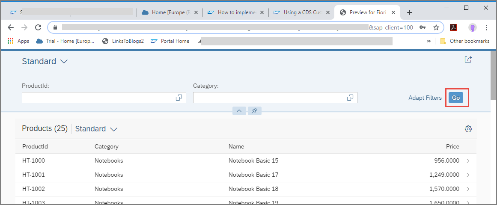

You can also debug your application, displayed in the SAP Fiori elements preview, in the browser. This is  beyond the scope of this tutorial, but for more information, see:

- [SAPUI5: UI Development Toolkit for HTML5: `Walkthrough` : Debugging](https://help.sap.com/doc/saphelp_uiaddon20/2.05/en-US/c9/b0f8cca852443f9b8d3bf8ba5626ab/frameset.htm)
- [Browser Debugging for ABAP Developers](https://help.sap.com/doc/saphelp_uiaddon20/2.05/en-US/c9/b0f8cca852443f9b8d3bf8ba5626ab/frameset.htm)


### Test yourself


### More Information

- [SAP Help Portal: SAP Cloud Platform (Concepts): ABAP Debugger](https://help.sap.com/viewer/5371047f1273405bb46725a417f95433/Cloud/en-US/4ec365a66e391014adc9fffe4e204223.html)
- [SAP Help Portal: SAP Cloud Platform (Tasks): Debugging ABAP Code](https://help.sap.com/viewer/5371047f1273405bb46725a417f95433/Cloud/en-US/4ec33a996e391014adc9fffe4e204223.html)
- [Blog post: Find Errors in Metadata Extensions, by Andre Fischer](https://blogs.sap.com/2020/07/09/how-to-find-errors-in-metadata-extensions-no-item-data-shown-in-object-page/)
- [Use the SAP Gateway Error Log in ADT, by Andre Fischer](https://blogs.sap.com/2020/07/22/how-to-use-the-sap-gateway-error-log-in-adt/)
---
