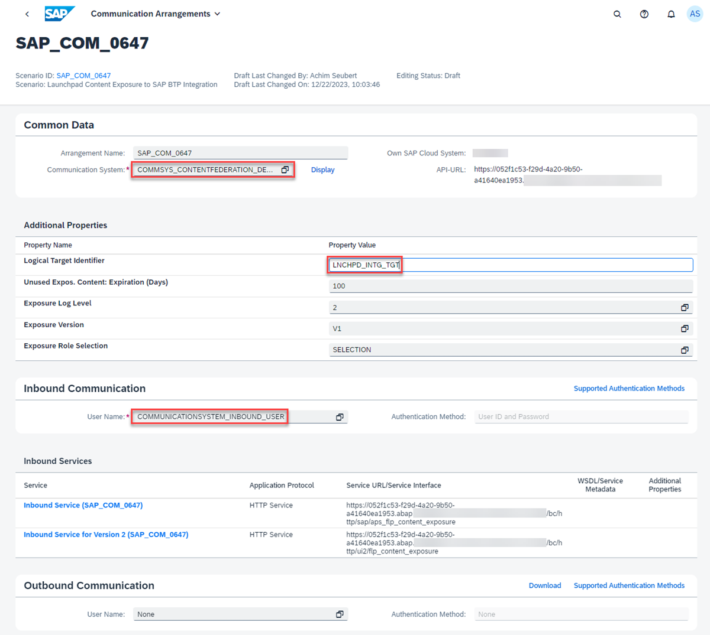
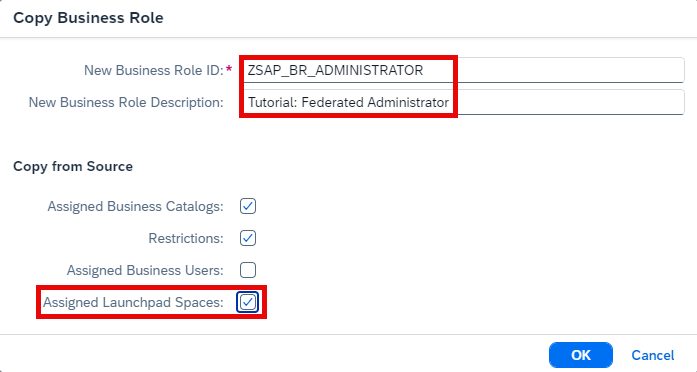
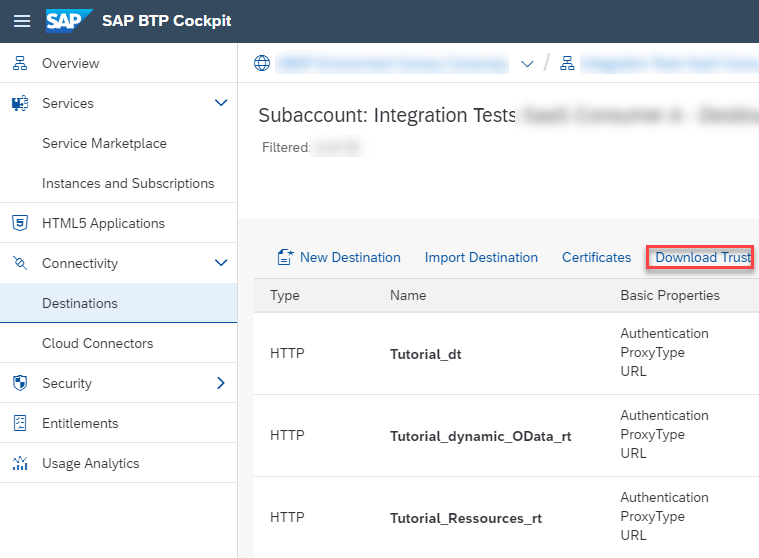
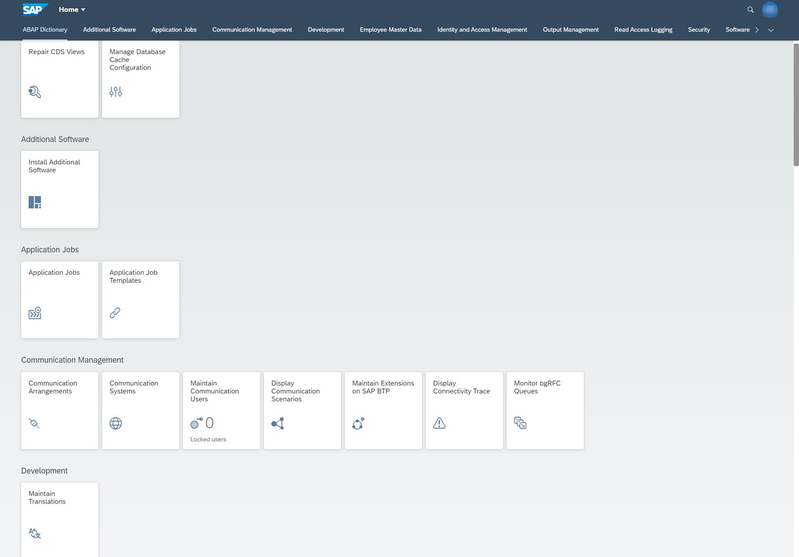

# Set SAP BTP, ABAP Environment as a Content Provider for SAP Build Work Zone, standard edition

<!-- description --> Expose launchpad content of a SAP BTP, ABAP Environment system to the SAP Build Work Zone, standard edition of a subaccount on SAP Business Technology Platform.

## Prerequisites

- You have subscribed to the [SAP Build Work Zone, standard edition](https://help.sap.com/docs/WZ_STD) in the subaccount where the content shall be consumed and your user is assigned to the `Launchpad_Admin` role collection. To subscribe to the SAP Build Work Zone, standard edition and assign the role collection, see ["Set Up the SAP Launchpad Service"](cp-portal-cloud-foundry-getting-started).
- Your user in the SAP BTP, ABAP environment system is assigned to the `SAP_BR_ADMINISTRATOR` role. See [Assigning the ABAP Environment Administrator Role to the New Administrator User](https://help.sap.com/docs/BTP/65de2977205c403bbc107264b8eccf4b/ad888b0ab0a74665a22e0a58ef9e9100.html?version=Cloud).

## You will learn

- How to set up a communication arrangement for communication scenario `SAP_COM_0647`
- How to expose the launchpad content of a business role to the SAP Build Work Zone, standard edition
- How to create the necessary destinations in the SAP BTP subaccount
- How to create a content provider
- How to create a launchpad site and add the exposed content

---

### Create a Communication System

1. Open the `Communication Systems` app from the SAP Fiori Launchpad in your SAP BTP, ABAP environment system.

2. Create a new communication system.

    - System ID and System name: `COMMSYS_CONTENTFEDERATION_DEMO`

    - Host Name: Callback URL, which is needed for setting up content change notifications. For example, for region **EU10**, the URL is `portal-service.cfapps.eu10.hana.ondemand.com`.

    - Port: `443`

    <!-- border -->

3. Add a technical user for inbound communication:

    <!-- border -->

    - Choose authentication method `User Name and Password`.

    <!-- border -->

    - User Name: `COMMUNICATIONSYSTEM_INBOUND_USER`

    - Description: `Inbound user for communication system`

    - Let the system generate a password. Do not forget to note the password for later use in `Step 6` (Create Design-Time destination).

    <!-- border -->

4. Similarly add a technical user for outbound communication with `Authentication Method` `None`.

    <!-- border -->

5. To save the communication system, select `Save`.

### Create the Communication Arrangement

1. Open the `Communication Arrangements` app from the SAP Fiori Launchpad and select `New`.

2. In the `New Communication Arrangement` dialog choose communication scenario `SAP_COM_0647`.

3. Select `Create`.

4. In the `Common Data` section, set the following values

    - Arrangement Name: `SAP_COM_0647`

    - Communication System: `COMMSYS_CONTENTFEDERATION_DEMO`

    - Logical Target Identifier: `LNCHPD_INTG_TGT`

    <!-- border -->

5. Enter the job execution details for scheduling the SAP Fiori Launchpad content exposure job every 10 minutes.

6. Select `Save`.

### Select Roles for Exposure to SAP Build Work Zone, standard edition

1. In the `Maintain Business Roles` app, search for business role ID `SAP_BR_ADMINISTRATOR`.

2. Copy business role `SAP_BR_ADMINISTRATOR` to

    - New Business Role ID: `ZSAP_BR_ADMINISTRATOR`.

    - Description: `Tutorial: Federated Administrator`.

    - Choose: Copy from Source `Assigned Launchpad Spaces`.

    <!-- border -->

    - Choose button `OK`.

3. Mark `Exposed to SAP BTP`.

4. Choose `Save`.

> The content related to the exposed business role, such as groups, catalogs, pages, or spaces, can be consumed by the SAP Build Work Zone, standard edition as soon as the job, which you have configured in the previous step, has run successfully.

### Configure Communication between the SAP BTP Subaccount and the SAP BTP, ABAP Environment System

1. In the SAP BTP cockpit, download the trust certificate of the subaccount runtime destinations by navigating to `Connectivity` > `Destinations`.

2. Select `Download Trust`.

    <!-- border -->

3. Open the `Communication Systems` app from the SAP Fiori launchpad in your SAP BTP, ABAP environment system.

4. Create a new communication system by setting the following values.

    - System ID: `SUBACCOUNT_SYSTEM_COMMUNICATION`

    - System Name: `SUBACCOUNT_SYSTEM_COMMUNICATION`

    - Select `Inbound only`

    - Set `SAML Bearer Assertion Provider` to `ON`

    - Upload the certificate file you downloaded from your subaccount as the Signing Certificate.

    - Enter the value of the certificate's CN attribute as `SAML Bearer Issuer`.

    <!-- border -->

5. To save the communication system, select `Save`.

### Protect Launchpad Content Against Clickjacking

1. Open the `Maintain Protection Allowlists` app from the SAP Fiori launchpad in your SAP BTP, ABAP environment system.

2. On the Clickjacking Protection tab page, choose `Create` to add a new host. On the `Add Trusted Host` screen, enter the following data:

    - Trusted Host Name: `<subdomain>.launchpad.cfapps.<region>.hana.ondemand.com`

    - Schema: `HTTPS`

    - Port: `443`

3. Select `Save`.

### Create the Design-Time Destination

You create a design-time destination to define the location from which the SAP Build Work Zone, standard edition should fetch the exposed content.

1. Navigate to the subaccount in which you have subscribed to the SAP Build Work Zone, standard edition.

2. In the `Connectivity` menu, choose `Destinations`.

3. Create a new destination and fill in the following fields:

    - Name: `Tutorial_dt`

    - Type: `HTTP`

    - Description: `Design-time destination for tutorial`

    - URL: Use the service URL of Service *Inbound Service (`SAP_COM_0647`)* provided in section`Inbound Services` of the communication arrangement created in `Step 2` (Create the Communication Arrangement). Add suffix `entities`.
    >**CAUTION:** *Do not* use the the service URL of the Inbound Service for Version 2.

    <!-- border -->

    - Proxy Type: `Internet`

    - Authentication: `BasicAuthentication`

    - User: `COMMUNICATIONSYSTEM_INBOUND_USER` (Created in `Step 1` (Create a Communication System))

    - Password: Maintain password created in `Step 1` (Create the Communication System).

    The destination should look like this:

    <!-- border -->

4. Select `Save`.

### Create Runtime Destination for Launching Apps in an iFrame

1. Create a new destination and fill in the following fields:

    - Name: `Tutorial_Ressources_rt`

    - Type: `HTTP`

    - Description: `Tutorial: Runtime destination for ressources`

    - URL: Fiori Launchpad URL of the SAP BTP, ABAP environment system without the `/ui` path.
        
        Format: https://<`tenant`>.**`abap-web`**.<`region`>.hana.ondemand.com

    - Proxy Type: `Internet`

    - Authentication: `NoAuthentication`

    - Additional Properties: (Select `New Property` to add new items)

        - HTML5.DynamicDestination: `true`

        - sap-platform: `ABAP`

2. Select `Save`.

Finally the destination should look like this:

<!-- border -->

### Create Runtime Destination for Dynamic OData access

1. Create a new destination.

    - Name: `Tutorial_dynamic_OData_rt`

    - Type: `HTTP`

    - Description: `Tutorial: Dynamic runtime destination for OData access`

    - URL: SAP Fiori Launchpad URL of the SAP BTP, ABAP environment system. Replace `abap-web` with `abap` and remove the `/ui` path.
        
        Format: https://<`tenant`>.**`abap`**.<`region`>.hana.ondemand.com

    - Proxy Type: `Internet`

    - Authentication: `SAMLAssertion`

    - Audience: SAP Fiori Launchpad URL of the SAP BTP, ABAP environment system

    - `AuthnContextClassRef`: `urn:oasis:names:tc:SAML:2.0:ac:classes:PreviousSession`

    - Additional Properties: (Select `New Property` to add new items)

        - HTML5.DynamicDestination: `true`

        - `nameIdFormat`: `urn:oasis:names:tc:SAML:1.1:nameid-format:emailAddress`

2. Select `Save`.

The destination should look like this:

<!-- border -->  

### Create Content Provider

1. Before you create the content provider, make sure the content is available. The content is synchronized every 10 minutes, as configured in step 2. It can take up to one hour until the first synchronization run is scheduled. To check the availability of the content, open the **Display Launchpad Content Exposure Logs** app from the SAP Fiori launchpad in your SAP BTP, ABAP environment system. Once everything has been synchronized successfully, the content is available for consumption.

2. From the subaccount, navigate to `Services` > `Instances and Subscriptions` and search for the `SAP Build Work Zone, standard edition` in the search box

3. Access SAP Build Work Zone, standard edition.

4. Select **Channel Manager**.

5. Create a new content provider.

    <!-- border -->

6. Add title, description, ID, and the destinations created in `Step 6-8` (Create Design-Time / Runtime destination) accordingly:

    - Title: `Tutorial`

    - Description: `Content Provider tutorial`

    - ID: `Tutorial`

    - Design-Time Destinations: `Tutorial_dt`

    - Runtime Destination: `Tutorial_Ressources_rt`

    - Runtime Destination for OData: `Tutorial_dynamic_OData_rt`

    - Automatically add all content items to subaccount: `Off`

    - Use the Identity Provisioning service to provision user authorizations: `Off`

    - Include group and catalog assignments to roles: `Off`

7. Select `Save`.

    The content provider should look like this:

    <!-- border -->

> In the `Status` column of the table the status changes to `Created` as soon as the creation is finished.

### Choose Content in the Content Manager

1. Navigate to the **Content Manager**.

2. Choose the `Content Explorer` button, where all the already created content providers are listed.

3. Choose the content provider you have created in the previous step.

4. Select the `Administrator` content item and choose `Add`.

    <!-- border -->

### Create Launchpad Site

1. Navigate to the Site Directory.

2. Select `Create Site`.

3. Choose a site name and select `Create`.

4. Select `Edit` and move your cursor to the search box to `Search for items to assign`.

    <!-- border -->

5. Choose the `Administrator` role (select `+`).

6. Select `Save`.

7. Copy and store the URL of the launchpad for later use.

    <!-- border -->

> Now you have assigned the business role, that is exposed to the SAP Build Work Zone, standard edition, to your launchpad site. With the business role all apps that are related to this business role will be available on the launchpad site. Also, a role collection is created, which is labeled according to this format: `<Content Provider name>_<Business Role name>`

### Add Role Collection to User

> To access the launchpad site you have to assign the role collection created in the previous step, to your SAP BTP, ABAP environment user in the SAP BTP cockpit.

1. Open the SAP BTP Cockpit and navigate to the subaccount of the SAP Build Work Zone, standard edition.

2. Navigate to the `Users` menu.

3. Search for your user and select it.

4. Choose `Assign Role Collection` in the `Role Collection` section (depending on your window size, you might have to select `...` first).

5. Assign the created role collection `~tutorial_ZSAP_BR_ADMINISTRATOR` to the user.

    <!-- border -->

### Access Launchpad Site

1. With your user, access the launchpad site via the URL stored in `Step 11`.

2. Log off and log on again. This makes sure the newly assigned role collection is taken into account.

The launchpad site should look like this. The groups might be in different order:
<!-- border -->

---
