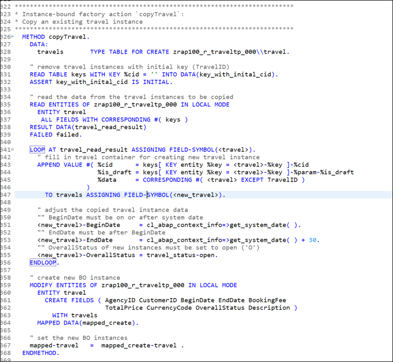
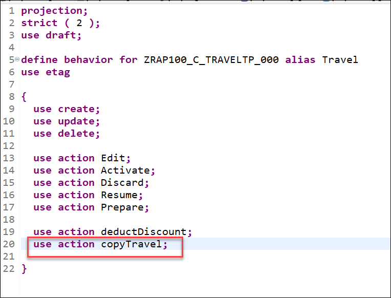
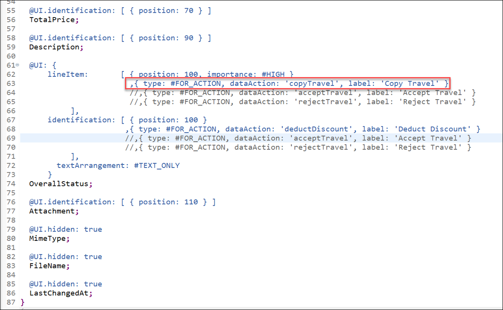
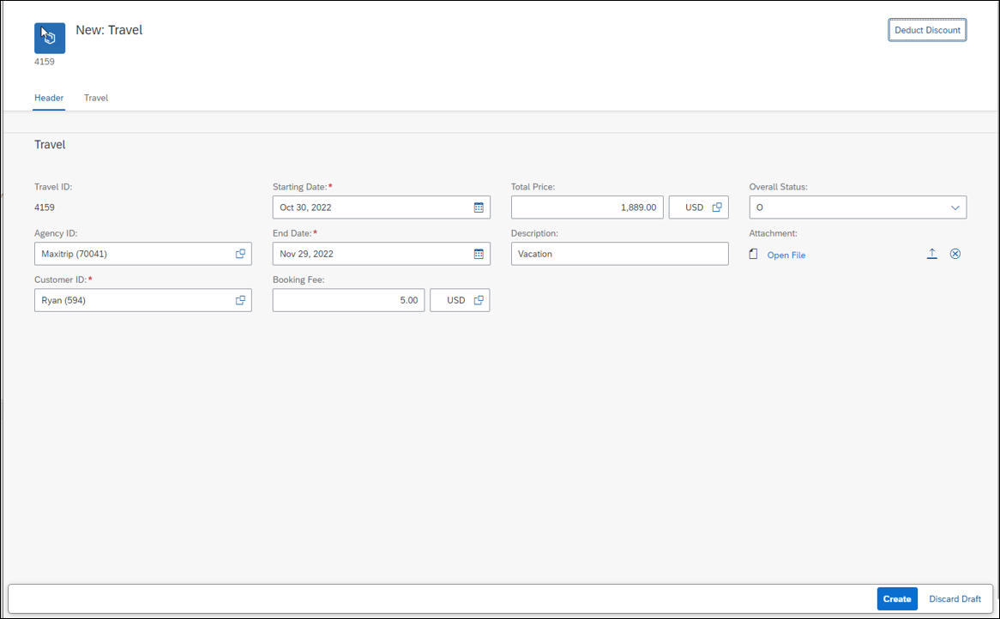
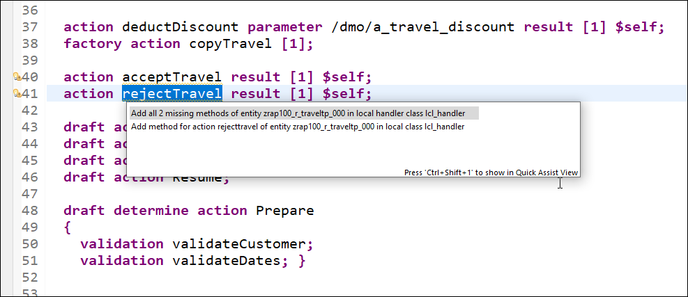
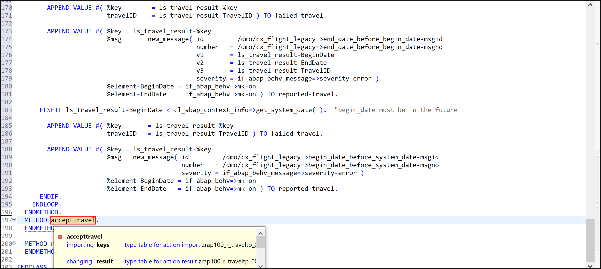
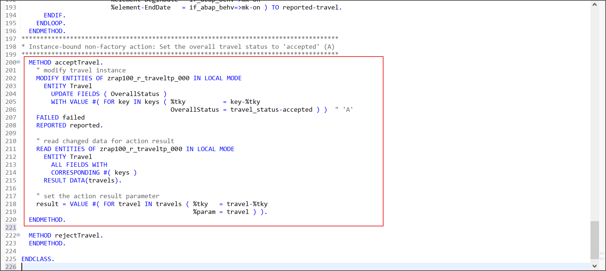
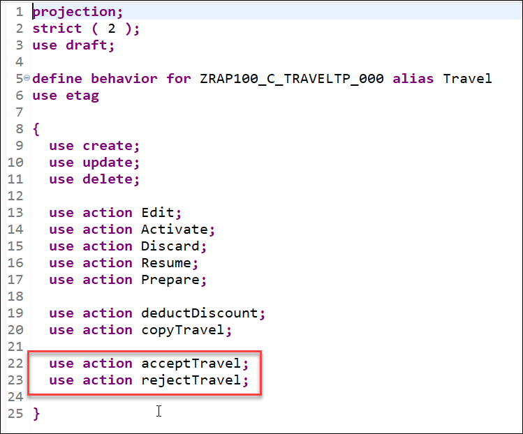
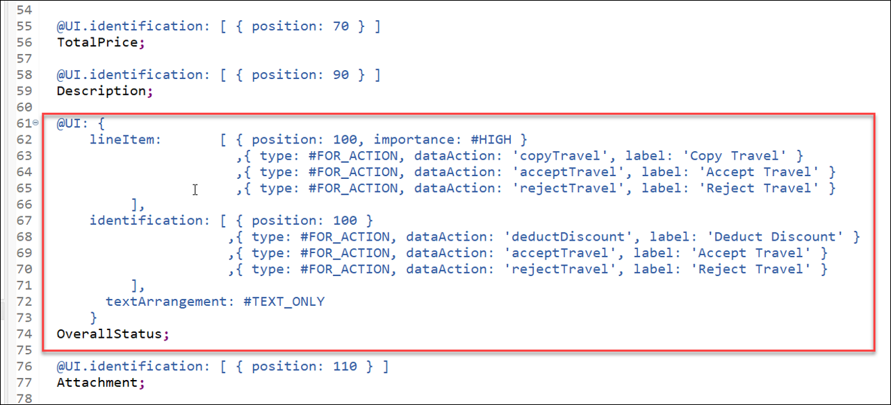

# Enhance the Business Object Behavior With Factory Action
<!-- description --> Enhance the business object behavior using factory action with SAP BTP ABAP environment.

## Prerequisites
- You need to have access to an SAP BTP, ABAP environment, or SAP S/4HANA Cloud, ABAP environment or SAP S/4HANA (release 2022 or higher) system. 
  For example, you can create free [trial user](abap-environment-trial-onboarding) on SAP BTP, ABAP environment.
- You have downloaded and installed the [latest ABAP Development Tools (ADT)] (https://tools.hana.ondemand.com/#abap) on the latest Eclipse© platform.
- You have created an [ABAP Cloud Project](abap-environment-create-abap-cloud-project).
- Make sure, your system has the ABAP flight reference scenario. If your system hasn't this scenario. You can download it [here](https://github.com/SAP-samples/abap-platform-refscen-flight). The trial systems have the flight scenario included.

## You will learn  
  - How to define factory action
  - How to implement factory action
  - How to preview and test enhanced travel app

  In the previous exercise, you've defined and implemented instance action.

  In the present exercise, you will learn how to add factory action.

---

## Intro
>Reminder: Do not forget to replace the suffix placeholder ### with your chosen or assigned group ID in the exercise steps below.
>
>**About: Actions**:
>
> In the RAP context, an action is a non-standard operation that change the data of a BO instance. They are self-implemented operations.   
> Two main categories of actions can be implemented in RAP:
>
> - **Non-factory actions**: Defines a RAP action which offers non-standard behavior. The custom logic must be implemented in the RAP handler method `FOR MODIFY`. An action per default relates to a RAP BO entity instance and changes the state of the instance.  An action is related to an instance by default. If the optional keyword `static` is used, the action is defined as static action. Static actions are not bound to any instance of a RAP BO entity but relate to the complete entity.
>
> - **Factory actions**: Factory actions are used to create RAP BO entity instances. Factory actions can be instance-bound (default) or static. Instance-bound factory actions can copy specific values of an instance. Static factory actions can be used to create instances with `prefilled` default values.
>
> **Further reading**: [Actions](https://help.sap.com/viewer/923180ddb98240829d935862025004d6/Cloud/en-US/83bad707a5a241a2ae93953d81d17a6b.html) **|** [CDS BDL - non-standard operations](https://help.sap.com/doc/abapdocu_cp_index_htm/CLOUD/en-US/index.htm?file=abenbdl_nonstandard.htm) **|** [Implicit Response Parameters](https://help.sap.com/viewer/923180ddb98240829d935862025004d6/Cloud/en-US/aceaf8453d4b4e628aa29aa7dfd7d948.html) **|** [ABAP EML - `response_param`](https://help.sap.com/doc/abapdocu_cp_index_htm/CLOUD/en-US/index.htm?file=abapeml_response.htm)


### Define factory action

Now, you will define, implement, and expose the action `copyTravel`, an instance-bound factory action used to copy one or more travel instances and creates new instances based on the copied data. A new travel ID is assigned to a new travel instance by the unmanaged internal early numbering.

Define the instance factory action `copyTravel` in the behavior definition

 1. Go to the behavior definition  **`ZRAP100_R_TRAVELTP_###`** and insert the following code snippet after the action defined in the previous step.

 2. Add following:
 
    ```ABAP  
    factory action copyTravel [1];
    ```

    The result should look like this:

        

    Short explanation: 

    For factory actions, the same rules apply as for instance non-factory actions with the following differences:
    
      - Instance factory actions are specified with the keyword factory action before its name.
      - Output parameters are not allowed. Factory actions always produce one new BO entity instance with possible child entity instances. It is therefore not necessary to specify the result parameter.
      - The cardinality must always be [1] for factory actions.
      - The result of a factory action is returned in the implicit response parameter mapped by a mapping between the BDEF derived type `%cid` and the key of the newly created entity instance.

    Further information can be found here: [CDS BDL - action, factory](https://help.sap.com/doc/abapdocu_cp_index_htm/CLOUD/en-US/index.htm?file=abenbdl_action_factory.htm)

 2. Save  and activate  the changes.


### Implement factory action

Implement the instance factory action `coyTravel` in the base BO behavior pool.

 1. First declare the required method in the behavior pool. Go to the behavior definition `ZRAP100_R_TRAVELTP_###`, set the cursor on the action name, `copyTravel`, and press Ctrl+1 to open the Quick Assist view. Select the entry Add method for action `copyTravel` of entity `zrap100_r_traveltp_###` in the view to add the required method to the local handler class. The result should look like this:

    

 2. Go to the declaration part of the local handler class of the behavior pool `ZRAP100_BP_TRAVELTP_###`, set the cursor on the method name, `copyTravel`, press F2, and examine the full method interface.

    

 3. Implement the factory action `copyTravel` in the behavior pool class icon `ZRAP100_BP_TRAVELTP_###`. The implementation method of a factory action imports the parameter structure `%param` which has the component `%is_draft`. This component can be used by calling EML APIs to indicates the state of the new instance to be created:
    
    - `%is_draft = 00` : New instance must be created as active instance - i.e., must be persisted.
    - `%is_draft = 01` : New instance must be created as draft instance - i.e., will first be only stored in the draft table.

    The logic consists of the following steps:

      - Remove all travel instances with initial ID and read the data from the transferred travel keys to be copied.
      - Fill in a travel container ( `itab` ) with all the new travel instances to be created. The copied data are adjusted as needed.
         - The component `%param-%is_draft` indicating the state of the new entity have to be evaluated - and the state of the new instances set accordingly.
         - In the present exercise, we will adjust the begin date ( `BeginDate` ) and the end date ( `EndDate` ) due to the implemented validation `validateDates` and set the overall status of new travel instances to Open (O).
      - Create new Travel instances with the EML statement `MODIFY ENTITIES...CREATE` which returns the mapped data.
      - Set the result set in the mapped structure - especially in the internal table mapped-travel for the present example.
      
    For that, replace the current method implementation with the code snippet provided below and replace all occurrences of the placeholder ### with your group ID.

    ```ABAP   
    **************************************************************************
    * Instance-bound factory action `copyTravel`:
    * Copy an existing travel instance
    **************************************************************************
    METHOD copyTravel.
       DATA:
          travels       TYPE TABLE FOR CREATE zrap100_r_traveltp_###\\travel.

       " remove travel instances with initial %cid (i.e., not set by caller API)
       READ TABLE keys WITH KEY %cid = '' INTO DATA(key_with_inital_cid).
       ASSERT key_with_inital_cid IS INITIAL. 

       " read the data from the travel instances to be copied
       READ ENTITIES OF zrap100_r_traveltp_### IN LOCAL MODE
          ENTITY travel
          ALL FIELDS WITH CORRESPONDING #( keys )
       RESULT DATA(travel_read_result)
       FAILED failed.

       LOOP AT travel_read_result ASSIGNING FIELD-SYMBOL(<travel>).
          " fill in travel container for creating new travel instance
          APPEND VALUE #( %cid      = keys[ KEY entity %key = <travel>-%key ]-%cid 
                         %is_draft = keys[ KEY entity %key = <travel>-%key ]-%param-%is_draft
                         %data     = CORRESPONDING #( <travel> EXCEPT TravelID )
                      )
          TO travels ASSIGNING FIELD-SYMBOL(<new_travel>). 

          " adjust the copied travel instance data
          "" BeginDate must be on or after system date
          <new_travel>-BeginDate     = cl_abap_context_info=>get_system_date( ).      
          "" EndDate must be after BeginDate
          <new_travel>-EndDate       = cl_abap_context_info=>get_system_date( ) + 30. 
          "" OverallStatus of new instances must be set to open ('O')
          <new_travel>-OverallStatus = travel_status-open.   
       ENDLOOP.

       " create new BO instance
       MODIFY ENTITIES OF zrap100_r_traveltp_### IN LOCAL MODE
          ENTITY travel
          CREATE FIELDS ( AgencyID CustomerID BeginDate EndDate BookingFee 
                            TotalPrice CurrencyCode OverallStatus Description )
             WITH travels
          MAPPED DATA(mapped_create).

       " set the new BO instances
       mapped-travel   =  mapped_create-travel .
    ENDMETHOD.   
    ```

    The result should look like this:

    

 4. Save  and activate  the changes.


### Expose and test factory action

Expose the instance factory action in the BO behavior projection and in the CDS metadata extension and test the enhance SAP Fiori elements app.

 1. Expose the new action **`copyTravel`** in the BO behavior projection. For that, open your behavior projection  **`ZRAP100_C_TRAVELTP_###`** and insert the following code snippet after the actions added previously.

 2. Add following:
  

    ```ABAP
    use action copyTravel;
    ```

    The result should like this:

    

 2. Save  and activate  the changes.

 3. Enhance UI semantics of the UI service to make the action **`copyTravel`** only visible on the list report page with the label **Copy Travel**. For that, open your CDS metadata extension  **`ZRAP100_C_TRAVELTP_###`** and un-comment following code line in the **`@UI.lineItem`** annotation block placed before the element **`OverallStatus`**.

 4. Add following:
    
    ```ABAP   
    ,{ type: #FOR_ACTION, dataAction: 'copyTravel', label: 'Copy Travel' }
    ```

    The result should look like this:

    

 4. Save  and activate  the changes.

 5. Preview and test the enhanced SAP Fiori elements app. Select a travel instance and choose **Copy**.

      

    An object page with the new travel instance opens.

     

### Add instance actions acceptTravel and rejectTravel (optional)

In this step, you will define, implement, and expose two instance-bound non-factory actions for the Travel entity, `acceptTravel` and `rejectTravel`. These actions will be used to set the overall status of one or more given travel instances to accepted (A) and rejected (X) respectively.

 1. First, define the instance non-factory actions `acceptTravel` and `rejectTravel` in the behavior definition of the travel entity. 
    Go to your behavior definition `ZRAP100_R_TRAVELTP_###` and define both actions.

 2. For that, insert the following code snippet after the defined validations as shown on the screenshot below.

    ```ABAP
    action acceptTravel result [1] $self;
    action rejectTravel result [1] $self; 
    ```

    The result should like this:

    

 2. Save  and activate  the changes.

 3. Now, declare the required method in behavior implementation class with the ADT Quick Fix. Set the cursor on one of the action names, `acceptTravel` or `rejectTravel`, and press Ctrl+1 to open the Quick Assist view. Select the entry **Add all 2 missing methods of entity `zrap100_r_traveltp_###`**  to add both methods to the `local handler class lcl_travel` of the behavior pool `ZRAP100_BP_TRAVELTP_###`.

    The result should look like this: 

    

    You are through with the definition of both actions. Go ahead with the implementations of the two inserted method in the behavior pool.


### Implement action methods (optional)

Now implement the required action methods in the behavior pool `ZRAP100_BP_TRAVELTP_###` of the travel entity. 

 1. You can check the interfaces of the methods `acceptTravel` and `rejectTravel` in the declaration part of the local handler class in the behavior pool `ZRAP100_BP_TRAVELTP_###`. They are similar to the one of the action method `deductDiscount`. For that, set the cursor on one of the method name, press F2 to open the ABAP Element Info view, and examine the full method interface.

    

    Go ahead with the implementation.

 2. Implement the action `acceptTravel` in the implementation part of the local handler class. The action is used to set the value of the field `OverallStatus` to accepted (A).

    The logic consists of the following steps:

     - Implement the custom logic to determine the new values; Accepted (A) in the present scenario.
     - Modify the relevant fields of the travel instances; here only the field `OverallStatus` must be updated.
     - Read the whole data of the updated instances from the buffer to fill the action result parameter.

    For that, replace the current method implementation with the code snippet provided below and replace all occurrences of the placeholder ### with your group ID. You can make use of the F1 Help for more information about the EML statements and other ABAP constructs.

    ```ABAP
    *************************************************************************************
    * Instance-bound non-factory action: Set the overall travel status to 'A' (accepted)
    *************************************************************************************
    METHOD acceptTravel.
       " modify travel instance
       MODIFY ENTITIES OF zrap100_r_traveltp_### IN LOCAL MODE
          ENTITY Travel
          UPDATE FIELDS ( OverallStatus )
          WITH VALUE #( FOR key IN keys ( %tky          = key-%tky
                                           OverallStatus = travel_status-accepted ) )  " 'A'
       FAILED failed
       REPORTED reported.
 
       " read changed data for action result
       READ ENTITIES OF zrap100_r_traveltp_### IN LOCAL MODE
          ENTITY Travel
          ALL FIELDS WITH
          CORRESPONDING #( keys )
          RESULT DATA(travels).

       " set the action result parameter
       result = VALUE #( FOR travel IN travels ( %tky   = travel-%tky
                                                %param = travel ) ).
    ENDMETHOD.
    ```

    

    Short explanation:

     - The provided implementation is mass-enabled. This is recommended.
     - The EML statement `MODIFY ENTITIES ... UPDATE FIELDS` is used to update specific fields of the instances.
     - The internal tables are filled inline using the constructor operator VALUE which made the need for explicit declaration obsolete.
     - The EML statement `READ ENTITIES ... ALL FIELDS WITH CORRESPONDING` is used to read all fields of the updated instances from the buffer to fill the input paramter result.

 3. Implement the action `rejectTravel` which is used to set the value of the field `OverallStatus` to rejected (X). The business logic is similar to the one of the `acceptTravel` method. For that, replace the current method implementation with the code snippet provided below and replace all occurrences of the placeholder ### with your group ID.

    ```ABAP
    *************************************************************************************
    * Instance-bound non-factory action: Set the overall travel status to 'X' (rejected)
    *************************************************************************************
    METHOD rejectTravel.
       " modify travel instance(s)
       MODIFY ENTITIES OF zrap100_r_traveltp_### IN LOCAL MODE
          ENTITY Travel
          UPDATE FIELDS ( OverallStatus )
          WITH VALUE #( FOR key IN keys ( %tky          = key-%tky
                                           OverallStatus = travel_status-rejected ) )  " 'X'
       FAILED failed
       REPORTED reported.

       " read changed data for action result
       READ ENTITIES OF zrap100_r_traveltp_### IN LOCAL MODE
          ENTITY Travel
          ALL FIELDS WITH
          CORRESPONDING #( keys )
          RESULT DATA(travels).

       " set the action result parameter
       result = VALUE #( FOR travel IN travels ( %tky   = travel-%tky
                                                %param = travel ) ).
    ENDMETHOD.   
    ```

    

 4. Save  and activate  the changes.


### Expose and test actions (optional)

Now, you will expose the actions in the BO behavior projection and enrich the UI semantics in the CDS metadata extension to add appropriate button to the travel app.

 1. Expose the actions in the BO behavior projection.

    Go to your behavior projection `ZRAP100_C_TRAVELTP_###` and insert the following code snippet as shown on the screenshot below.

    ```ABAP
    use action acceptTravel;
    use action rejectTravel; 
    ```

    Your source code should look like this:

      

 2. Save  and activate  the changes. 

    The actions are yet ready to be consumed on the UI, but they also need to be explicitly placed on the UI.

 3. Enhance UI semantics of the UI service to make the actions visible on the list report page and the object page; with the labels accept travel and reject travel specified.

    For that, go to your CDS metadata extension `ZRAP100_C_TRAVELTP_###` and uncomment the relevant code lines in the `@UI annotations` block placed before the element `OverallStatus` as shown on the screenshot below.

       

 4. Save  and activate  the changes. 

 5. You can now preview and test your enhanced SAP Fiori elements app. The actions should now appear on the UI.

    For example, select a travel record with the overall status open and press on the action button accept travel or reject travel. The overall status should now be accepted or rejected.
    
      


### Test yourself 


---
