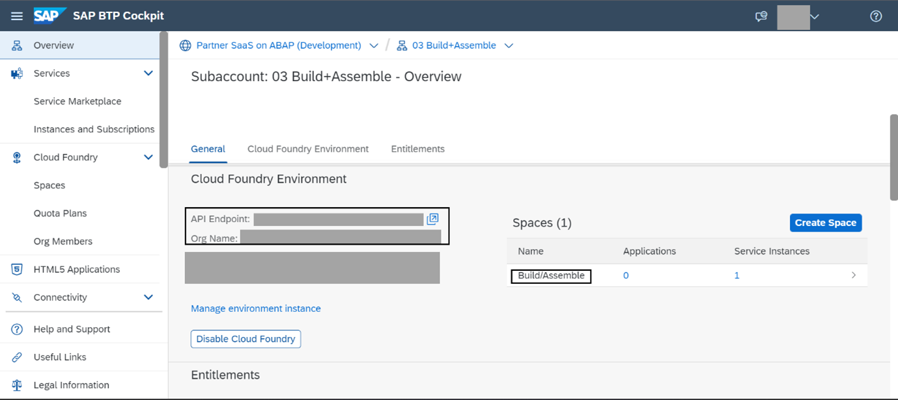
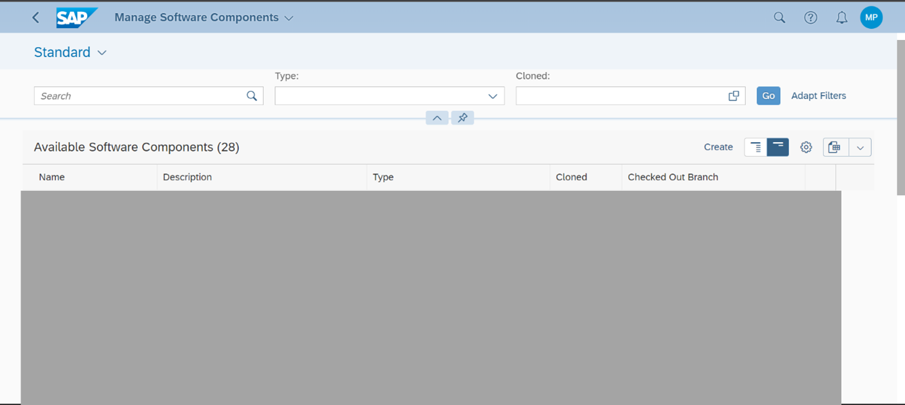
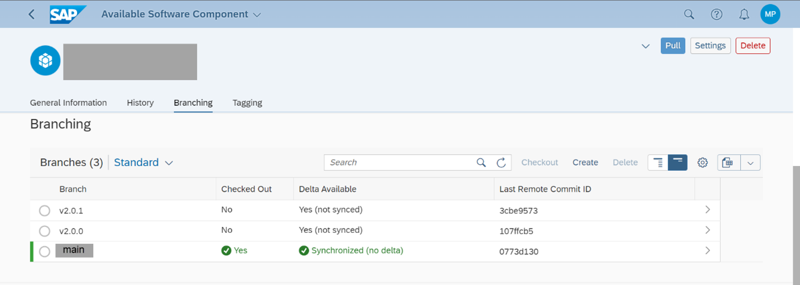
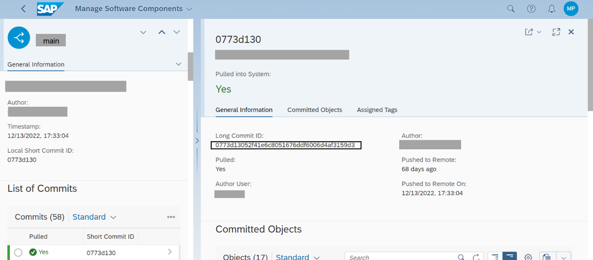
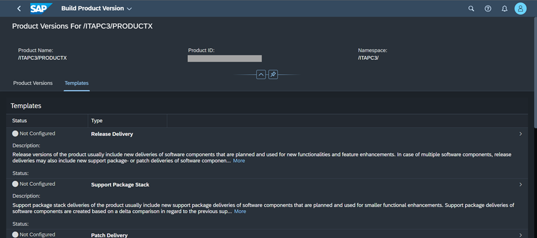
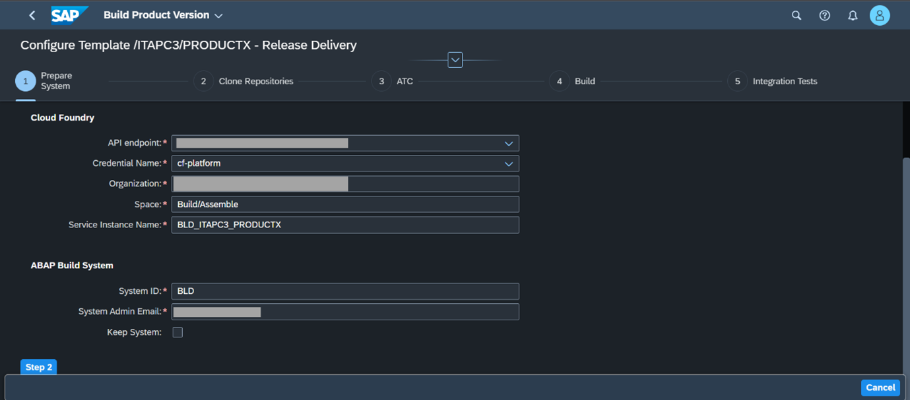
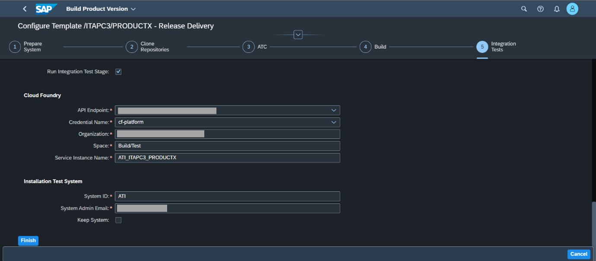
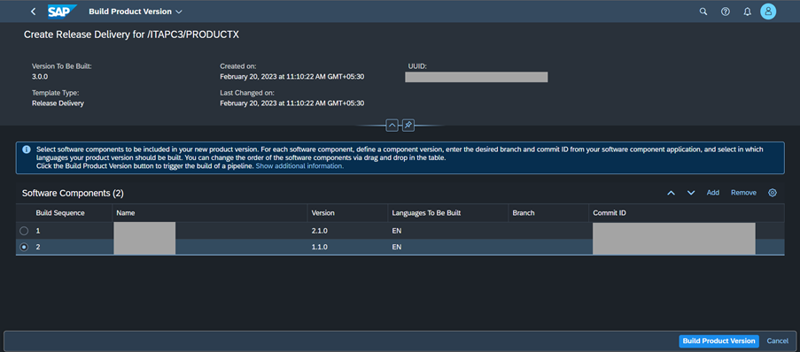

# Build the First Version of Your Add-On Product

## You will learn

- How to gather necessary information to configure your build parameters
- How to build your first add-on product
- How to troubleshoot errors during an add-on build

## Prerequisites

 -The Landscape Portal Application has been subscribed to and your user has the landscape portal admin role collection assigned
-Entitlements for the CI/CD service in the sub-account where the landscape portal application is subscribed

## Intro

<!-- description --> How to trigger an add-on build using the landscape portal, Bonus - How to troubleshoot errors.

---

### Step 1:Gather necessary information to configure your build parameters

1.Get the “orgname”, “apiendpoint” and “space” for the subaccount 03 Build/Assemble
  a>As an authorized BTP Cockpit user, navigate to the sub-account 03 Build/Assemble in the Global Account for Development
  b>Navigate to the overview section using the menu
  c>Note the “API Endpoint”, “Org Name” and the “Space” where you wish for your systems to be created. We shall use this information while configuring our build parameters

2.Get the “orgname”, “apiendpoint” and “space” for the subaccount 04 Build/Test
  a>As an authorized BTP Cockpit user, navigate to the sub-account 04 Build/Test in the Global Account for Development
  b>Navigate to the overview section using the menu
  c>Note the “API Endpoint”, “Org Name” and the “Space” where you wish for your systems to be created. We shall use this information while configuring our build parameters

3.Get the relevant CommitID for the software components involved in the build
  a>As Administrator of the development system where the code for the add-on is developed, open the “Manage Software Components” application from the Fiori Launchpad.
  b>Find your software component from the list of software components populated

  c>Open the entry for your software component and navigate to the “Branching” section

  d>Navigate to the branch where you are developing (say main) to see the list of commits. The “Message” column provides details of the transport request contained in the commit. Identify the commit based on which you wish to build your add-on product

  

  e>Open the entry for the chosen commit to see the Long Commit ID. We will use this while configuring our build parameters.

  

  f>In case you have more than 1 software component in your product, repeat above steps to identify the Long Commit ID for all involved software components.

### Step 2: Create a template for release build

1.As Landscape Portal Administrator, open the “Build Product Version” application of the landscape portal
  

2.Find your product in the list of products displayed and open the entry for it
3.Under the template section, configure release delivery. You could also configure a template for support package or patch delivery for future updates.

4.Configure parameters based on information collected earlier
  a>Configure parameters for the “Prepare System” phase.
  The API endpoint, Organization and Space are as per information collected from the sub-account 03 Build/Assemble
  The Credential Name is the name provided while maintaining credentials for the cloud foundry platform user in the previous tutorial of this group.
  The “Keep System” checkbox can be used to configure if the system shall be deleted after the build or kept alive.

> Note: Keeping the system alive helps in diagnosing issues faced during a build but could incur additional costs (entitlements locked for the system)

  

  b>Configure parameters for Clone, ATC and Build stages as per following screenshots

  

  

  

  c>Configure the “Integration Tests” stage like the “Prepare System” stage but with details of the sub-account 04 Build/Test

  

### Step 3: Configure software components and build a new version of the add-on product

1.Open your product in the “Build Product Version” Application of the Landscape Portal
2.Click the Create button and select Release Delivery (or Support Package/Patch if you are delivering one of these).

## Note: The “Support Package Stack” and “Patch Delivery” buttons are only enabled if templates are maintained for them

![Release Delivery] (ReleaseDelivery.png)

3.Add the software components relevant for your product with suitable commit IDs as identified in Step 1

4.Click “Build Product Version” to start the build

### Step 4: Monitor your build and troubleshoot errors

1.Open the “Build Product Version” application of the Landscape Portal and navigate to your product. Under the “Product Versions” section, you could see the status of the build

2.For more detailed logs, open the entry for the version you are building. This lists logs for various steps of the add-on build pipeline. Use these logs to diagnose errors that may arise during your builds

