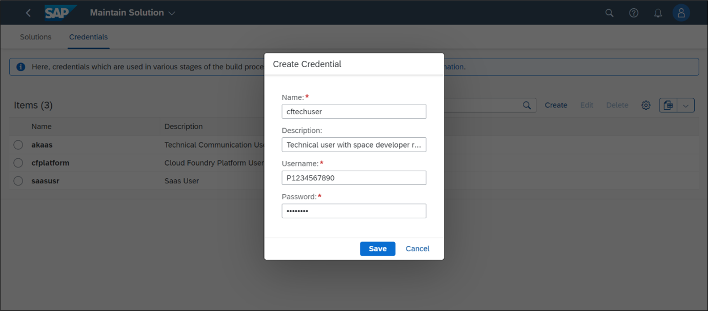
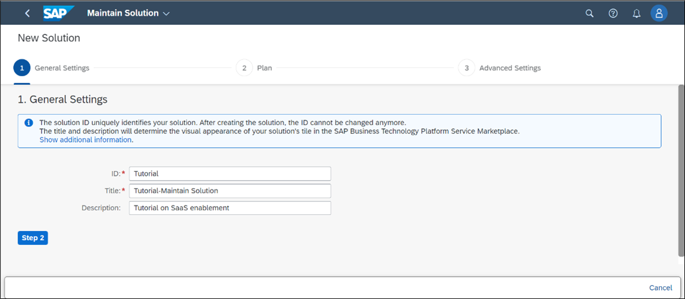
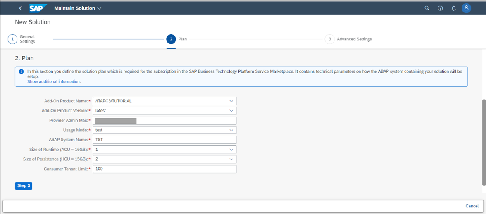
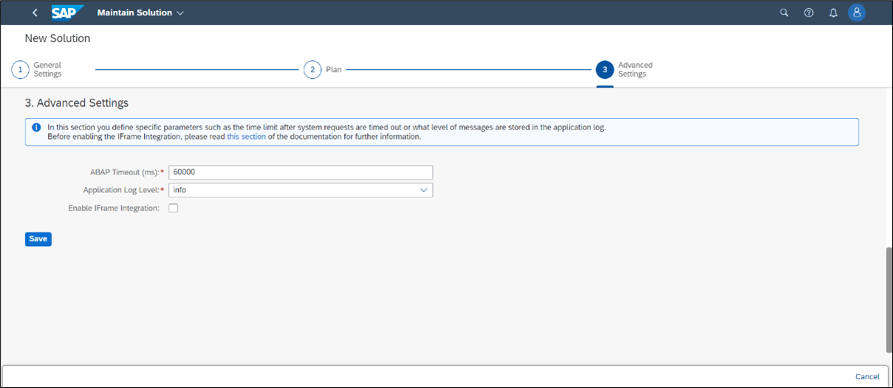
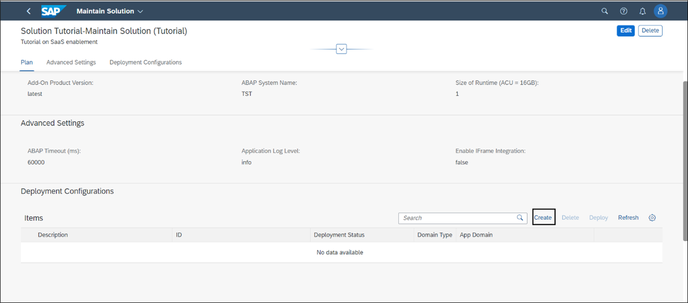
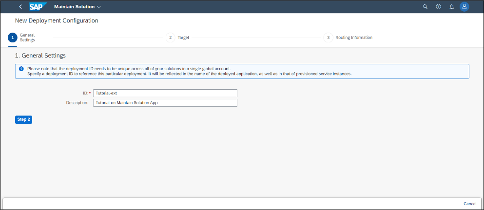
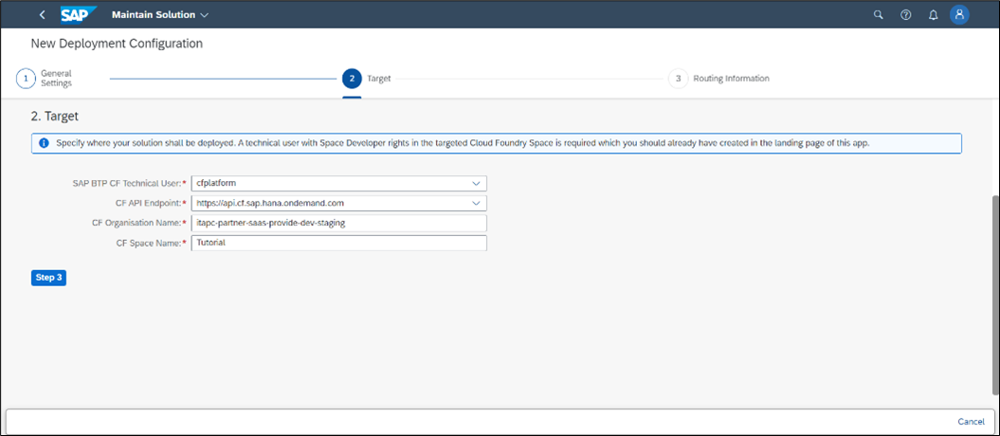
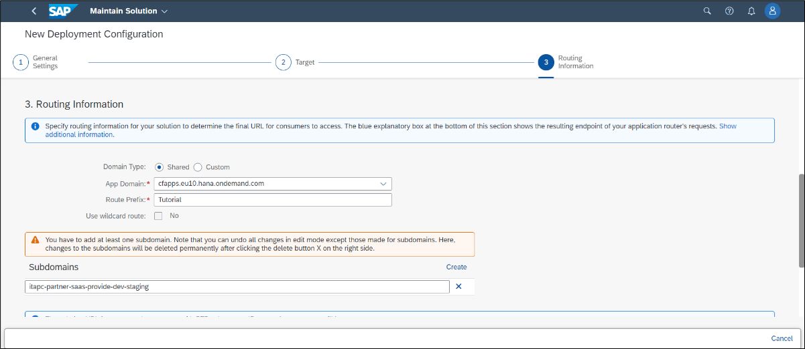
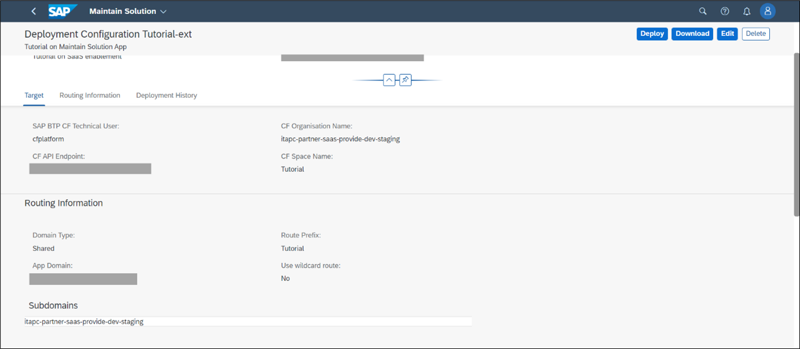
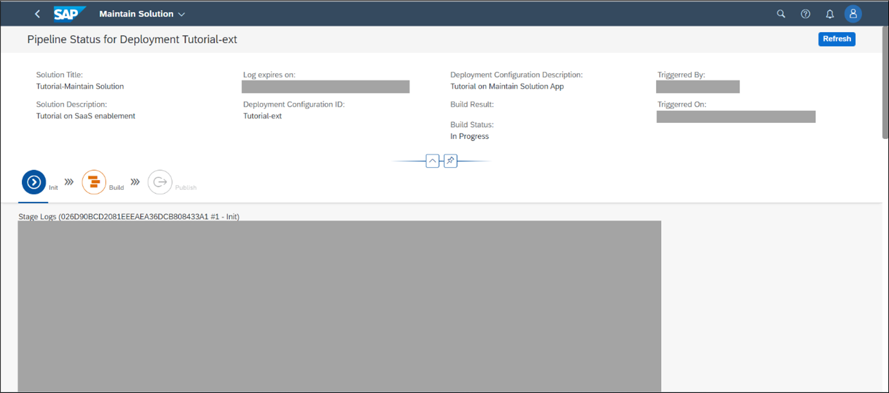

# Enable an Add-on Product for SaaS Subscription With Standard Configuration Using the Maintain Solution Application

<!-- description --> The Maintain Solution App guides you - as a provider through the SaaS solution configuration process. It also enables you to trigger and monitor the deployment of your SaaS solution

## Prerequisites

- Landscape Portal Admin role assigned to your user.
- A space in your provider subaccount. This is the space that your solution will be deployed to.
- You have created a technical user (email address) that has the Space Developer role assigned to it in the space created in the provider subaccount. This technical user needs to be available in SAP ID provider. This user will be used for the deployment.

## You will learn

- How to enable an add-on product for SaaS subscription with standard configuration using the Maintain Solution application of the Landscape Portal

---

### Understand the Maintain Solution Application

Once you have created your product and built a new product version using the Build Product Version app, you can use the Maintain Solution app.

The Maintain Solution app allows:

- Creation and maintenance of the necessary configuration settings for your SaaS solution.
- Configuration of deployment settings of the solution
- Triggering the deployment of your solution to SAP BTP Cloud Foundry so that your consumers can subscribe to it.

At the end of this process, your consumers will be able to subscribe to your SaaS solution.

Learn more about the Maintain Solution app [here](https://help.sap.com/docs/btp/sap-business-technology-platform/maintain-solution)

The following figure shows the steps to be followed.

### Maintain Credentials to be Used During Deployment

To maintain credentials to be used during deployment:

1. Log in to the Landscape Portal from the Business Technology Platform cockpit.
2. Under Solution, click on the Maintain Solution tile to open the app.
3. Switch to the "Credentials" tab.
4. In the Credentials table, you can view all your existing credentials.
    - To edit an existing credential, select it and click the Edit button.
    - To create a new credential, click the Create button.

5. Fill in the required information with the credentials of the technical user that has the Space Developer role assigned to it as created in the pre-requisites.

6. Save your changes.

### Create a Solution

To create a solution:

1. In the Solutions tab, click the Create button.

2. Fill in the data. There are three steps to this process. Learn more details around identifying values for the various parameters [here](https://help.sap.com/docs/btp/sap-business-technology-platform/solutions)

    a. General Settings - This step covers the visual representation of your solution

    b. Solution Plan - Here, you specify the technical parameters on how the ABAP system containing your solution will be set up.

    c. Advanced Settings – This covers the ABAP endpoint timeout, Application log level and an option to incorporate your solution into the Fiori Launchpad of SAP Build Work Zone.

3. Click Save to save your solution

### Create a Deployment Configuration For Your Solution

To Create a deployment configuration for the solution:

1. At the bottom of the solution object page, we have the Deployment Configurations table. Click the Create button on the right.

2. You are now guided through the process of setting all necessary parameter values. Please fill in the necessary data. There are three steps to this process. Learn more details around identifying values for the various parameters [here](https://help.sap.com/docs/btp/sap-business-technology-platform/credentials)

    a. General Settings - Unique ID for the deployment along with an optional description
    

    b. Target - Specify where your solution shall be deployed. Note that the technical user with Space Developer rights in the targeted Cloud Foundry space is required. You should have already created this user in the Credentials tab (Refer step 2 -"Maintain Credentials to be used during deployment")
    

    c. Routing information - in this step you specify the routing information for your solution to determine the final URL for consumers to access.  The subdomain can be identified from the overview page of your subaccount in the BTP Cockpit.
    

3. Save to complete the process.

### Deploy your Solution and Monitor the Deployment

To deploy the solution and monitor the deployment:

1. Click the Deploy Button to start the deployment

2. The deployment should start in some time. The logs and status of the deployment can be monitored. Click on the icons(Init,Build,Publish) to jump to the respective sections of the log
    - If an icon is grey: There is no information available.
    - If an icon is yellow: The step is currently in progress.
    - If an icon is red: There is an error. Scan the log to find more information on the error.
    - If an icon is blue: The step was completed successfully.

> NOTE:The logs will be deleted after 28 days

### Test yourself

---
