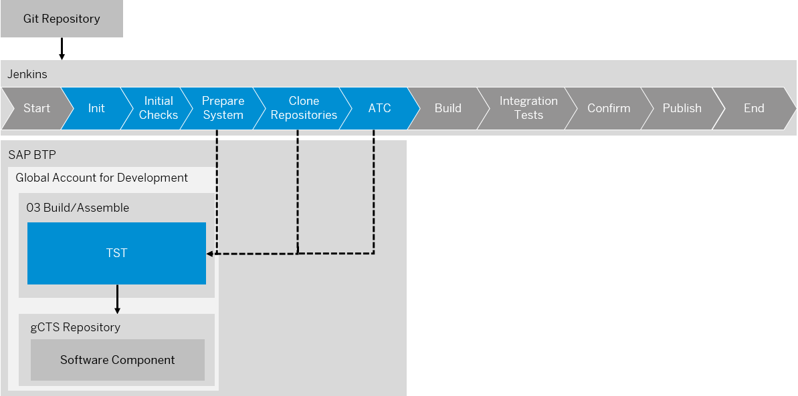
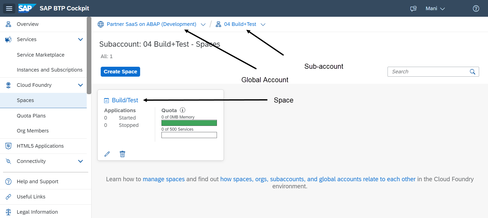
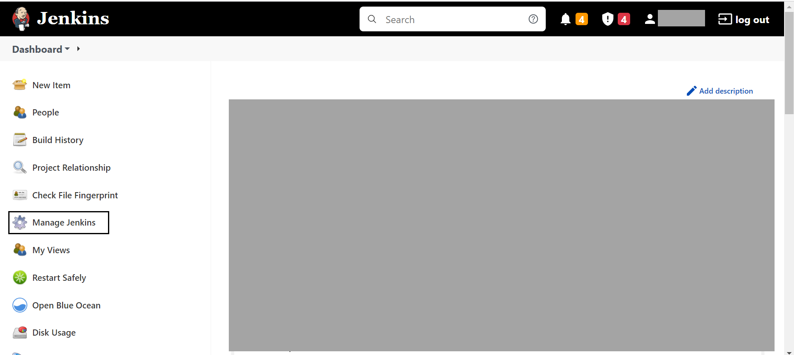
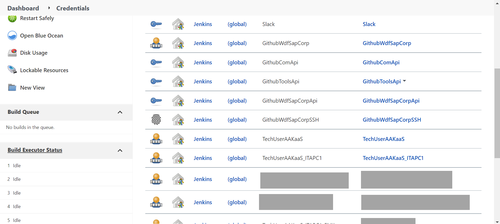
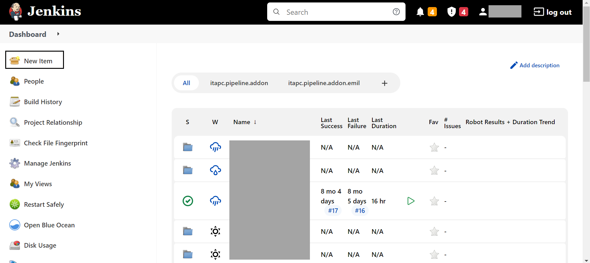
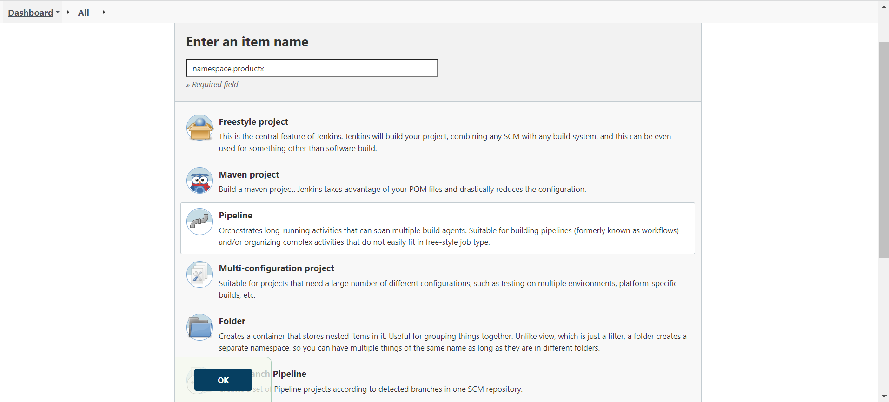
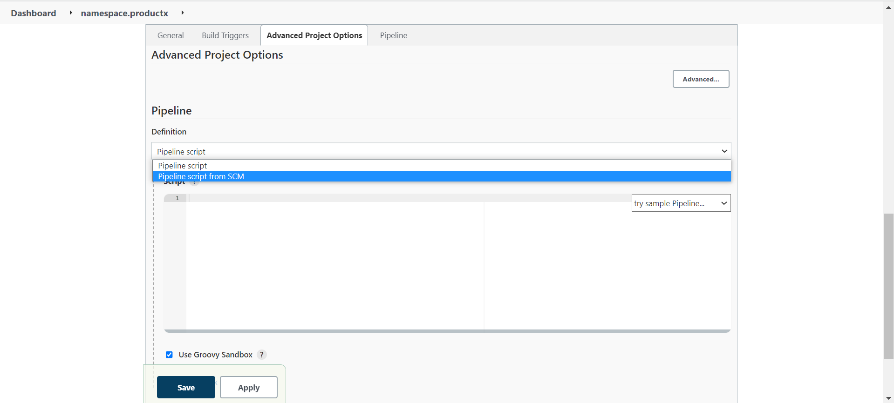
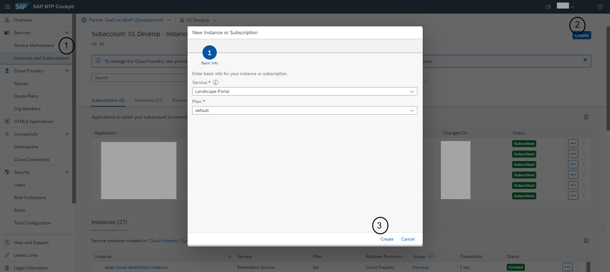
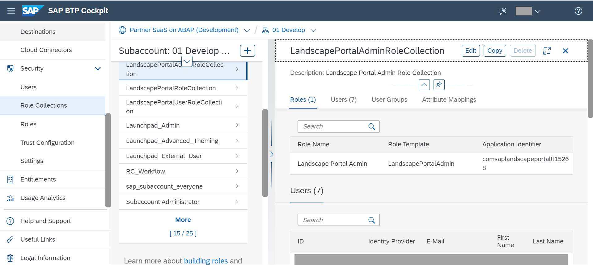
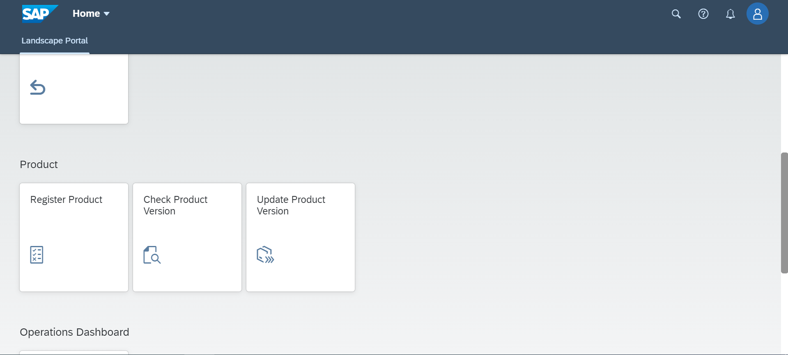

# Create Users with Suitable Roles to Build Your Add-on Product
<!-- description --> Overview of user roles and configurations needed to build an add-on product on SAP BTP, ABAP Environment

## Prerequisites

- For the add-on build, set up a Jenkins CI/CD server using the [CX server](https://www.project-piper.io/infrastructure/overview/#cx-server-recommended)
- You need an [S-user in SAP One Support Launchpad](https://launchpad.support.sap.com/#/notes/1271482) with user management authorization
- Entitlements for the Landscape Portal application
- A Git repository is created and a user with read access is available

## You will learn

- How to configure users required for setting up an add-on build pipeline
- How to register an add-on for use in a global account

---

### Overview of user setup and add-on product registration

**Add Technical Platform User to Space in Subaccount 03 Build/Assemble:**

To trigger a import in the assembly system, communication scenario SAP\_COM\_0510 is used.
To trigger the build process in assembly system, communication scenario SAP\_COM\_0582 is used.
The credentials for these 2 scenarios is retrieved by creating a service key in the system.

As operator, assign a technical Cloud Foundry platform user as a space developer in subaccount 03 Build/Assemble.  Later, this user's credentials are stored in the Jenkins credentials and used to create service key.

**Add Technical Platform User to Space in Subaccount 04 Build/Test:**

For the add-on installation test, a test system is created in the space in subaccount 04 Build/Test

As an operator, assign a technical Cloud Foundry platform user as a space developer in the space in subaccount 04 Build/Test. Later, this user's credentials are stored in the Jenkins credentials and used similar to earlier step in Build/Assemble

**Create a Technical Communication User for Access to the Add-on Assembly Kit as a Service(`AAKaaS`):**

As part of the add-on build process, the Add-on Assembly Kit is used. With `AAKaaS`, the on-premise tooling is now available as a cloud service that is used by the build pipeline.
To access the service that is offered via SAP Support Launchpad, a [technical communication user](https://launchpad.support.sap.com/#/notes/2532813) is used. [Create such a technical communication user](https://launchpad.support.sap.com/#/notes/2174416)

**Add technical communication user created above to Jenkins credentials store:**

Finally, as a Jenkins administrator, add the credentials of the technical communication user to the Jenkins Credentials store

**Register Add-On Product for Installation in Global Accounts:**

The registration of a new add-on product is a manual step. Your add-on product should only be installed in ABAP systems in your global accounts for development and production. Therefore, the product needs to be created and global accounts need to be registered with SAP using the Landscape Portal application "Register Product"

### Add Technical Platform User to space for assembly

As BTP Cockpit administrator(operator), to add a technical platform user to the space which shall contain the system for assembly,

1. Navigate to the global account for development

2. Navigate to the sub-account 03 Build/Assemble -> Cloud Foundry -> Spaces -> Build/Assemble

3. Within the space, navigate to Members->Add Members

4. Specify the email ID of the technical platform user and ensure the checkbox for space developer role is selected

5. Click OK

### Add Technical Platform User to space for test

Repeat the steps from Step 2 for the sub-account 04 Build/Test and the Build/Test space. This will authenticate the technical platform user to create the system for add-on installation test.  

As BTP Cockpit administrator(operator), to add a technical platform user to the space which shall contain the system for add-on installation test,

1. Navigate to the global account for development

2. Navigate to the sub-account 04 Build/Test -> Cloud Foundry -> Spaces -> Build/Test

3. Within the space, navigate to Members->Add Members

4. Specify the email ID of the technical platform user and ensure the checkbox for space developer role is selected

5. Click OK

### Add users to Jenkins Credentials Store

In order to add the required users to the Jenkins Credentials Store, as *Jenkins Administrator*.

1. In the Jenkins dashboard, navigate  to "Manage Jenkins"

2. In the Manage Jenkins section, navigate to the security section

3. Use the manage credentials option to maintain the following users:

- Technical CF Platform User(s) maintained in the steps, "Add Technical Platform User to space for assembly" and
 "Add Technical Platform User to space for test"
- Technical communication user created in the "Overview of user setup and add-on product registration" step

### Create a Jenkins Pipeline

In order to build the add-on product, create a new Jenkins pipeline as *Jenkins Administrator*.

1. From the Jenkins Dashboard, select "New Item"

2. Provide a unique name to the item and select "pipeline" as the type. Click OK

3. Scroll to the pipeline settings under "Advanced Project Options" and select "pipeline script from SCM" from the dropdown. This enables the settings to be picked from a source code management repository such as from GitHub

4. Set SCM to "Git" and add your git repository URL  

5. Configure credentials to access the repository with a user that has read access.

> We shall configure different files of this GitHub repository in the next tutorial of this group. The linkage established by this step allows the pipeline to read content from configurations in various files of the repository

### Register add-on product for installation in global accounts

To register an add-on for installation in a global account,

1. As subaccount administrator of the 01 Develop sub-account, subscribe to the Landscape Portal application. Ensure you have enough entitlements in the sub-account for this step

2. As security administrator of the 01 Develop sub-account, add the `LandscapePortalAdminRoleCollection` to your user

3. Launch the Landscape Portal by finding it in the "Instances and Subscriptions" section

4. Open the "Register Product" application

5. Find your product in the list or create a new product if your add-on product name (example: /NAMESPC/PRODUCTX) does not exist in the list

6. Open the product details by clicking on the product name

7. Click Register.

### Test Yourself

---
