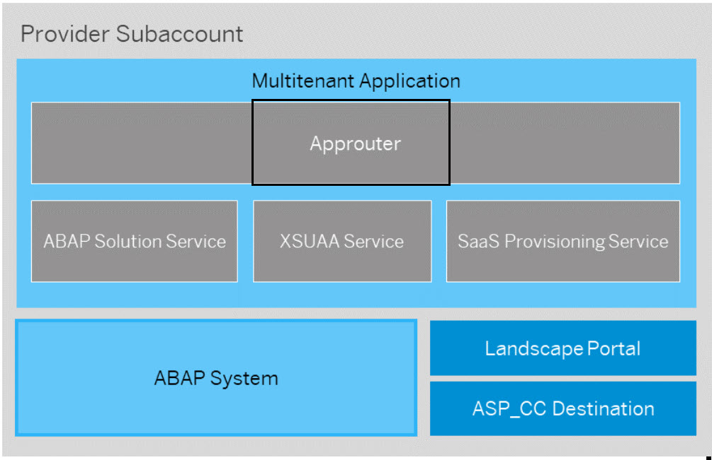
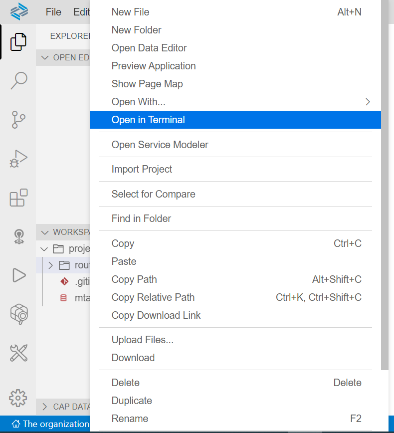

# Develop and Configure an approuter application for the multitenant application of the SaaS solution
<!-- description --> Develop and configure the approuter application for the multitenant application of the solution

## Prerequisites
 - Have created MTA project for the multitenant application in the Business Application Studio as per the previous tutorial of this group

## You will learn
  - How to configure an approuter application.


---

### Create a Node.js project for the router




To authenticate business users of the application at runtime, use the tenant-aware approuter application and the XSUAA service in SAP Business Technology Platform. This will also provide the necessary callbacks for the SaaS Provisioning Service. In addition, we provide the middleware `@sap/asp-middleware` component that enhances the approuter to also take care of automatically routing the consumer to their ABAP tenant.

1. Create a new folder called 'router'  


2. Open a command prompt (terminal) in this folder


3. Create a new project by executing the following command
  Shell/Bash ```npm init```


    In the upcoming wizard flow you can leave the defaults or define your own values if preferred.
        

      Result: After the project is initialized, the package contains a package.json file
      


4. The package.json should have the following content (if the defaults are kept):

```JSON
{
  "name": "router",
  "version": "1.0.0",
  "description": "",
  "main": "index.js",
  "scripts": {
    "test": "echo \"Error: no test specified\" && exit 1"
  },
  "author": "",
  "license": "ISC"
}
```


### Install necessary dependencies


The '@sap/approuter' and the '@sap/asp-middleware' must be installed so that they can be used in the start script.

Execute the following command in the terminal:
```Shell/Bash
npm install @sap/approuter @sap/asp-middleware
```


Result:
The two modules will be listed in the package.json as 'dependencies' and are downloaded into the node\_modules folder.

Updated package.json (versions might differ):
```JSON
{
  "name": "router",
  "version": "1.0.0",
  "description": "",
  "main": "index.js",
  "scripts": {
    "test": "echo \"Error: no test specified\" && exit 1"
  },
  "author": "",
  "license": "ISC",
  "dependencies": {
    "@sap/approuter": "^11.2.1",
    "@sap/asp-middleware": "^1.0.9"
  }
}
```


### Add a start script


A start script needs to be added to prepare the application for execution in the Cloud Foundry Environment.

To add a start script, add the following property under the "scripts" section of package.json

```JSON
"start": "node index.js",
```

The updated package.json looks as follows:
```JSON
{
  "name": "router",
  "version": "1.0.0",
  "description": "",
  "main": "index.js",
  "scripts": {
    "start": "node index.js",
    "test": "echo \"Error: no test specified\" && exit 1"
  },
  "author": "",
  "license": "ISC",
  "dependencies": {
    "@sap/approuter": "^11.2.1",
    "@sap/asp-middleware": "^1.0.9"
  }
}
```


### Create the start script index.js


Create the file "index.js".


The JavaScript code for the application must be written here. The minimum code required is the following:

```JavaScript
const approuter = require('@sap/approuter');
const ar = approuter();

ar.start({
  extensions: [ require('@sap/asp-middleware') ]
});
```

It will load the approuter and the asp-middleware and ensures that both components are wired. Additionally, the approuter is started.


### Configure the routes


To make sure that the approuter routes all relevant requests to the ABAP Solution, a routing configuration file needs to be created and configured:

Create a file named xs-app.json next to the index.js file. Add ABAP endpoint to both routes

It should have the following content:
```JSON
{
	"authenticationMethod": "route",
	"welcomeFile": "/ui",
	"logout": {
		"logoutEndpoint": "/sap/public/bc/icf/logoff",
  	"logoutPage": "/ui"
	},
	"routes": [
		{
		"source": "^/sap/(.*)$",
		"target": "/sap/$1",
		"authenticationType": "xsuaa",
		"service": "com.sap.cloud.abap.solution",
		"csrfProtection": false
		},
		{
		"source": "^/ui(.*)$",
		"target": "/ui$1",
		"authenticationType": "xsuaa",
		"service": "com.sap.cloud.abap.solution",
		"csrfProtection": false,
		"endpoint": "abap"
		}
	]
}
```


### Test the router


To test that everything works, execute npm start in your command prompt.

As a result, you should see the following error message: 'Error: No ABAP Solution credentials found in environment'.


This tells us that the middleware was loaded as a dependency and that the start command is correct.


### Test yourself


---
