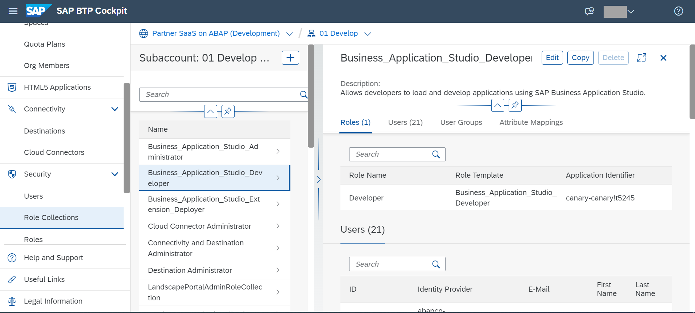
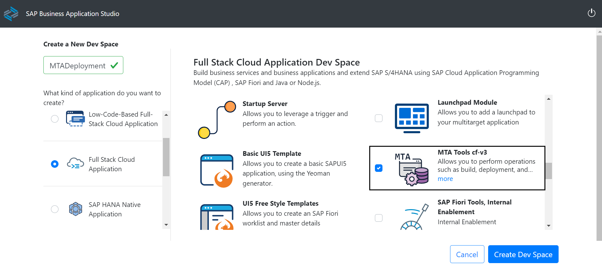
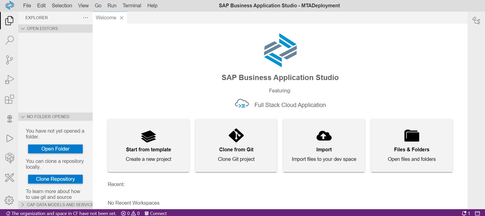
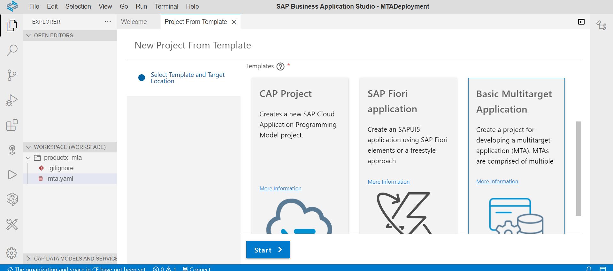
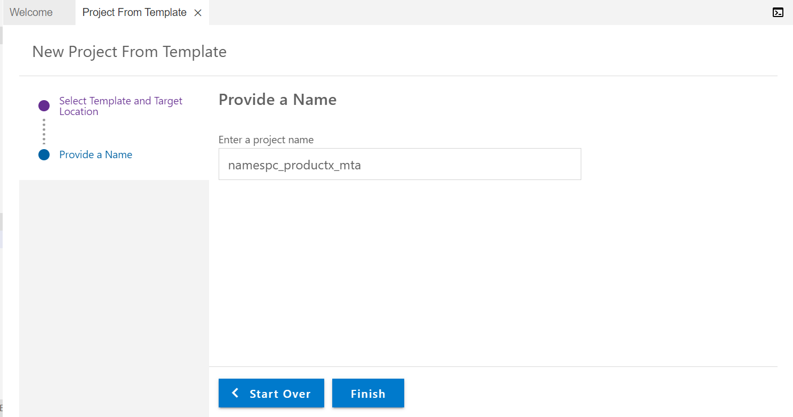
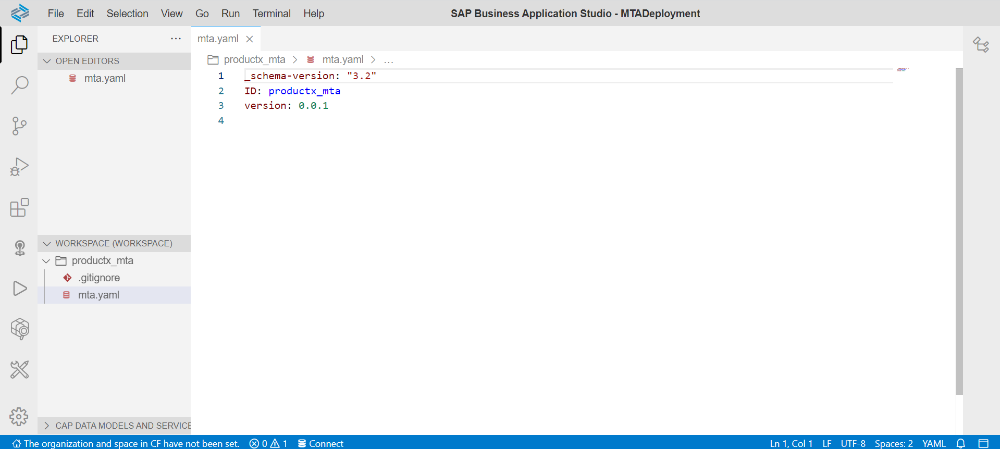

# Create an MTA project for the Multitenant Application using SAP Business Application Studio

<!-- description --> Create a new MTA project for the Multitenant Application of the solution using the SAP Business Application Studio

## Prerequisites

- A user with Subaccount Administrator access to the 05 Provide sub-account

## You will learn

- How to create an MTA project in the Business Application Studio

---

### Add Business Application Studio Developer Role

As subaccount administrator of the 05 Provide subaccount, go to Security→Role Collections

1. Select the `Business_Application_Studio_Developer` Role Collection.
2. Click Edit.
3. Add the relevant users for development and MTA deployment.
4. Save the changes.

### Create a new dev space

1. Open the Business Application Studio (BAS) instance using the relevant user.

2. Create a new Dev Space by clicking on "New".

3. Give a suitable name and add the MTA tools plugin (You may see a slightly different name depending on when you refer this tutorial).

4. Once the space is shown as "Running", open it. You should see a welcome page.

If the welcome page does not appear, you can always start a project from template by clicking on 'File'-->New Project from Template.

### Create New MTA Project from Template

1. Create a new Basic Multitarget Application Project from Template

2. Provide a unique project name to identify the application in your workspace  

3. Click Finish. You should see a project created with a generated "mta.yaml" file.

### Test Yourself

---
