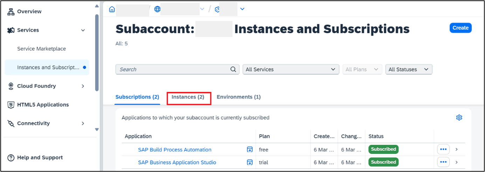
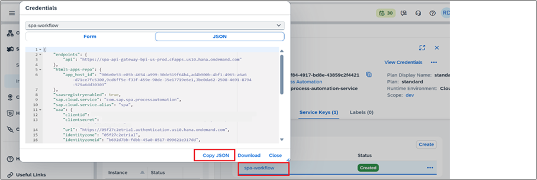
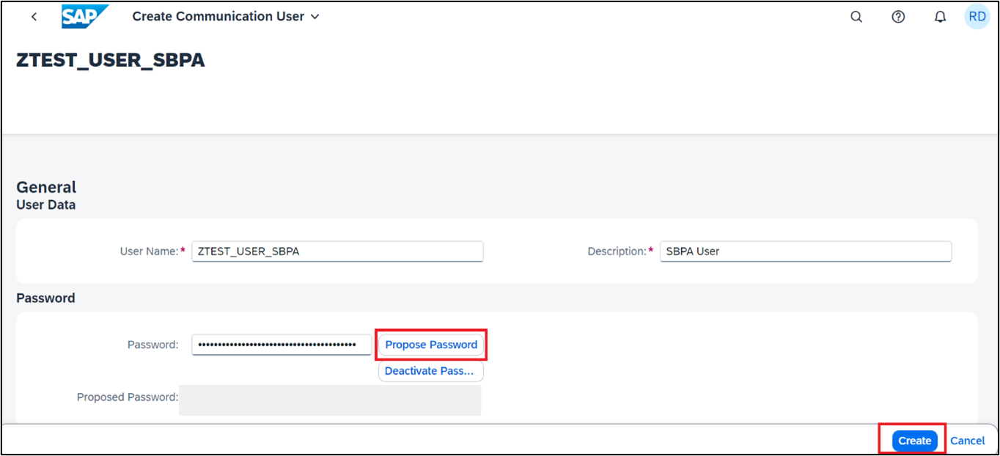
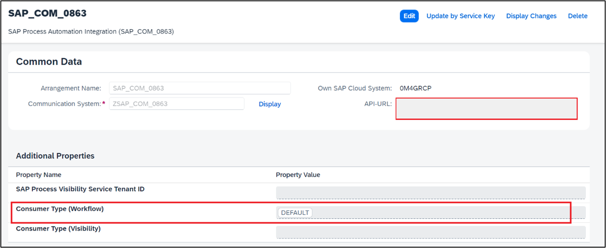
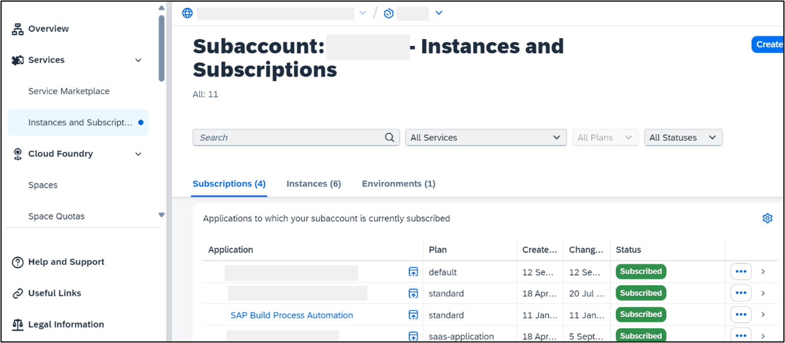
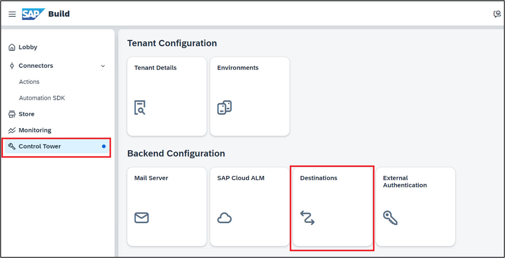
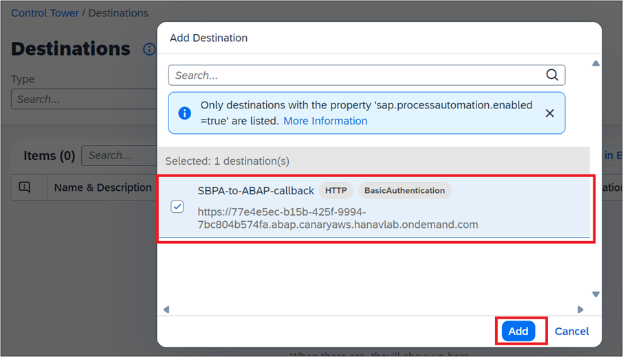

# Integration of BTP ABAP environment with SAP Build Process Automation

<!-- description -->  Configure connection between BTP ABAP environment (Steampunk) and SAP Build Process Automation.

## Prerequisites

- You have a **licensed version** of SAP BTP ABAP environment
- SAP BTP ABAP environment instance with the **Administrator role**
- SAP BTP tenant with SAP Build Process Automation **subscription Instance** and **service key** must be created for SAP Build Process Automation. You can use the **Booster** for subscription as described [here](https://developers.sap.com/tutorials/spa-subscribe-booster.html)

## You will learn

- SAP Build Process Automation Integration with SAP BTP ABAP environment
- Creation of a Communication Arrangement for SAP Build Process Automation Workflows
- Creation of callback destination from SAP Build Process Automation to SAP BTP ABAP environment
- Properties to be used in the callback destination to enable it for SAP Build Process Automation
- Adding the callback destination in SAP Build Process Automation

### Overview

To integrate SAP BTP ABAP environment with External Systems or Services like **SAP Build Process Automation** you create a **Communication Arrangement**.

A Communication Arrangement describes which communication partners communicate with each other in the scenario, and how they communicate. Communication Arrangement is formed by combining the below artifacts.

- **Communication Scenario**: Communication Scenario is a design time description of how two communication partners communicate with each other. It consists of technical information like inbound and/or outbound services example OData or SOAP as well as supported authentication methods. There are various **standard communication scenarios** provided by SAP which are ready to use, like in this tutorial we would be using `SAP_COM_0863`.

- **Communication System**: The communication system represents the communication partner within a communication e.g., **SAP Build Process Automation** in this case.

- **Communication User**: Communication users are used by Communication Systems to authenticate themselves to be able to connect to your system in BTP ABAP Environment.

### Create Communication Arrangement

You will now create a communication arrangement in the **ABAP system** on BTP ABAP Environment using **service key of SAP Build Process Automation** Instance.

>Communication Arrangement is not transported between systems but created locally by the system administrator.

 1. Get SAP Build Process Automation Service Key.

    - In the BTP Cockpit **navigate** to your development **subaccount**.

    

    - Click **Services** and **Instances**.

    

    - Click **Instances**.

    

    - Click the name of your **SAP Build Process Automation instance**.

    

    - From the **navigation pane** choose, **Service keys**.  
   
    

    - Select one entry and **copy the service key**.

    

 2. Open the Communication Arrangement app in your SAP BTP ABAP Environment.

    - Click on the BTP ABAP environment instance in your BTP sub account to **navigate** to the **Fiori launchpad**.

    

    - In the Fiori launchpad **Open Communication Arrangement**.

    

 3. Click on **New** to create communication arrangement.

    

 4. Communication Scenario `SAP_COM_0863`.

    Communication Scenario `SAP_COM_0863` is a **ready-to-use** communication scenario provided by SAP for integration with SAP Build Process Automation.

    

 5. Set **Additional Properties**.

    Once the scenario is selected pop-up window extends with pre-filled Communication Arrangement name and option to set additional properties, enter, or create Communication User and to enter service key.  

    **Click** on Additional Properties, **set given value**, and click **Close**.

    Consumer Type (Workflow) - `DEFAULT`

    

    >The consumer type is used to identify the **default communication arrangement** i.e., if the SAP Build Process Automation Communication Arrangement has **Consumer Type (Workflow)** set to **`DEFAULT`** then the system will try to trigger all workflows in SBPA by default. Therefore, default assignment can be done only on one Communication arrangement for a Consumer Type.

 6. Create a **New Communication User**.

    Select a Communication User (of which you know the password) or create a new one to use for **inbound communication** (from SAP Build Process Automation to your BTP ABAP environment).

    - Click **New** to create a communication user.

    

    - Clicking on new navigates to the **Create Communication User App**. 
    Enter the below info and click on **Create**.

       User Name:   `ZTEST_USER_SBPA`
       Description:  `SBPA User`
       Password: Click on Propose Password (Save the password for later use)

    

    >Save the proposed **password** and **user name** as that would be required during creation of **callback destination**.  

 7. In the field **Service key** paste the **SAP BUild Process Automation** instance service key that we retrieved as part of   'Get SAP Build Process Automation Service Key' and click **Create**.

    

 8. Communication Arrangement is saved.

    >Save the highlighted API-URL for later use while creating callback destination.

    

### Create Callback Destination

**Create** a destination in the SAP BTP subaccount, to enable the **inbound communication** to the BTP ABAP environment. In addition, the destination **must be enabled** for use in SAP Build Process Automation.

The destination will be used for the **callback** to the SAP BTP ABAP environment from SAP Build Process Automation. The callback is triggered on the completion of workflow process on SAP Build Process Automation.

 1. In the BTP Cockpit **navigate** to your development **subaccount**.

    

 2. **Choose** Connectivity>Destination>Create Destination.

    

 3. Choose **Blank Template** and enter the following data and click on **Save**.

    - **Name:**  `abap-cloud-dev-steampunk-canary` (Any Name)

    - **Type:**  HTTP

    - **Description:**  SBPA to ABAP Callback Destination

    - **URL:** Enter the `API-URL` saved during Communication Arrangement creation. If not saved    access the communication arrangement and copy the API URL displayed     under Common Data > `API-URL`. It is the API URL for **BTP** ABAP Environment instance.

    - **Proxy Type:** Internet

    - **Authentication:** `BasicAuthentication`

    - **User:** Enter the Inbound Communication User created during Communication Arrangement creation.

    - **Password:** Enter the Password of the (inbound) communication user in the Communication Arrangement.

    - **Additional Properties:** Click on New Properties and add Additional Properties.
      `sap.applicationdevelopment.actions.enabled` → true.
      `sap.processautomation.enabled` → true

    

    >The addition of Additional Properties `sap.applicationdevelopment.actions.enabled`and `sap.processdevelopment.enabled`enables the destination for use in SAP Build Process Automation.

### Add callback destination in SAP Build Process Automation

 1. **Open** the SAP Build Process automation from your subaccount.

     Subaccount > Instances and Subscriptions > Subscriptions > SAP Build Process Automation.

    - **Click** on SAP Build Process Automation to **open** the Application.
    

 2. Navigate to **Control Tower > Destinations**.

    

 3. Choose **Destinations > New Destination**.

    

 4. Select the destination that you have **created in SAP BTP cockpit** and click **Add**.

    

### Test Yourself

---
