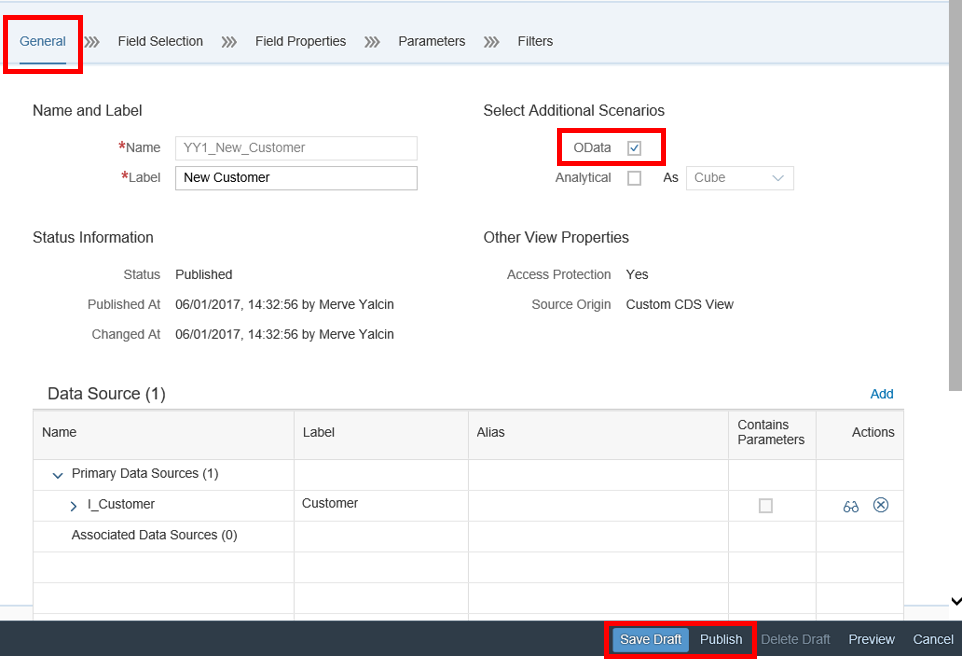
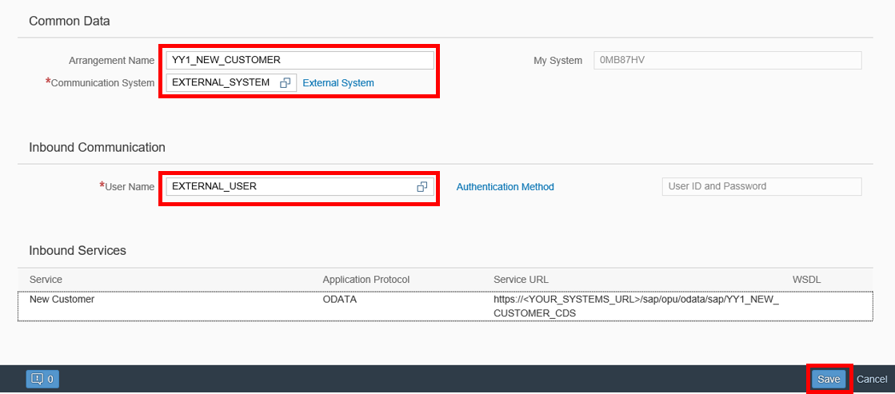
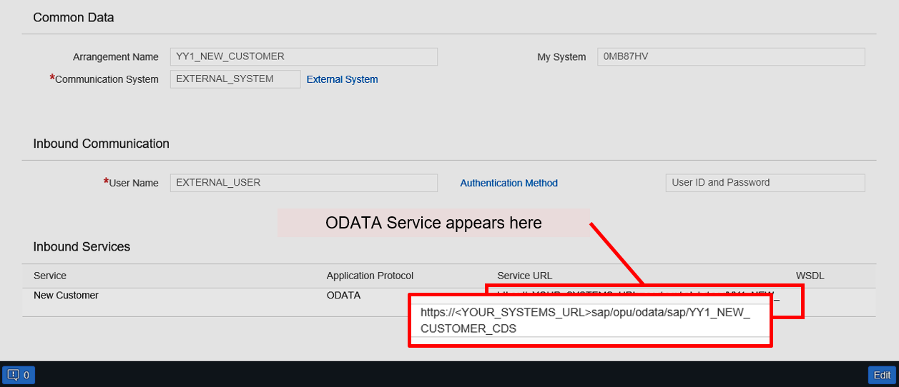

# Create and Expose Custom CDS Views  
<!-- description --> Create a custom CDS view from an existing data source and expose it as a Web Service.

## Prerequisites  
Assign the Business Catalog **`SAP_CORE_BC_EXT`** and **`SAP_CORE_BC_COM`** to your user.

<<<<<<< HEAD
## You will learn  
- How to create a CDS view to minimize a data set exposed to customer
- How to expose the CDS view as a web service

## Intro
If you need access to data in your system in a way the system does not offer so far, you can create your own data access by making use of a custom Core Data Services view (custom CDS view). Usually, the data of an application is distributed across several database tables. Using CDS views allows you to model the data access without changing underlying database tables. In general, CDS views are intended to be consumed by a UI, analytics or other systems. CDS View can be built on CDS Views as well. To simplify the data access there are pre-delivered CDS Views, custom CDS views can only be built on.

=======

## Intro
If you need access to data in your system in a way the system does not offer so far, you can create your own data access by making use of a custom Core Data Services view (custom CDS view). Usually, the data of an application is distributed across several database tables. Using CDS views allows you to model the data access without changing underlying database tables. In general, CDS views are intended to be consumed by a UI, analytics or other systems. CDS View can be built on CDS Views as well. To simplify the data access there are pre-delivered CDS Views, custom CDS views can only be built on.
## You will learn  
- How to create a CDS view to minimize a data set exposed to customer
- How to expose the CDS view as a web service
>>>>>>> 59f95048a11e62962d5c8eb49e89b6f027533a25
## Time to Complete
**15 Min**.

---

### Open Custom CDS Views application

Navigate to the **Extensibility** category and press the **Custom CDS Views** tile to start the application on your Fiori Launchpad.

### Select data source

This brings you to the data source list of the available data sources for Custom CDS Views.
Search for a data source you want to use as a basis and **select** the data source **(1)** `I_Customer`.

This is the primary data source of the new Custom CDS view.

Now execute **create (2)** to create a new Custom CDS view.

### Create custom CDS view

On the general tab enter name `YY1_New_Customer` and label `New Customer`.

### Select fields

This step is used to tailor a given CDS View to the needs of a customer.
Now switch to the Field Selection tab and **select** following **fields (1)**:
- `Customer`
- `CustomerName`
- `CustomerFullName`
- `Country`
- `CityName`
- `PostalCode`
- `StreetName`
These fields will be available in the custom CDS view.

Now **save** and **publish** the view.

Result:
This saves and activates the view.
In case the primary data source is access protected, the new view is protected, too.

### Generate OData service

Switch back to the general tab to generate an OData Service by `checkmarking` it.
Afterwards **save** and **publish** your change. Now your OData Service is generated.

Result:
Now new service `<ViewName>_CDS` got created and the service is registered for further usage in the communication scenario.

### Open Custom Communication Scenarios application

Go back to Press the **Custom Communication Scenarios** tile to start the application.

### Add new scenario

In **Custom Communication Scenario** add a new Scenario by clicking on **new** button.

### Add name and description

A new window will open where you can define the **Name of the New Scenario** and its **Description**.

### Add services

First you have to click the **add** button. Afterwards search for New Customer and add `YY_NEW_CUSTOMER_CDS` as a service.

### Publish communication scenario

After adding the service `YY_NEW_CUSTOMER_CDS`, the result will be shown in the following way:

Now you can **publish** your Communication Scenario.

### Use communication system and user

If you already have a communication system and user then use them in the following steps.
Otherwise you can create a new communication system and user by making use of the following example.
Therefore go to Step 2: Creating a Communication System and User in the [this blog](https://blogs.sap.com/2017/05/17/part-viii-custom-business-object-exposure-as-external-web-service-bonus-plan/).

### Create communication arrangement

Navigate to the **Communication Management** category and press the **Communication Arrangements** tile to start the application.

### Add new communication arrangement

Click on the **new** button to create a new Communication Arrangement.

### Select scenario and describe arrangement name

You can choose `YY1_New_Customer` as Scenario and select the **create** button by clicking the value help.

### Save communication arrangement

Now select your Service, like `EXTERNAL_SYSTEM` as Communication System and **save** the Communication Arrangement.

### Generating URL

After you have saved your Communication Arrangement, the URL will be generated.

Result:
The role containing the authorizations for the service(s) is assigned to a communication user. After this step, you can call the service in a web browser and logon with the communication user. You can consume this service also in tools like Excel using the comm. user logon.

Note: the communication arrangement is a configuration object that is created in test and production system separately.
