# Download the Eclipse IDE and add the ABAP Development Tools (ADT) Plugin
<!-- description --> IDownload the Eclipse IDE and add the ABAP Development Tools (ADT) Plugin

## You will learn
- How do download the Eclipse IDE
- How to add the ADT plugin to Eclipse

## Prerequisites
- Operating System: 
      - Windows 10, or higher
      - Apple macOS 10.15 or higher
- Microsoft VC++ Runtime:
      - For Windows: [Microsoft Visual C++ 2013 Redistributable (x64)](https://docs.microsoft.com/en-US/cpp/windows/latest-supported-vc-redist?view=msvc-170#visual-studio-2013-vc-120) 
    >**Hint:** Precisely version Visual Studio 2013 (VC++ 12.0) x64 is required.
-	Java Runtime:
      -	ADT is validated and tested against Java versions 17 and 21 (Oracle Java and `OpenJDK`).
      - The latest Eclipse packages are bundled with [`Eclipse Temurin`](https://adoptium.net/), an `OpenJDK` binary distribution provided by the [`Eclipse Adoptium`](https://projects.eclipse.org/projects/adoptium) project. Any other JRE found on the system is not used. If you want to remove the bundled JRE and use a custom one, see SAP note [3035242](https://launchpad.support.sap.com/#/notes/3035242).
    >**Hint:** You do not need to manually install a JRE / JDK, since it is already bundled with the latest Eclipse packages, which are downloadable as a ready-to-run zip file. 

---

### Download and run Eclipse IDE

  1. Open the [Eclipse download page](https://www.eclipse.org/downloads/packages/) to download the appropriate (usually latest) Eclipse version.

      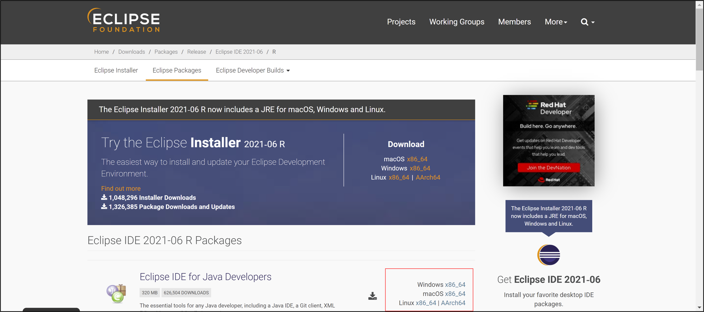

  2. Click **Download**.

      

  3. Click the **Download** icon of your browser and select the folder symbol.

      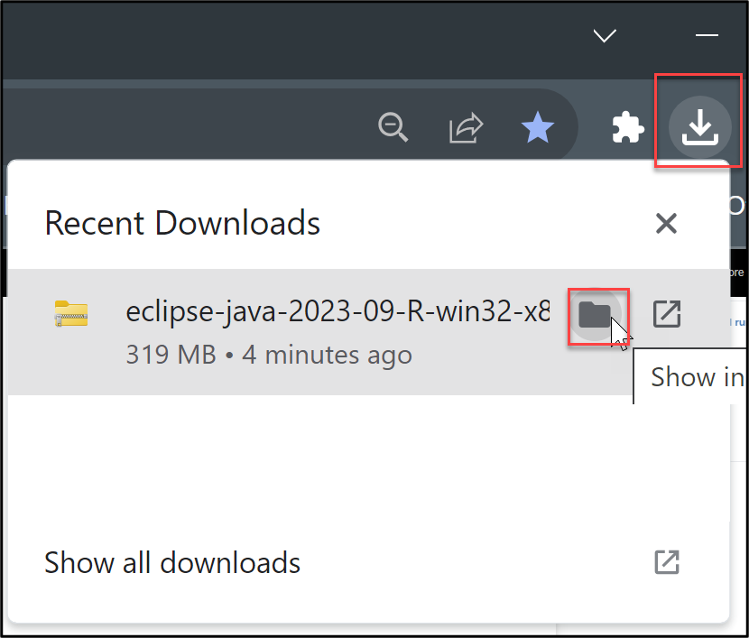

  4. Extract the Eclipse file with right-click.

      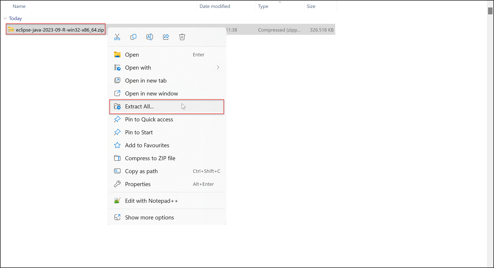

  5. Click **Extract** in the wizard. 
   
      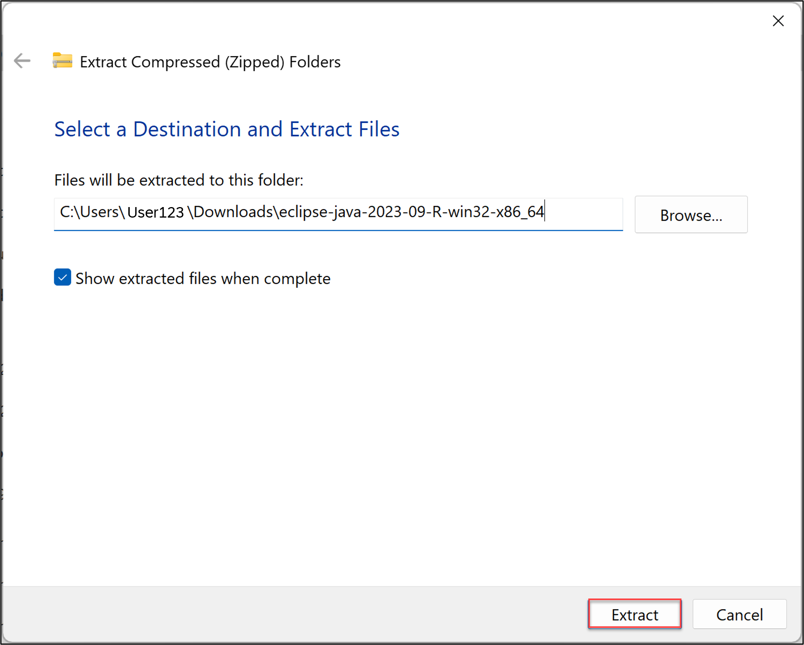
  
  6. Open the **Eclipse-Java** folder.
     
      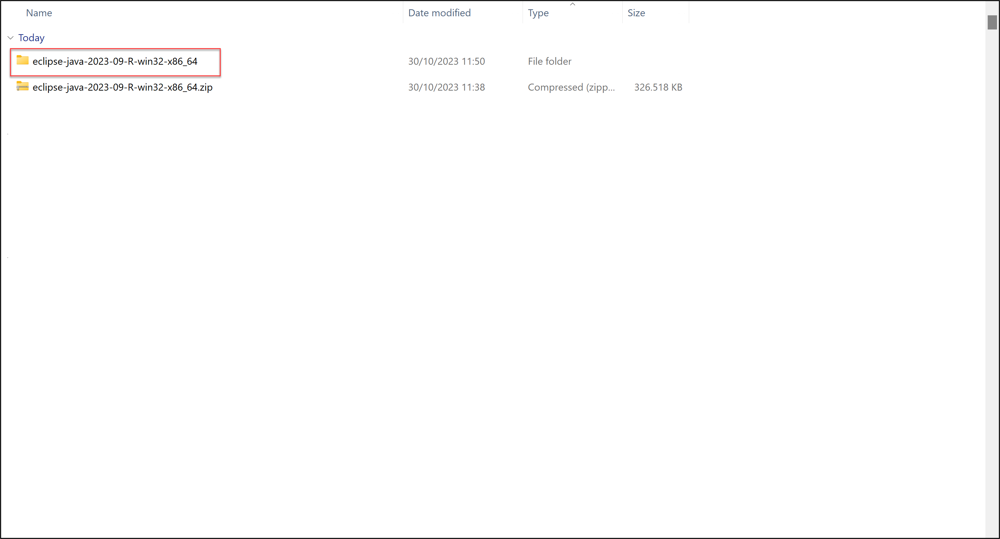

  7. Open the **Eclipse** folder.

      

  8. Double-click **`eclipse.exe`** to run the application.

      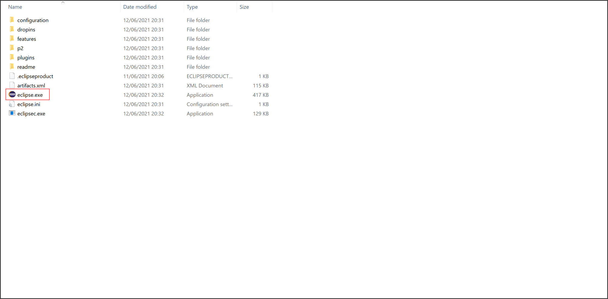

  9.  Launch your workspace.

      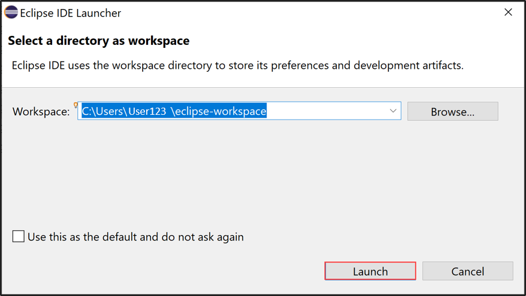

  10. Close both pages.

      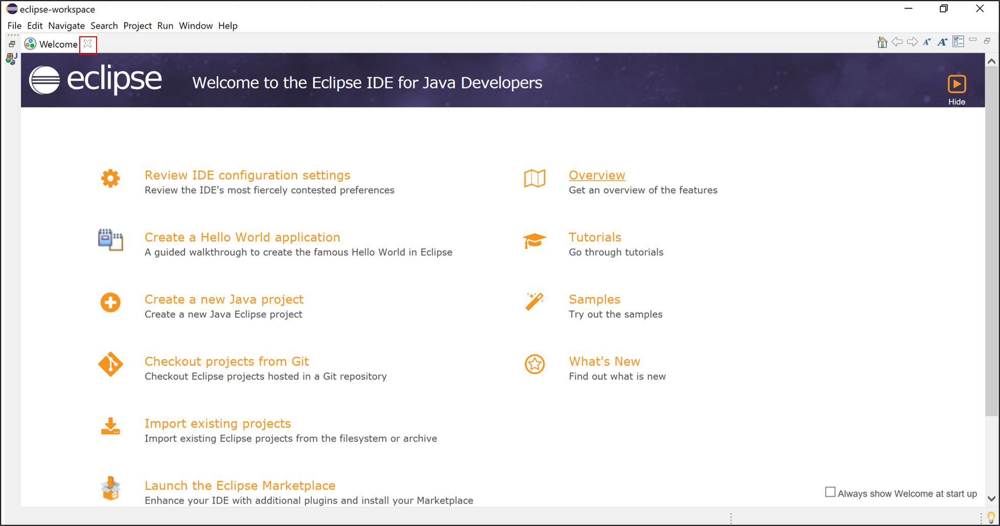

      

### Add ADT plugin to Eclipse

 1. Select **Help** > **Install New Software**.

      

 2. Enter the latest ADT URL **`https://tools.hana.ondemand.com/latest`** in the **Work with** section, press enter,  select **ABAP Development Tools** and click **Next >**.

      

 3. Click **Next >**.

      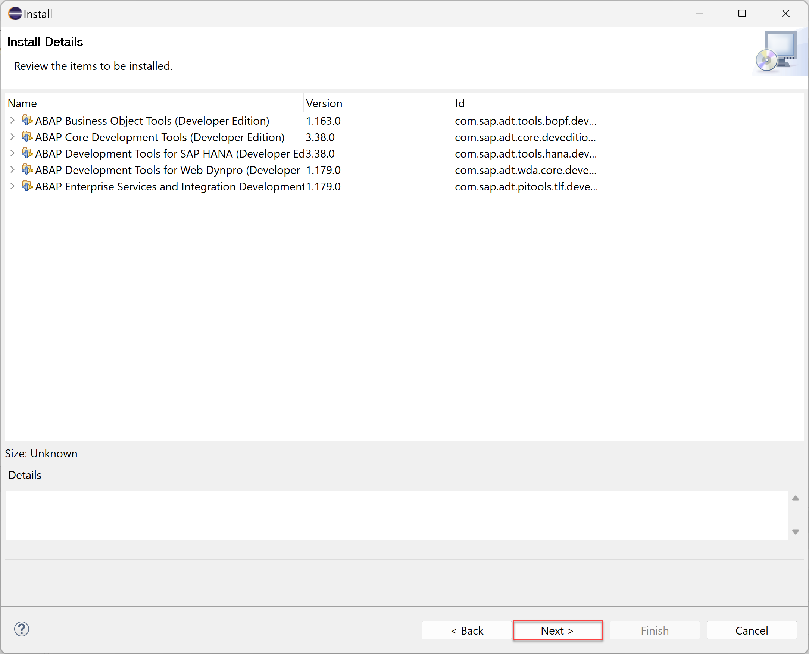

 4. Accept the **license agreement** and click **Finish**.

      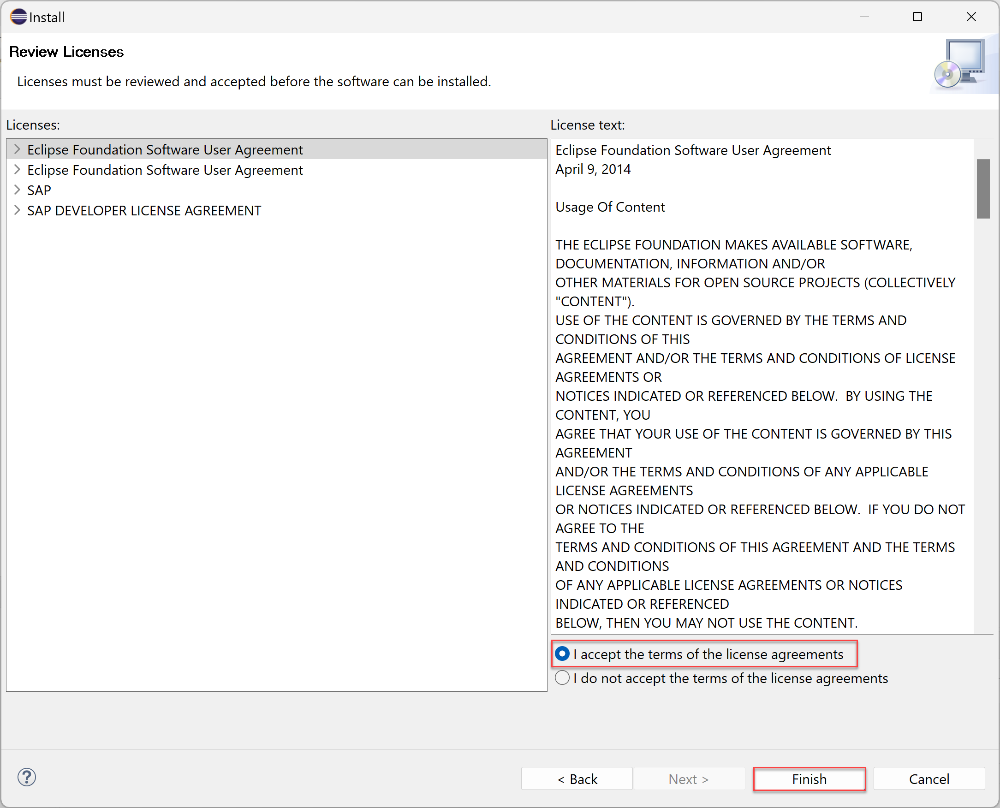

 5. Click **Select All** and **Trust Selected**.

      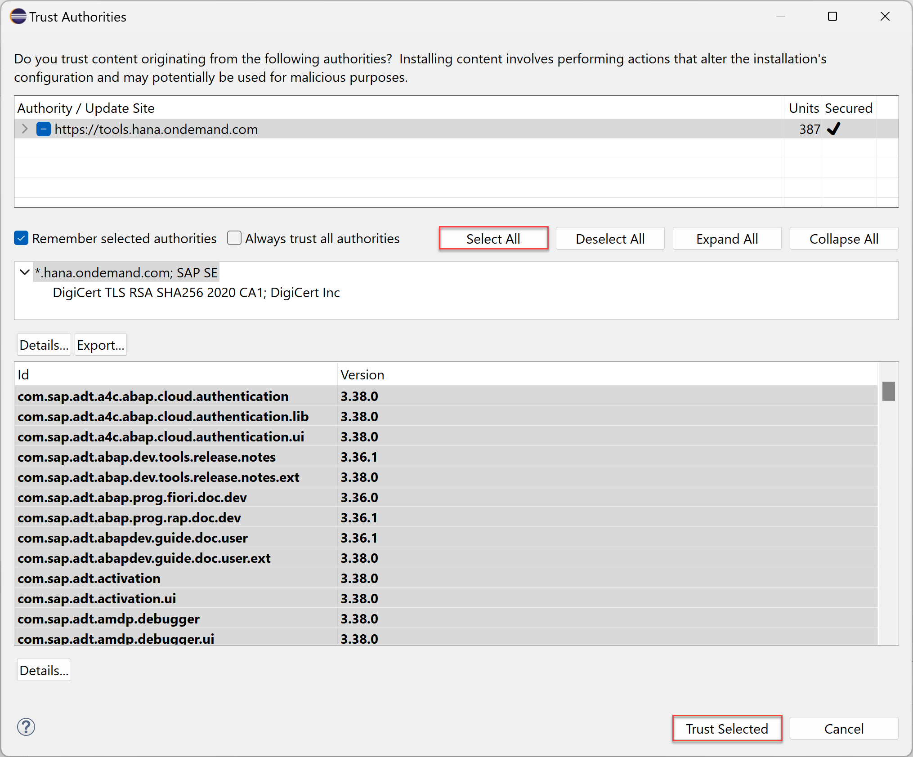

 6. Click **Restart Now**.

      

 7. Now ADT is installed. Switch to the ABAP perspective. Therefore select **Window** > **Perspective** > **Other Perspective** > **Other**.

    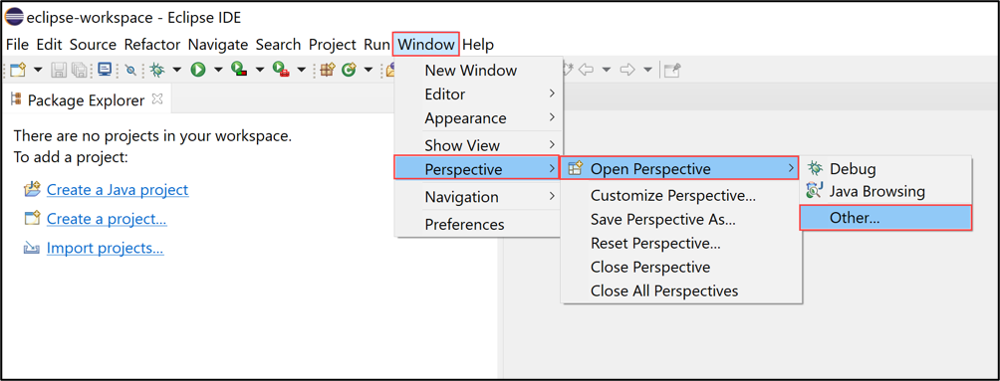

    Then select **ABAP** and click **Open**.

      

 8. Check your result.

      

### More information

Following this tutorial you will be able to update the latest version of Eclipse and ADT when new releases are available.

If you want to install the abapGit plugin for ADT, you can follow the [Install the abapGit Plugin](abap-install-abapgit-plugin) tutorial.

### Test yourself

