 
# Create an Online Shop Business Object
<!-- description --> Create an online shop business object with SAP S/4HANA Cloud, ABAP Environment or SAP S/4HANA on-premise.

 
## Prerequisites  
- This tutorial can be used in the SAP S/4HANA Public Cloud. This tutorial can also be used in both SAP S/4HANA Cloud, private edition system and SAP S/4HANA on-premise system with release 2022 FPS01, in which case you will need to import the [SAP Note 3330593](https://launchpad.support.sap.com/#/notes/3330593) and [SAP Note 3280851](https://me.sap.com/notes/3280851) in your system. We suggest using a [Fully-Activated Appliance] (https://blogs.sap.com/2018/12/12/sap-s4hana-fully-activated-appliance-create-your-sap-s4hana-1809-system-in-a-fraction-of-the-usual-setup-time/) in SAP Cloud Appliance Library for an easy start without the need for system setup.
- For SAP S/4HANA on-premise, create developer user with full development authorization 
- You have installed the latest [Eclipse with ADT](abap-install-adt).
- Business role `SAP_BR_PURCHASER` needs to be assign to your business user
- Use Starter Development Tenant in S/4HANA Cloud for the tutorial to have necessary sample data in place. See [3-System Landscape and Transport Management](https://help.sap.com/docs/SAP_S4HANA_CLOUD/a630d57fc5004c6383e7a81efee7a8bb/e022623ec1fc4d61abb398e411670200.html?state=DRAFT&version=2208.503).
- Business role `SAP_BR_PURCHASER` needs to be assigned to your business user
- You are already logged into SAP S/4HANA Cloud, ABAP Environment or SAP S/4HANA on-Premise. If not, please complete the [login tutorial](abap-s4hanacloud-login).

## You will learn  
- How to create an ABAP package
- How to create a database table
- How to create transactional UI services
- How to enhance the behavior definition of a data model 
- How to publish a service binding
- How to run the SAP Fiori Elements Preview
 
## Intro
In this tutorial, wherever X/XXX/#/### appears, use a number (e.g. 000).

--- 

### Create ABAP package

**Hint:** In case the CAL instance is not used, please set up for developer extensibility to get `ZLOCAL` package.
 - Create software component for local cloud-ready development with `ZLOCAL`
 - Create a structure package with `ZLOCAL`


  1.  Select **ZLOCAL** > **New** > **ABAP Package**.

      

  2.  Create new **ABAP package**:
       - Name: **`Z_PURCHASE_REQ_XXX`**
       - Description: Package XXX
       - Check **Add to favorite packages**

      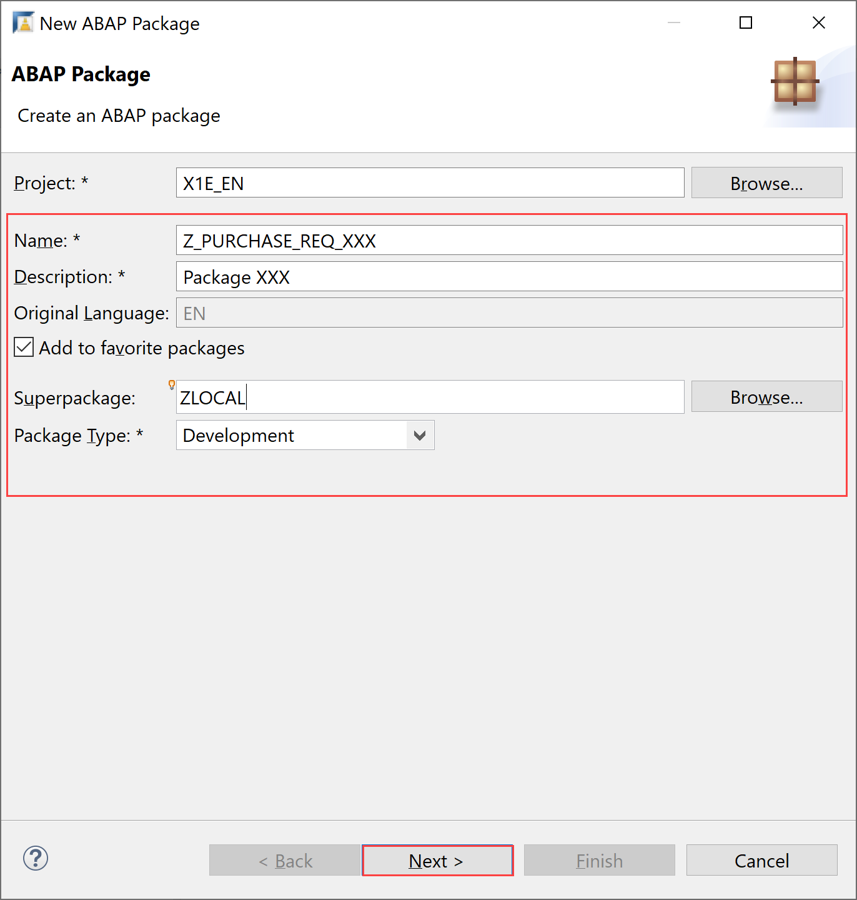

       Click **Next >**.

  3. Click **Next >**.

      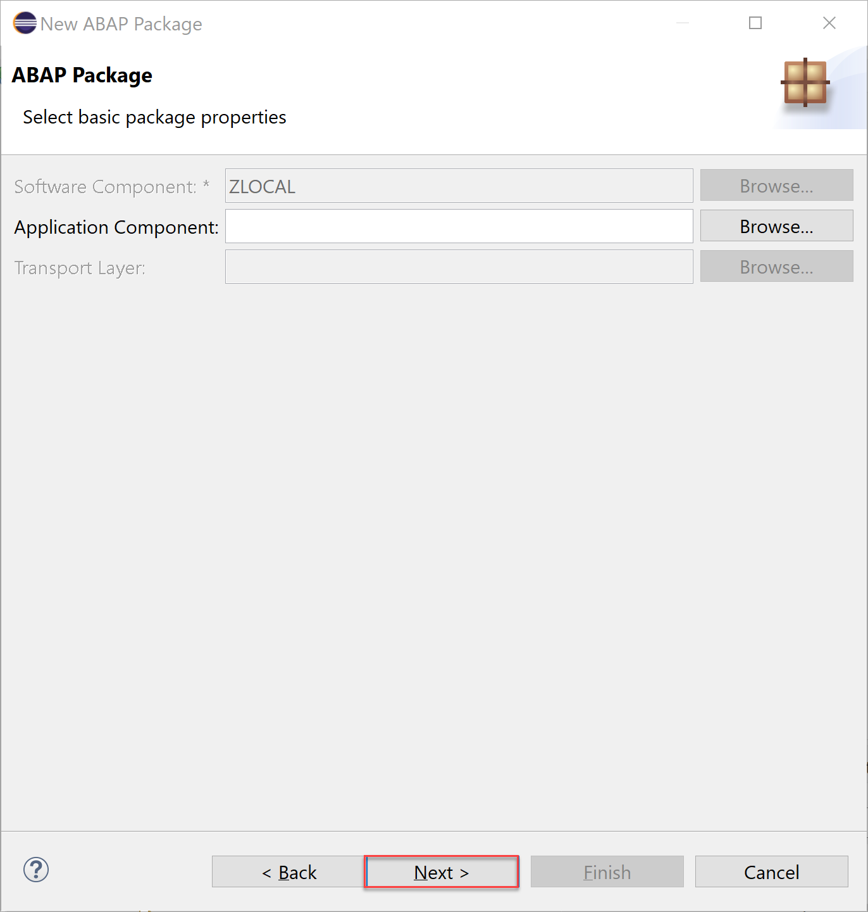


  4.  Create a new request:
      -  Request Description: TR12345

      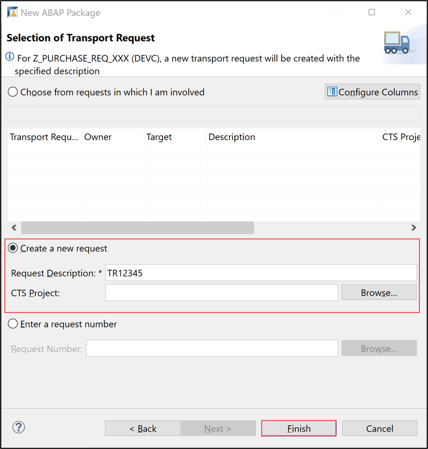

       Click **Finish**.


### Create database table

  1. Right-click your package `Z_PURCHASE_REQ_XXX` and select **New** > **Other ABAP Repository Object**.

      

  2. Search for **database table**, select it and click **Next >**.

      

  3. Create new database table:
     - Name: `ZAONLINESHOP_XXX `
     - Description: Shop to purchase electronics

      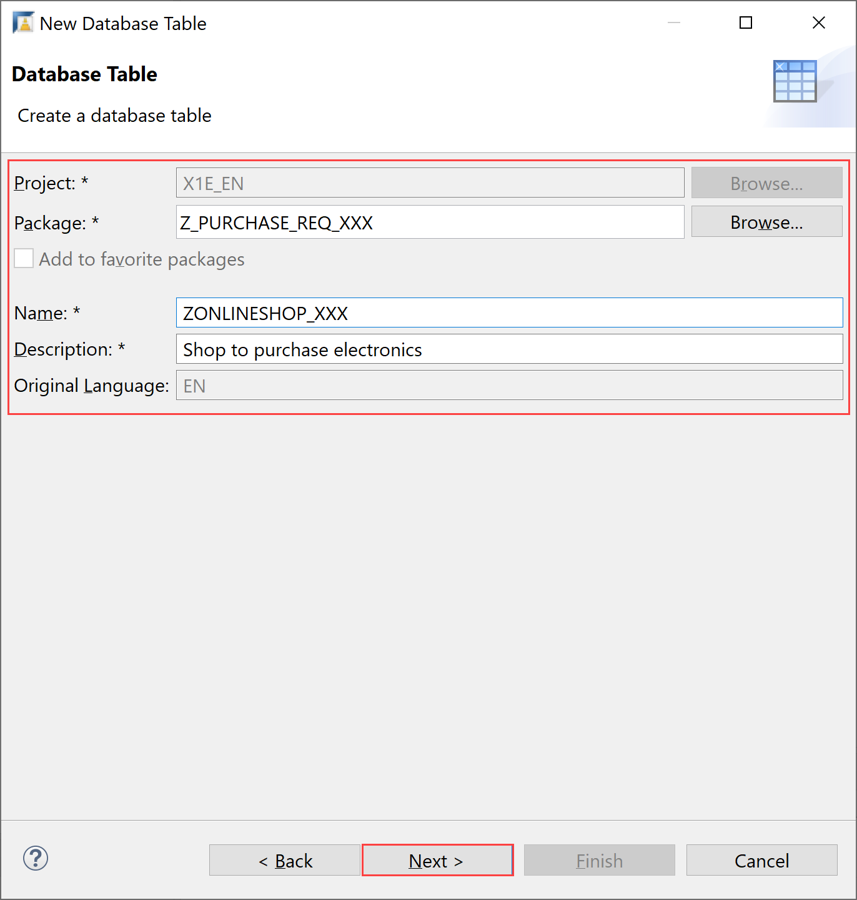

       Click **Next >**.

  4. Click **Finish**.

      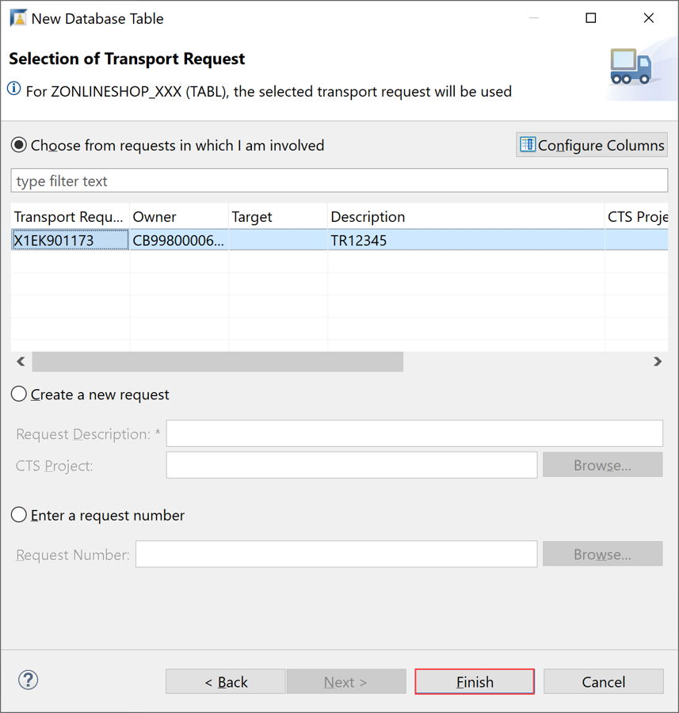

  5. Replace your code with following:

    ```ABAP
    @EndUserText.label : 'Shop to purchase electronics'
    @AbapCatalog.enhancement.category : #EXTENSIBLE_ANY
    @AbapCatalog.tableCategory : #TRANSPARENT
    @AbapCatalog.deliveryClass : #A
    @AbapCatalog.dataMaintenance : #RESTRICTED
    define table zaonlineshop_xxx {
      key client            : abap.clnt not null;
      key order_uuid        : sysuuid_x16 not null;
      order_id              : abap.numc(8) not null;
      ordered_item          : abap.char(10) not null;
      @Semantics.amount.currencyCode : 'zaonlineshop_xxx.currency'
      price                 : abap.curr(11,2);
      @Semantics.amount.currencyCode : 'zaonlineshop_xxx.currency'
      total_price           : abap.curr(11,2);
      currency              : abap.cuky;
      order_quantity        : abap.numc(4);
      delivery_date         : abap.dats;
      overall_status        : abap.char(30);
      notes                 : abap.string(256);
      created_by            : abp_creation_user;
      created_at            : abp_creation_tstmpl;
      last_changed_by       : abp_lastchange_user;
      last_changed_at       : abp_lastchange_tstmpl;
      local_last_changed_at : abp_locinst_lastchange_tstmpl;
      purchase_requisition  : abap.char(10);
      pr_creation_date      : abap.dats;
    }
    ```

   6. Save and activate.


### Generate transactional UI services


  1. Right-click your database table `ZAONLINESHOP_XXX` and select **Generate ABAP Repository Objects**.

      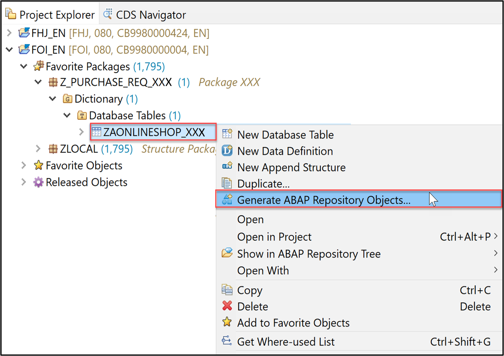

  2. Create new **ABAP repository object**:
     - Description: **Purchase Requisition XXX**
     - Generator: **ABAP RESTful Application Programming Model: UI Service**

      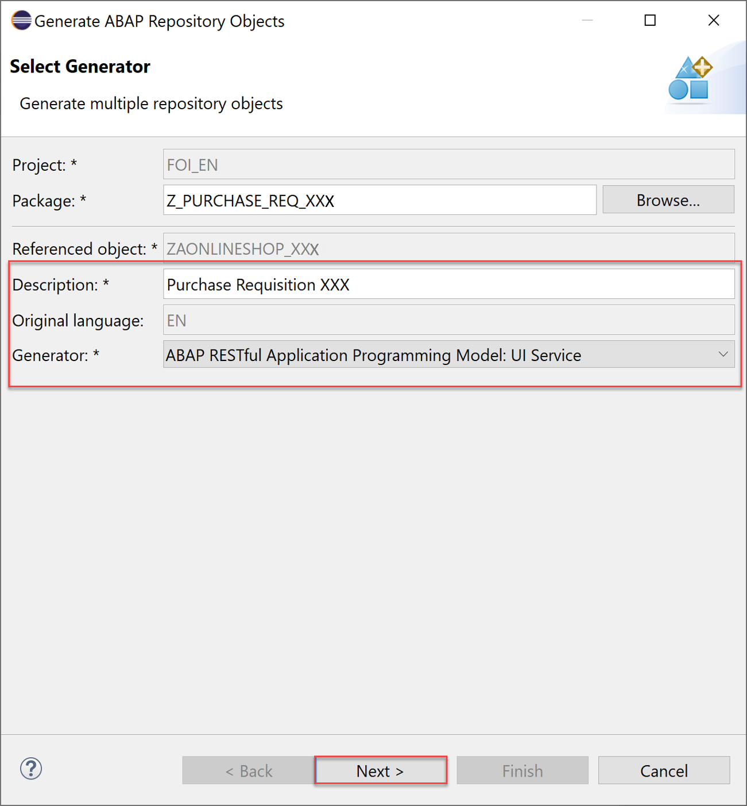

       Click **Next >**.

  3. Maintain the required information on the **Configure Generator** dialog to provide the name of your data model and generate them.         
     
     For that, navigate through the wizard tree **(Business Objects, Data Model, etc...)**, maintain the artefact names provided in the table below, and press **Next >**.

     Verify the maintained entries and press **Next >** to confirm. The needed artifacts will be generated.

     **Please note**: Error Invalid XML format.   
     If you receive an error message **Invalid XML format of the response**, this may be due to a bug in version 1.26 of the ADT tools. An update of your ADT plugin to version 1.26.3 will fix this issue.

    | **RAP Layer**                          | **Artefacts**           | **Artefact Names**                                  |
    |----------------------------------------|-------------------------|-----------------------------------------------------|
    | **Business Object**                    |                         |                                                     |
    |                                        | **Data Model**          | Data Definition Name: **`ZR_ONLINESHOPTP_###`**     |
    |                                        |                         | Alias Name: **`OnlineShop`**                        |  
    |                                        | **Behavior**            | Implementation Class: **`ZBP_ONLINESHOPTP_###`**    |
    |                                        |                         | Draft Table Name: **`ZDONLINESHOP_###`**            |  
    | **Service Projection (BO Projection)** |                         | Name: **`ZC_ONLINESHOPTP_###`**                     |
    | **Business Services**                  |                         |                                                     |
    |                                        | **Service Definition**  | Name: **`ZUI_ONLINESHOP_###`**                      |
    |                                        | **Service Binding**     | Name: **`ZUI_ONLINESHOP_O4_###`**                   |
    |                                        |                         | Binding Type: **`OData V4 - UI`**                   |

                        

    Click **Next >**.

  5. Click **Finish**.

      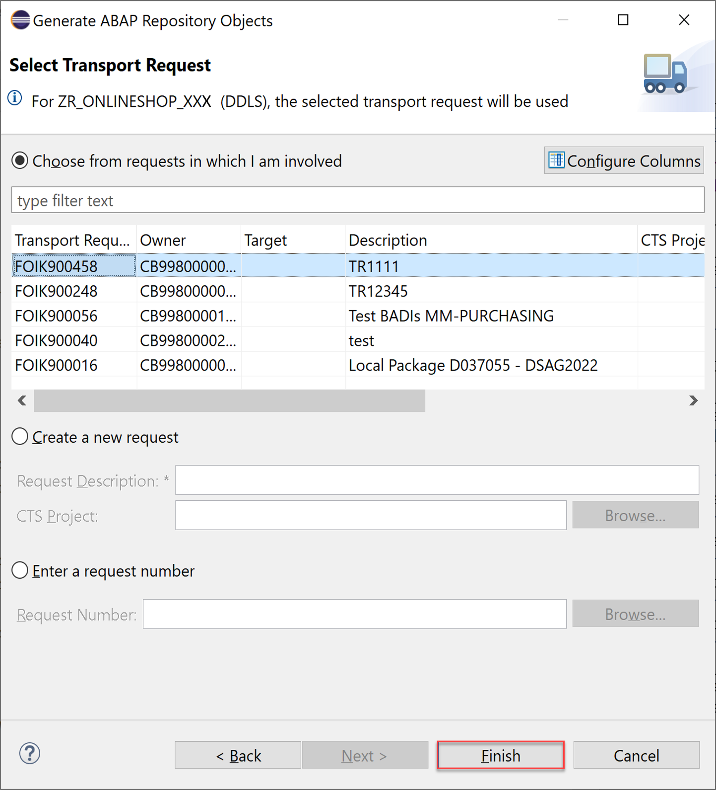


### Enhance behavior definition of data model

**Hint:** In case of S/4HANA 2022 `FPS01`, strict(1) mode must be used. 

**In this tutorial example, a SAP S/4HANA Cloud, ABAP environment system was used. The mode therefore is `strict (2)`.**
  
  1. Open your behavior definition **`ZR_ONLINESHOPTP_XXX`** to enhance it. Add the following read-only fields to your behavior definition:

    ```ABAP
    ,
    PurchaseRequisition,
    PrCreationDate,
    DeliveryDate;
    ```

     


  2. Check your behavior definition:

    ```ABAP
    managed implementation in class ZBP_ONLINESHOPTP_XXX unique;
    strict ( 2 );
    with draft;

    define behavior for ZR_ONLINESHOPTP_XXX alias OnlineShop
    persistent table zaonlineshop_xxx
    draft table ZDONLINESHOP_XXX
    etag master LocalLastChangedAt
    lock master total etag LastChangedAt
    authorization master( global )
    {
      field ( readonly )
       OrderUUID,
       CreatedAt,
       CreatedBy,
       LastChangedAt,
       LastChangedBy,
       LocalLastChangedAt,
       PurchaseRequisition,
       PrCreationDate,
       DeliveryDate;

      field ( numbering : managed )
       OrderUUID;

      create;
      update;
      delete;

      draft action Edit;
      draft action Activate;
      draft action Discard;
      draft action Resume;
      draft determine action Prepare;

      mapping for ZAONLINESHOP_xxx  
      {
        OrderUUID = order_uuid;
        OrderID = order_id;
        OrderedItem = ordered_item;
        Price = price;
        TotalPrice = total_price;
        Currency = currency;
        OrderQuantity = order_quantity;
        DeliveryDate = delivery_date;
        OverallStatus = overall_status;
        Notes = notes;
        CreatedBy = created_by;
        CreatedAt = created_at;
        LastChangedBy = last_changed_by;
        LastChangedAt = last_changed_at;
        LocalLastChangedAt = local_last_changed_at;
        PurchaseRequisition = purchase_requisition;
        PrCreationDate = pr_creation_date;
      }
    }
    ```

   4. Save and activate.  


### Publish service binding and run SAP Fiori Elements preview

Choose between the tabs **Cloud** and **On-premise** and follow the publishing process.

  [OPTION BEGIN [Cloud]] 

  1. Open your service binding **`ZUI_ONLINESHOP_O4_XXX`** and click **Publish**.

     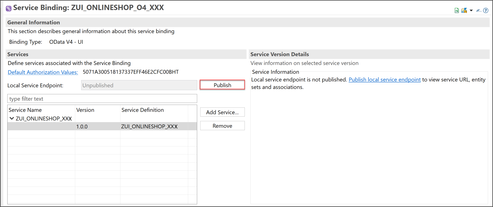

  2. Select **`OnlineShop`** in your service binding and click **Preview** to open SAP Fiori Elements preview.

     

  [OPTION END]

  [OPTION BEGIN [On-premise]] 

  1. Login to **SAP NetWeaver** and execute `/n/IWFND/V4_ADMIN` `t-code`.

     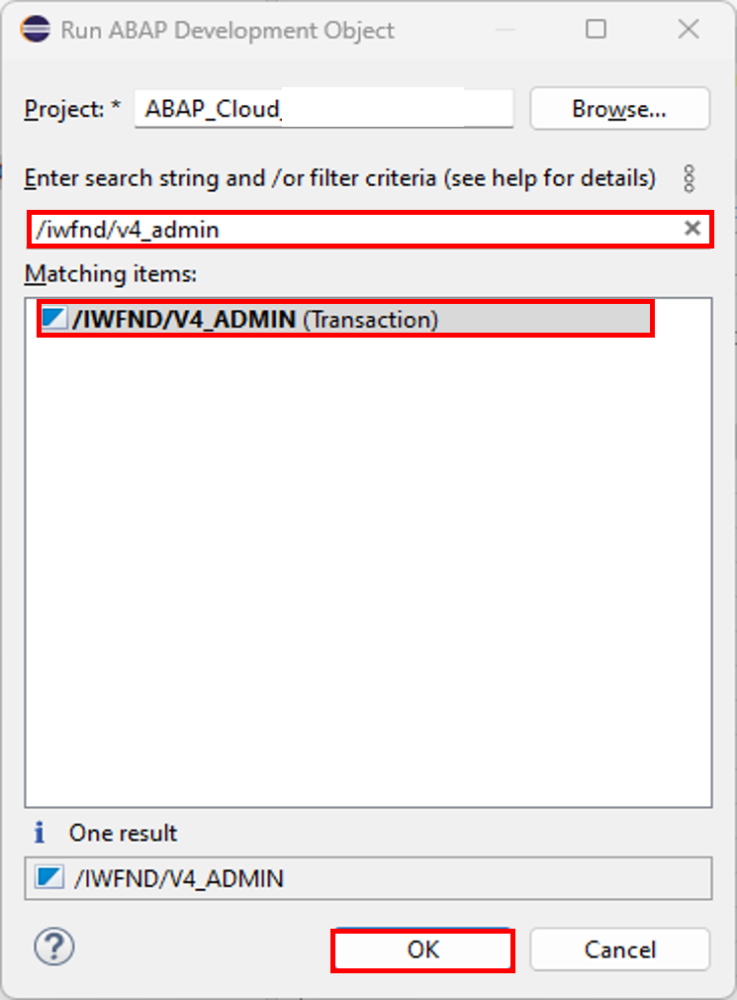

  2. Click on **Publish Service Groups**.

     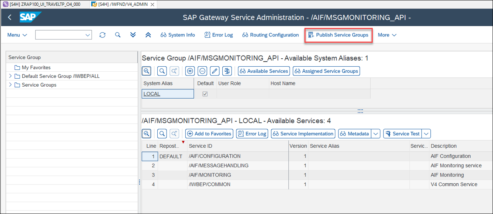

  3. Select **System Alias** and click **Get Service Groups**. Select the Service Group **`ZUI_ONLINESHOP_O4_XXX`** and click **Publish Service Groups**.

     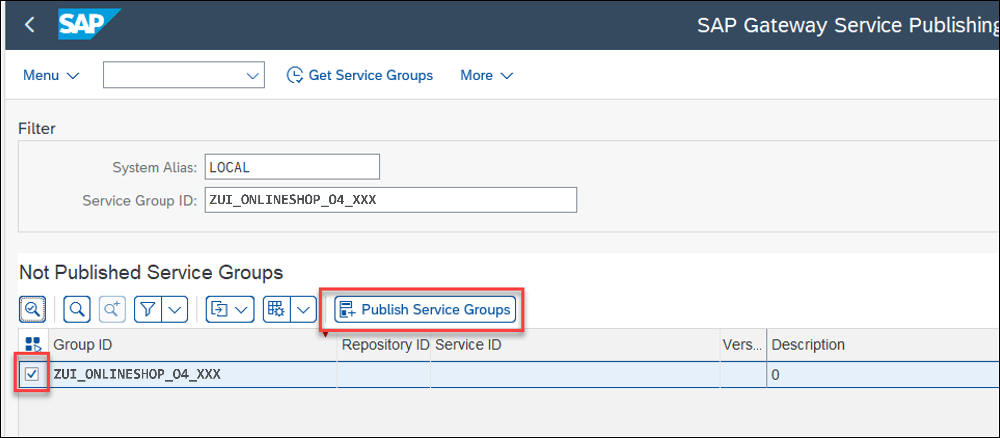

  4. Click **Continue**, you will get the message **New service group(s) successfully published**.
    
     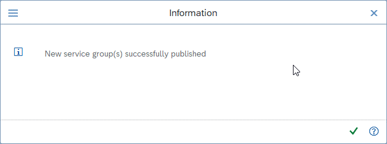

  5. Click the back button to see the published group.

  6. Expand the **Service Groups** and double click on the group.

      

  7. We can see the available services under this group.

  8. To test the service, go back to your service binding, select **`OnlineShop`** to start the SAP Fiori Elements preview.

      


     More information [here](https://launchpad.support.sap.com/#/notes/2948977).

  
  [OPTION END]

 

### Test yourself
