 
### Create an ABAP package

In this step, we'll create an ABAP package with the **`superpackage` `$TMP`**. 

  1.  Select **Local Objects (`$TMP`)** > **New** > **ABAP Package**.

      

  2.  Create new **ABAP package**:
       - Name: **`$Z_PURCHASE_REQ_TIER3_###`**
       - Description: Package ### - Tier 3
       - `Superpackage:` **`$TMP`**
       - Package Type: Development
 
      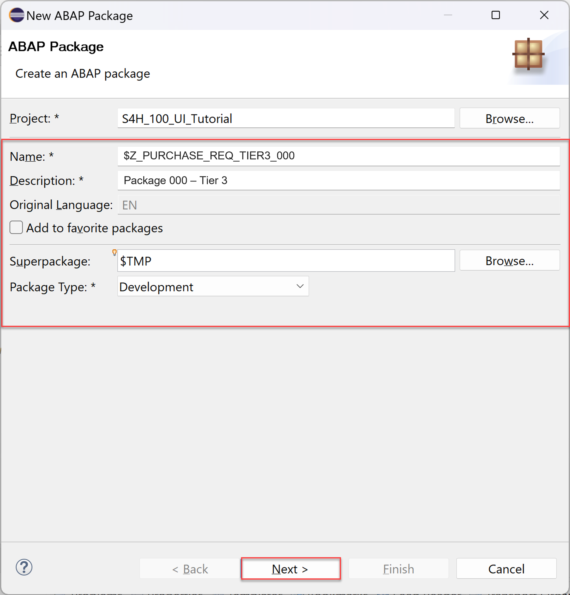

       Click **Next >**.

  3. Click **Next >**.

      

  4. Click **Finish**.
  
      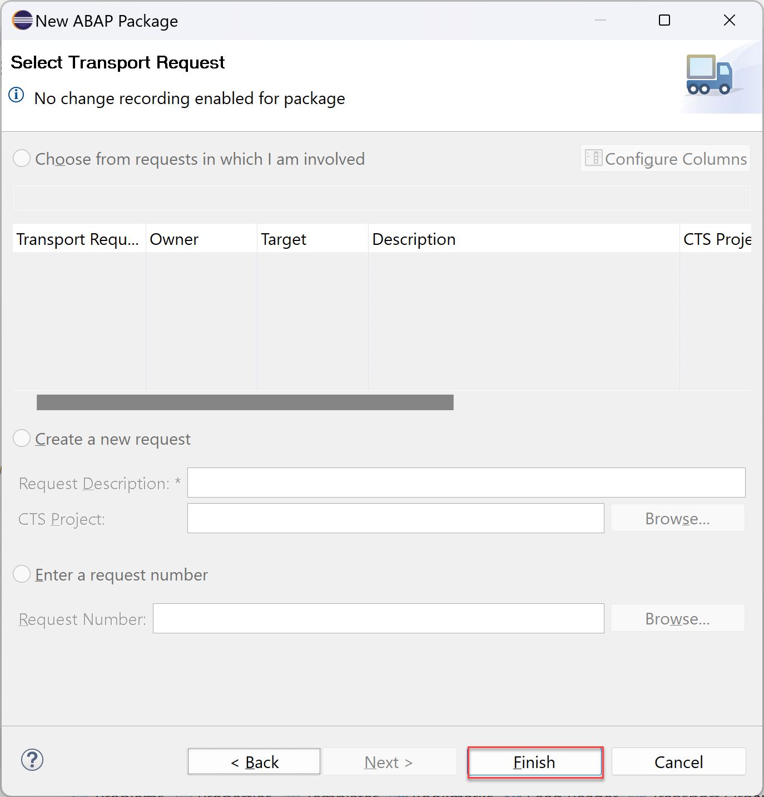 

 
  5. Now continue with step 2 of [Create an Shopping Cart Business Object](abap-s4hanacloud-procurement-purchasereq-shop). Move on with [Enhance the Behavior Definition and Behavior Implementation of the Shopping Cart Business Object](abap-s4hanacloud-purchasereq-enhance-shop) and [Integrate released purchase requisition API into Shopping Cart Business Object](abap-s4hanacloud-purchasereq-integrate-api). Afterwards, come back and continue with step 2 of this tutorial.
 

### Create list report object page

This step is for creating a list report object page. Open Visual Studio Code and open your visual studio projects folder

  1. Open **Visual Studio Code** and open your **Visual Studio Code projects folder**. Select the **projects** folder. Your created projects will later appear in this folder.

     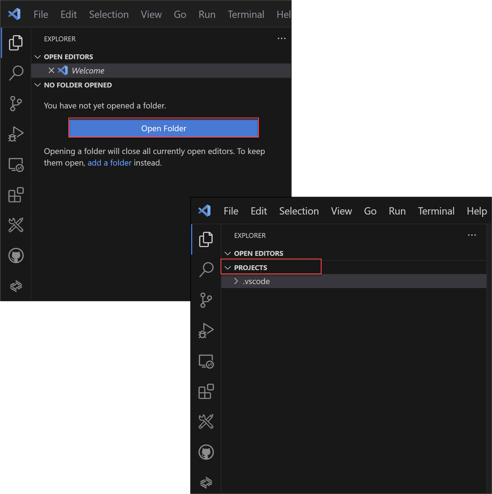

    >**Hint:** You can find your folder under: `C:\Users\<userid>\projects`.

  2. Select the menu on the top and click **View > Command Palette**.

      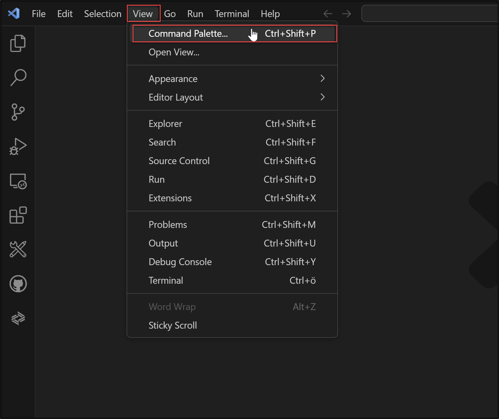

  3. Search for **Fiori: Open Application Generator** and select it.

      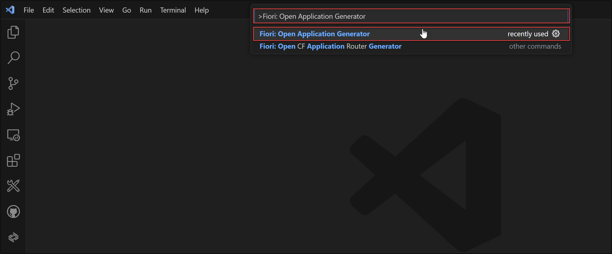
 
  4. Select **Template Type: SAP Fiori**, as template **List Report Page** and click **Next >**.

      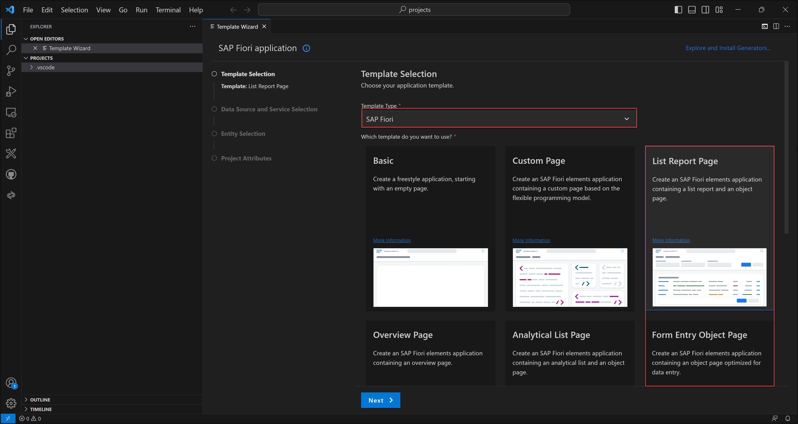

  5. Configure data source, system and service:
     - Data source: **Connect to a System**
     - System: New System
     - System type: **ABAP On Premise**
     - System URL: `https://mysystem.fqdn.com:44301`
     - SAP client: 100
     - Service username: `<your_username>`
     - Service password: `<your_password>`
       
       Click the login symbol on the right side to log in.

     - System name: `<your_system_ur>`
     - Service: **`ZUI_SHOPCART_O4_### > ZUI_SHOPCART_###(0001) - OData V4`**

     

     Click **Next >**.

    >**Hint:** In case of invalid security certificate errors, follow this [link](https://help.sap.com/docs/SAP_FIORI_tools/17d50220bcd848aa854c9c182d65b699/4b318bede7eb4021a8be385c46c74045.html).

  6. Select your main entity **`ShoppingCart`** and click **Next >**.

      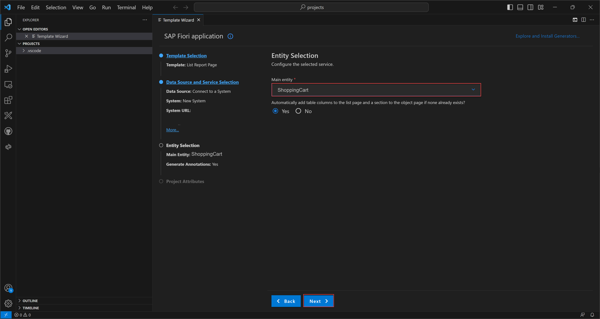

  7. Configure project attributes:  
     - Name: **`z_purchase_req_tier3_###`**
     - Title: **Shopping Cart ###**
     - Description: **A Fiori application.**
     - Project folder path: `c:\Users\<userid>\projects`
     - Add deployment configuration: Yes
     - Add FLP configuration: No
     - Configure advanced options: No

     Click **Next >**.

      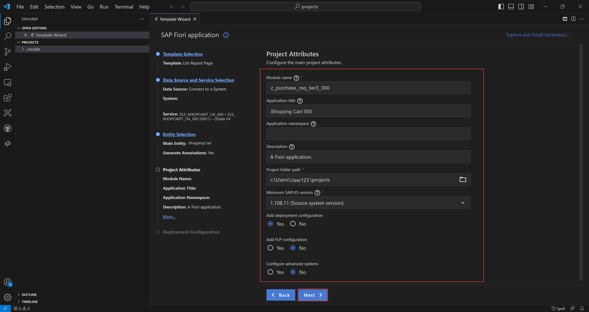

     An FLP configuration does not have to be created in Visual Studio Code, as this will be created in a later step using [tools for setting up the Launchpad content](https://help.sap.com/docs/FLP/6583b46f6c164aad818a3891bc91d8d8/08683e5409b74ced8705b2856c96c63b.html?state=DRAFT).

     The project folder path has a further substructure.

    >**Hint:** Your **module name must** be written in **lowercase letters**.

  8. Configure deployment:
       - Target: ABAP
       - Target system: `<your_abap_system_url>`
       - Enter client: 100
       - SAPUI5 ABAP Repository: `zshopcart_tier3_###`
       - Package: `$z_purchase_req_tier3_###`
       - How do you want to enter Transport Request? Manually
       - Transport Request: is not needed
  
      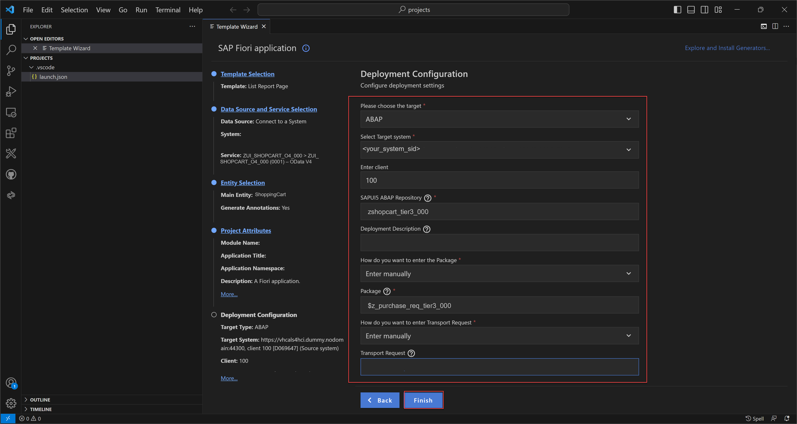

     Click **Finish**.

### Run SAP Fiori application for data preview

In this step, we'll run the SAP Fiori application, to check 

  1. In the **Application Information** overview, select **Preview Application** to start the preview.

      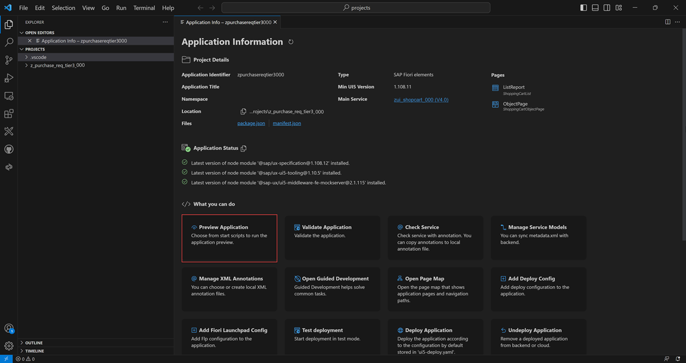

  2. Log in with your credentials. Then select the first entry in the search bar.
  
      

  3. Your browser opens. Click **Go** and check your application. 

      

### Deploy your application 

This step describes the deployment of the created application.

  1. In the **Application Information** overview, select **Deploy Application** to start the deployment.

         

  2. When prompted, check deployment configuration and press y. Open the URL at the end of the deployment log in browser to preview the application.

      

      When the deployment is successful, you will get these two information back as a result: **deployment successful**.

    >**Hint:** If an error message appears, use the [Environment Check](https://help.sap.com/docs/SAP_FIORI_tools/17d50220bcd848aa854c9c182d65b699/75390cf5d81e43aea5db231ef4225268.html).

### Run your application standalone

  1. Open the URL to open the deployed application.

      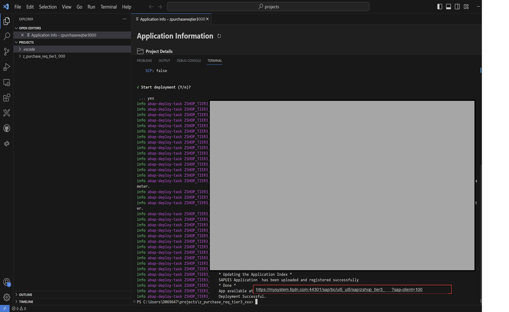 

  2. Click **Go** and check your application.

      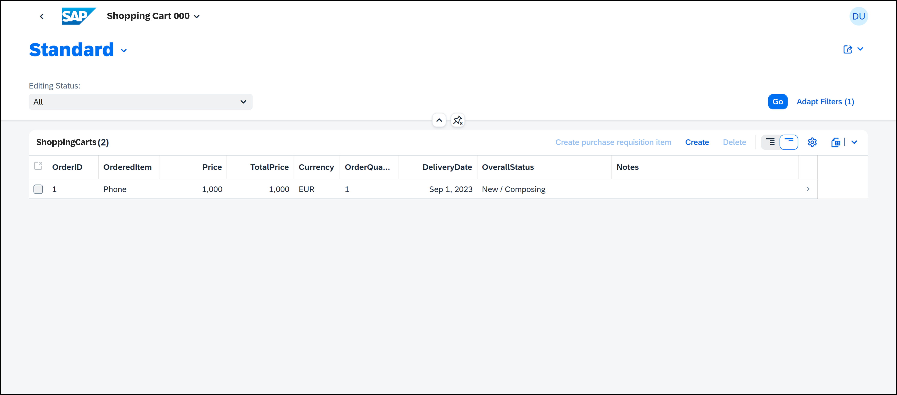 

### Check BSP library in Eclipse

  1. Open Eclipse and check the **BSP library** in your package **`$z_purchase_req_tier3_###`**. You can find your package under **Local Objects (`$TMP`)** > **User123**. If you are not able to see BSP applications and SAP Fiori Launchpad app description items, refresh your package by pressing `F5`.

      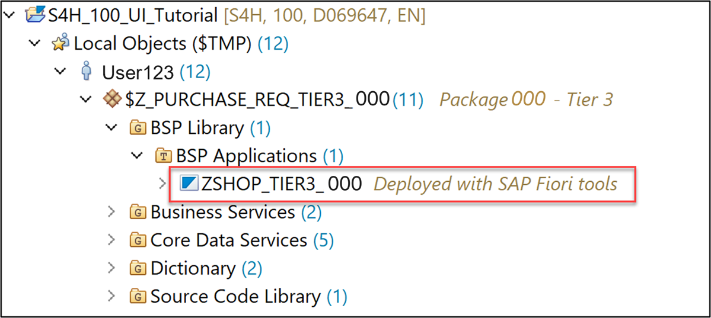

### Test yourself
