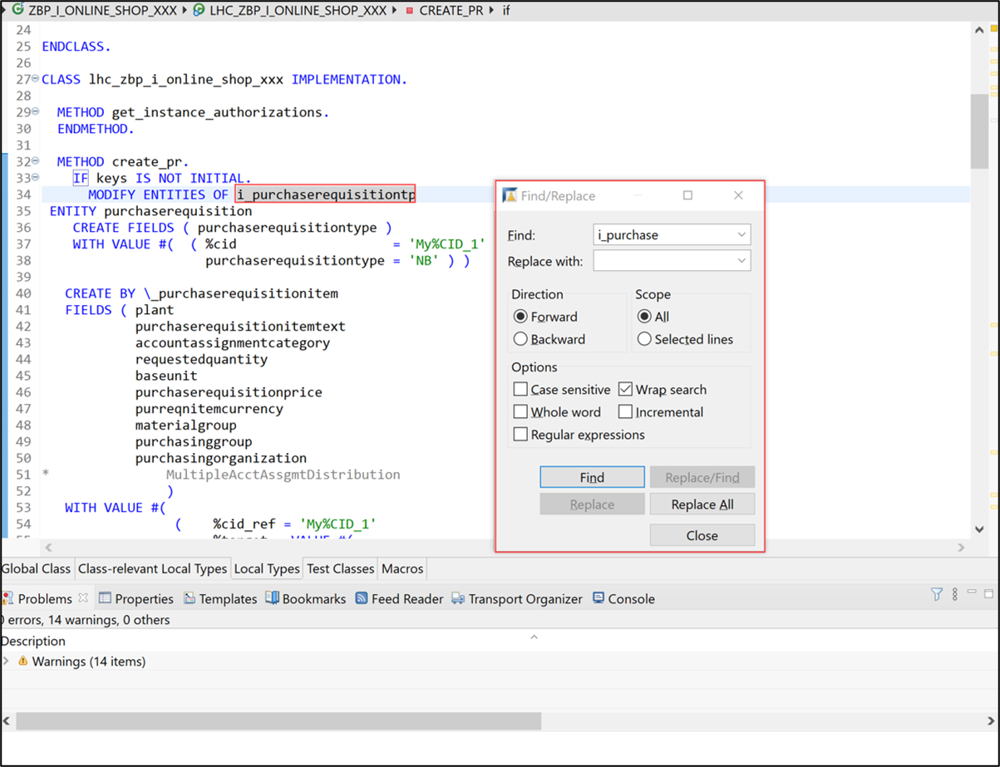
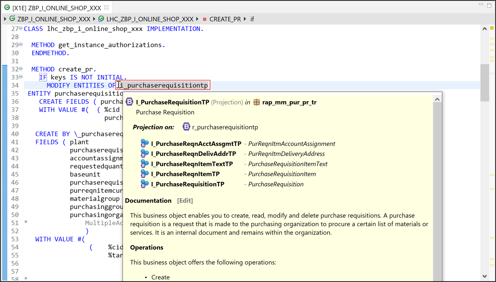
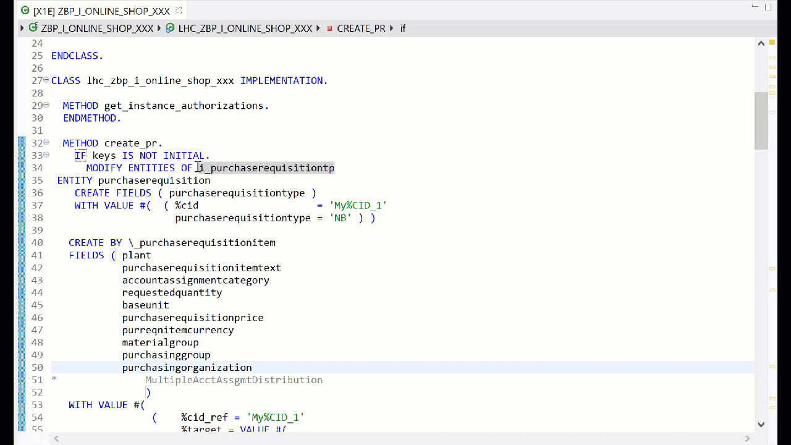
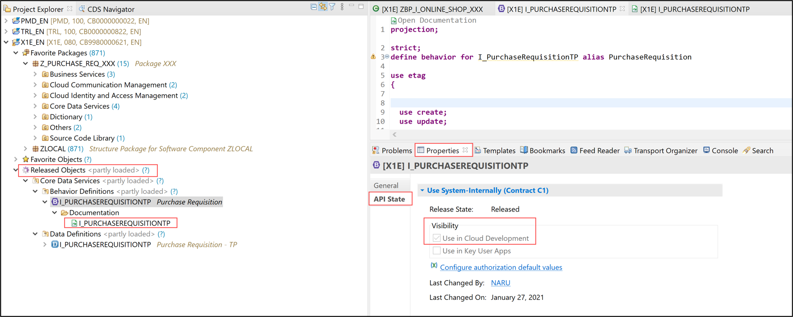
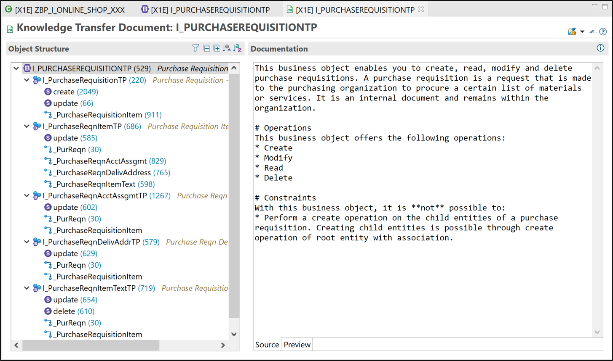
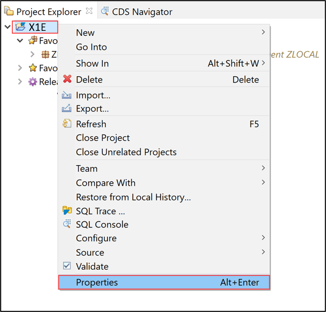
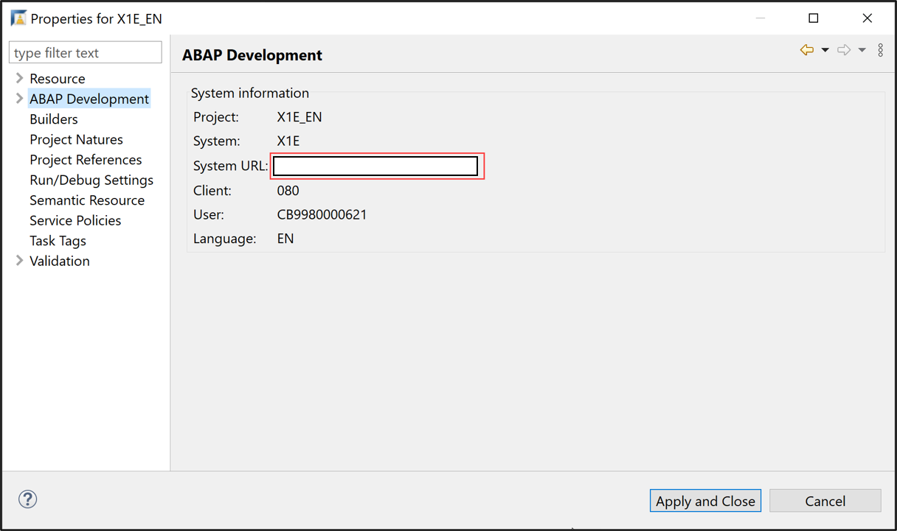

### Enhance behavior definition of data model 

**Hint:** In case of S/4HANA 2022 `FPS01`, strict(1) mode must be used.

  1. Add the following action statement for `createPurchaseRequisitionItem ` to your behavior definition **`ZR_ONLINESHOPTP_XXX`**.

    ```ABAP
    action(features:instance) createPurchaseRequisitionItem  result [1] $self;
    ```
   
     

     **Hint:** Please replace **`#`**, **`X`** and **`XXX`** with your ID. 

  2. Check your behavior definition:

    ```ABAP
    managed implementation in class ZBP_ONLINESHOPTP_XXX unique;
    strict ( 2 );
    with draft;

    define behavior for ZR_ONLINESHOPTP_XXX alias OnlineShop
    persistent table zaonlineshop_xxx
    draft table ZDONLINESHOP_XXX
    etag master LocalLastChangedAt
    lock master total etag LastChangedAt
    authorization master( global )
    {
      field ( readonly )
      OrderUUID,
      CreatedAt,
      CreatedBy,
      LastChangedAt,
      LastChangedBy,
      LocalLastChangedAt,
      PurchaseRequisition,
      PrCreationDate,
      DeliveryDate;

      field ( numbering : managed )
      OrderUUID;


      create;
      update(features: instance) ;
      delete;

      draft action(features: instance) Edit;
      draft action Activate;
      draft action Discard;
      draft action Resume;
      draft determine action Prepare { validation checkOrderedQuantity;  validation checkDeliveryDate;}
        determination setInitialOrderValues on modify { create; }
        determination calculateTotalPrice on modify { create; field Price; } 
      validation checkOrderedQuantity on save { create; field OrderQuantity; }
      validation checkDeliveryDate on save { create; field DeliveryDate; }

    action(features:instance) createPurchaseRequisitionItem  result [1] $self;
      mapping for ZAONLINESHOP_XXX 
      {
        OrderUUID = order_uuid;
        OrderID = order_id;
        OrderedItem = ordered_item;
        Price = price;
        TotalPrice = total_price;
        Currency = currency;
        OrderQuantity = order_quantity;
        DeliveryDate = delivery_date;
        OverallStatus = overall_status;
        Notes = notes;
        CreatedBy = created_by;
        CreatedAt = created_at;
        LastChangedBy = last_changed_by;
        LastChangedAt = last_changed_at;
        LocalLastChangedAt = local_last_changed_at;
        PurchaseRequisition = purchase_requisition;
        PrCreationDate = pr_creation_date;
      }
    }
    ```

   3. Save and activate. 

### Enhance behavior definition of projection view


  1. Open your behavior definition **`ZC_ONLINESHOPTP_XXX`** to enhance it. Add action `createPurchaseRequisitionItem` to your behavior definition.

    ```ABAP
    use action createPurchaseRequisitionItem;
    ```
    
    

  2. Check your behavior definition:

    ```ABAP
    projection;
    strict ( 2 );
    use draft;

    define behavior for ZC_ONLINESHOPTP_XXX alias OnlineShop
    use etag
    {
      use create;
      use update;
      use delete;

      use action Edit;
      use action Activate;
      use action Discard;
      use action Resume;
      use action Prepare;
      use action createPurchaseRequisitionItem;
    }
    ```

   3. Save and activate.


### Enhance metadata extension

  1. Open your metadata extension **`ZC_ONLINESHOPTP_XXX`** to enhance it. Add following annotation to `PurchaseRequisition`.

    ```ABAP
    ,

    { type: #FOR_ACTION, dataAction: 'createPurchaseRequisitionItem', label: 'Create purchase requisition item' } ] 
    @UI.identification: [ {
      position: 100 , 
      label: 'PurchaseRequisition'
    }]
    PurchaseRequisition;
    ```

    

  2. Check your metadata extension:

    ```ABAP
    @Metadata.layer: #CUSTOMER
    @UI: {
      headerInfo: {
        typeName: 'OnlineShop', 
        typeNamePlural: 'OnlineShops'
      }
    }

    annotate view ZC_ONLINESHOPTP_XXX with
    {
      @UI.facet: [ {
        id: 'idIdentification', 
        type: #IDENTIFICATION_REFERENCE, 
        label: 'OnlineShop', 
        position: 10 
      } ]
      @UI.hidden: true
      OrderUUID;
      
      @UI.lineItem: [ {
        position: 10 , 
        importance: #MEDIUM, 
        label: 'OrderID'
      } ]
      @UI.identification: [ {
        position: 10 , 
        label: 'OrderID'
      } ]
      OrderID;
      
      @UI.lineItem: [ {
        position: 20 , 
        importance: #MEDIUM, 
        label: 'OrderedItem'
      } ]
      @UI.identification: [ {
        position: 20 , 
        label: 'OrderedItem'
      } ]
      OrderedItem;
      
      @UI.lineItem: [ {
        position: 30 , 
        importance: #MEDIUM, 
        label: 'Price'
      } ]
      @UI.identification: [ {
        position: 30 , 
        label: 'Price'
      } ]
      Price;
      
      @UI.lineItem: [ {
        position: 40 , 
        importance: #MEDIUM, 
        label: 'TotalPrice'
      } ]
      @UI.identification: [ {
        position: 40 , 
        label: 'TotalPrice'
      } ]
      TotalPrice;
      
      @UI.lineItem: [ {
        position: 50 , 
        importance: #MEDIUM, 
        label: 'Currency'
      } ]
      @UI.identification: [ {
        position: 50 , 
        label: 'Currency'
      } ]
      Currency;
      
      @UI.lineItem: [ {
        position: 60 , 
        importance: #MEDIUM, 
        label: 'OrderQuantity'
      } ]
      @UI.identification: [ {
        position: 60 , 
        label: 'OrderQuantity'
      } ]
      OrderQuantity;
      
      @UI.lineItem: [ {
        position: 70 , 
        importance: #MEDIUM, 
        label: 'DeliveryDate'
      } ]
      @UI.identification: [ {
        position: 70 , 
        label: 'DeliveryDate'
      } ]
      DeliveryDate;
      
      @UI.lineItem: [ {
        position: 80 , 
        importance: #MEDIUM, 
        label: 'OverallStatus'
      } ]
      @UI.identification: [ {
        position: 80 , 
        label: 'OverallStatus'
      } ]
      OverallStatus;
      
      @UI.lineItem: [ {
        position: 90 , 
        importance: #MEDIUM, 
        label: 'Notes'
      } ]
      @UI.identification: [ {
        position: 90 , 
        label: 'Notes'
      } ]
      Notes;
      
      @UI.hidden: true
      LocalLastChangedAt;
      
      @UI.lineItem: [ {
        position: 100 , 
        importance: #MEDIUM, 
        label: 'PurchaseRequisition'
      },

      { type: #FOR_ACTION, dataAction: 'createPurchaseRequisitionItem', label: 'Create purchase requisition item' } ] 
      @UI.identification: [ {
        position: 100 , 
        label: 'PurchaseRequisition'
      }]
      PurchaseRequisition;
      
      @UI.lineItem: [ {
        position: 110 , 
        importance: #MEDIUM, 
        label: 'PrCreationDate'
      } ]
      @UI.identification: [ {
        position: 110 , 
        label: 'PrCreationDate'
      } ]
      PrCreationDate;
    }
    ```

   3. Save and activate.


### Open documentation


You have 2 options to open the documentation inside ADT.

 
> **Option 1**:

>  1. Open your ABAP class **`zbp_i_online_shop_xxx`**, search for `i_purchaserequisitiontp`, press CTRL and click on it.
      
>  2. Now you are in the released object `i_purchaserequisitiontp`.
     Click **Open Documentation** to open it.
      
>  3. Now you are able to read the documentation.
      

>   **HINT:** You can also open the Element Info by clicking `i_purchaserequisitiontp` and pressing **`F2`**.
>       

>    You can also switch to different layers inside the Element Info.
>       

> **Option 2**:
 
> 1. Go back to tab `i_purchaserequisitiontp`. You are now able to see the behavior definition folder of the released object `i_purchaserequisitiontp`  in the project explorer. Now navigate to the documentation `i_purchaserequisitiontp` and open it.
      
>**HINT**: You can also check the API State of released object and see its visibility by selecting the properties.
> 2. Now you can see the documentation.
      

 
### Implement unmanaged save and save_modified

In our scenario, we want to integrate the released purchase requisition API during the save sequence.

  1. Open the behavior definition `ZR_ONLINESHOPTP_XXX`, delete the following line:
  
    ```ABAP
    persistent table zaonlineshop_xxx 
    ```
  
  2. In your behavior definition **`ZR_ONLINESHOPTP_XXX`** add the `with unmanaged save` statement.

    ```ABAP
    with unmanaged save
    ```
    

  3. Check your behavior definition:

    ```ABAP
    managed implementation in class ZBP_ONLINESHOPTP_XXX unique;
    strict ( 2 );
    with draft;

    define behavior for ZR_ONLINESHOPTP_XXX alias OnlineShop
    draft table ZDONLINESHOP_XXX
    etag master LocalLastChangedAt
    lock master total etag LastChangedAt
    authorization master( global )
    with unmanaged save
    {
      field ( readonly )
      OrderUUID,
      CreatedAt,
      CreatedBy,
      LastChangedAt,
      LastChangedBy,
      LocalLastChangedAt,
      PurchaseRequisition,
      PrCreationDate,
      DeliveryDate;

      field ( numbering : managed )
      OrderUUID;

      create;
      update(features: instance) ;
      delete;

      draft action(features: instance) Edit;
      draft action Activate;
      draft action Discard;
      draft action Resume;
      draft determine action Prepare { validation checkOrderedQuantity;  validation checkDeliveryDate;}
        determination setInitialOrderValues on modify { create; }
        determination calculateTotalPrice on modify { create; field Price; } 
      validation checkOrderedQuantity on save { create; field OrderQuantity; }
      validation checkDeliveryDate on save { create; field DeliveryDate; }

    action(features:instance) createPurchaseRequisitionItem  result [1] $self;
      mapping for ZAONLINESHOP_XXX 
      {
        OrderUUID = order_uuid;
        OrderID = order_id;
        OrderedItem = ordered_item;
        Price = price;
        TotalPrice = total_price;
        Currency = currency;
        OrderQuantity = order_quantity;
        DeliveryDate = delivery_date;
        OverallStatus = overall_status;
        Notes = notes;
        CreatedBy = created_by;
        CreatedAt = created_at;
        LastChangedBy = last_changed_by;
        LastChangedAt = last_changed_at;
        LocalLastChangedAt = local_last_changed_at;
        PurchaseRequisition = purchase_requisition;
        PrCreationDate = pr_creation_date;
      }
    }
    ```

  4. Save and activate.

  5. Open the behavior implementation `ZBP_ONLINESHOPTP_XXX` and add the missing method `save_modified` with create, update and delete to your behavior implementation. In your Local Types, add the `save_modified` to your `lsc_zr_onlineshoptp_xxx` class:

    ```ABAP
    METHODS save_modified REDEFINITION. 
    ```

    

    Position the cursor on the `save_modified` method and use the shortcut `ctrl + 1` to load the quick assist proposals, then double-click on `Add implementation for save_modified` to automatically create an empty implementation for the method. Implement it in your `lsc_zr_onlineshoptp_xxx` as follows:

    ```ABAP
      METHOD save_modified.

        DATA : lt_online_shop_as        TYPE STANDARD TABLE OF zaonlineshop_xxx,
              ls_online_shop_as        TYPE                   zaonlineshop_xxx.
        IF create-onlineshop IS NOT INITIAL.
          lt_online_shop_as = CORRESPONDING #( create-onlineshop MAPPING FROM ENTITY ).
          INSERT zaonlineshop_xxx FROM TABLE @lt_online_shop_as.
        ENDIF.
        IF update IS NOT INITIAL.
          CLEAR lt_online_shop_as.
          lt_online_shop_as = CORRESPONDING #( update-onlineshop MAPPING FROM ENTITY ).
          LOOP AT update-onlineshop  INTO DATA(onlineshop) WHERE OrderUUID IS NOT INITIAL.
    *           select * from zaonlineshop_xxx where order_uuid = @onlineshop-OrderUUID into @data(ls_onlineshop) .
    *                      lt_online_shop_as = CORRESPONDING #( create-onlineshop MAPPING FROM ENTITY ).

            MODIFY zaonlineshop_xxx FROM TABLE @lt_online_shop_as.
    *           ENDSELECT.
          ENDLOOP.
        ENDIF.

        LOOP AT delete-onlineshop INTO DATA(onlineshop_delete) WHERE OrderUUID IS NOT INITIAL.
          DELETE FROM zaonlineshop_xxx WHERE order_uuid = @onlineshop_delete-OrderUUID.
          DELETE FROM zdonlineshop_xxx WHERE orderuuid = @onlineshop_delete-OrderUUID.
        ENDLOOP.
      ENDMETHOD.

    ```

   6. Save and activate it.

>We use the unmanaged save option for our scenario, rather than the additional save option. This is because the additional save should only be used in case data needs to be saved in addition to BO data in a persistence outside the BO, as stated in the [Additional Save documentation](https://help.sap.com/docs/SAP_S4HANA_CLOUD/e5522a8a7b174979913c99268bc03f1a/ca7097c8ea404b11b1f1334fd54cdd15.html). Since this is not our use case (the purchase requisition is created and saved in the persistency of the online shop BO), we rely on the unmanaged save option.


### Enhance behavior implementation

**Hint:** Please replace **`X`**, **`#`** and **`XXX`** with your ID. 

**For S/4HANA on premise:** Material `D001` or similar needs to be created in system if S/4HANA on-premise is used. [More information](https://help.sap.com/docs/SAP_S4HANA_ON-PREMISE/f7fddfe4caca43dd967ac4c9ce6a70e4/23d6b8535c39b44ce10000000a174cb4.html?version=2022.000)


  1. In your **Global Class**, replace your code with following:

    ```ABAP
    class ZBP_ONLINESHOPTP_XXX DEFINITION PUBLIC ABSTRACT FINAL FOR BEHAVIOR OF zr_onlineshoptp_xxx.
    PUBLIC SECTION.
      CLASS-DATA mapped_purchase_requisition TYPE response for mapped i_purchaserequisitiontp.

    ENDCLASS.


    CLASS zbp_onlineshoptp_xxx IMPLEMENTATION.
    ENDCLASS.
    ```

  2. Add the missing constant to your implementation, the `createPruchaseRequisitionItem` action and enhance the `save_modified` method. In your **Local Types**, replace your code with following:

    ```ABAP
    CLASS lsc_zr_onlineshoptp_xxx DEFINITION INHERITING FROM cl_abap_behavior_saver.

      PROTECTED SECTION.

      METHODS save_modified REDEFINITION.
      METHODS cleanup_finalize REDEFINITION.

    ENDCLASS.

    CLASS lsc_zr_onlineshoptp_xxx IMPLEMENTATION.

      METHOD save_modified.

        DATA : lt_online_shop_as        TYPE STANDARD TABLE OF zaonlineshop_xxx,
              ls_online_shop_as        TYPE                   zaonlineshop_xxx.
        IF create-onlineshop IS NOT INITIAL.
          lt_online_shop_as = CORRESPONDING #( create-onlineshop MAPPING FROM ENTITY ).
          INSERT zaonlineshop_xxx FROM TABLE @lt_online_shop_as.
        ENDIF.
        IF update IS NOT INITIAL.
          CLEAR lt_online_shop_as.
          lt_online_shop_as = CORRESPONDING #( update-onlineshop MAPPING FROM ENTITY ).
          LOOP AT update-onlineshop  INTO DATA(onlineshop) WHERE OrderUUID IS NOT INITIAL.
    *           select * from zaonlineshop_xxx where order_uuid = @onlineshop-OrderUUID into @data(ls_onlineshop) .
    *                      lt_online_shop_as = CORRESPONDING #( create-onlineshop MAPPING FROM ENTITY ).

            MODIFY zaonlineshop_xxx FROM TABLE @lt_online_shop_as.
    *           ENDSELECT.
          ENDLOOP.
        ENDIF.

        LOOP AT delete-onlineshop INTO DATA(onlineshop_delete) WHERE OrderUUID IS NOT INITIAL.
          DELETE FROM zaonlineshop_xxx WHERE order_uuid = @onlineshop_delete-OrderUUID.
          DELETE FROM zdonlineshop_xxx WHERE orderuuid = @onlineshop_delete-OrderUUID.
        ENDLOOP.
      ENDMETHOD.

      METHOD cleanup_finalize.
      ENDMETHOD.

    ENDCLASS.

    CLASS lhc_onlineshop DEFINITION INHERITING FROM cl_abap_behavior_handler.
      PRIVATE SECTION.
        CONSTANTS:
          BEGIN OF is_draft,
            false TYPE abp_behv_flag VALUE '00', " active (not draft)
            true  TYPE abp_behv_flag VALUE '01', " draft
          END OF is_draft.
        CONSTANTS:
          BEGIN OF c_overall_status,
            new       TYPE string VALUE 'New / Composing',
    *        composing  TYPE string VALUE 'Composing...',
            submitted TYPE string VALUE 'Submitted / Approved',
            cancelled TYPE string VALUE 'Cancelled',
          END OF c_overall_status.
        METHODS:
          get_global_authorizations FOR GLOBAL AUTHORIZATION
            IMPORTING
            REQUEST requested_authorizations FOR OnlineShop
            RESULT result,
          get_instance_features FOR INSTANCE FEATURES
            IMPORTING keys REQUEST requested_features FOR OnlineShop RESULT result.

        METHODS calculateTotalPrice FOR DETERMINE ON MODIFY
          IMPORTING keys FOR OnlineShop~calculateTotalPrice.

        METHODS setInitialOrderValues FOR DETERMINE ON MODIFY
          IMPORTING keys FOR OnlineShop~setInitialOrderValues.

        METHODS checkDeliveryDate FOR VALIDATE ON SAVE
          IMPORTING keys FOR OnlineShop~checkDeliveryDate.

        METHODS checkOrderedQuantity FOR VALIDATE ON SAVE
          IMPORTING keys FOR OnlineShop~checkOrderedQuantity.
        METHODS createPurchaseRequisitionItem FOR MODIFY
          IMPORTING keys FOR ACTION OnlineShop~createPurchaseRequisitionItem RESULT result.
    ENDCLASS.

    CLASS lhc_onlineshop IMPLEMENTATION.
      METHOD get_global_authorizations.
      ENDMETHOD.
      METHOD get_instance_features.

        " read relevant olineShop instance data
        READ ENTITIES OF zr_onlineshoptp_xxx IN LOCAL MODE
          ENTITY OnlineShop
            FIELDS ( OverallStatus )
            WITH CORRESPONDING #( keys )
          RESULT DATA(OnlineOrders)
          FAILED failed.

        "ToDo: dynamic feature control is currently not working for the action cancel order

        " evaluate condition, set operation state, and set result parameter
        " update and checkout shall not be allowed as soon as purchase requisition has been created
        result = VALUE #( FOR OnlineOrder IN OnlineOrders
                          ( %tky                   = OnlineOrder-%tky
                            %features-%update
                              = COND #( WHEN OnlineOrder-OverallStatus = c_overall_status-submitted  THEN if_abap_behv=>fc-o-disabled
                                        WHEN OnlineOrder-OverallStatus = c_overall_status-cancelled THEN if_abap_behv=>fc-o-disabled
                                        ELSE if_abap_behv=>fc-o-enabled   )
    *                         %features-%delete
    *                           = COND #( WHEN OnlineOrder-PurchaseRequisition IS NOT INITIAL THEN if_abap_behv=>fc-o-disabled
    *                                     WHEN OnlineOrder-OverallStatus = c_overall_status-cancelled THEN if_abap_behv=>fc-o-disabled
    *                                     ELSE if_abap_behv=>fc-o-enabled   )
                            %action-Edit
                              = COND #( WHEN OnlineOrder-OverallStatus = c_overall_status-submitted THEN if_abap_behv=>fc-o-disabled
                                        WHEN OnlineOrder-OverallStatus = c_overall_status-cancelled THEN if_abap_behv=>fc-o-disabled
                                        ELSE if_abap_behv=>fc-o-enabled   )

                            ) ).
      ENDMETHOD.

      METHOD calculateTotalPrice.
        DATA total_price TYPE zr_onlineshoptp_xxx-TotalPrice.

        " read transfered instances
        READ ENTITIES OF zr_onlineshoptp_xxx IN LOCAL MODE
          ENTITY OnlineShop
            FIELDS ( OrderID TotalPrice )
            WITH CORRESPONDING #( keys )
          RESULT DATA(OnlineOrders).

        LOOP AT OnlineOrders ASSIGNING FIELD-SYMBOL(<OnlineOrder>).
          " calculate total value
          <OnlineOrder>-TotalPrice = <OnlineOrder>-Price * <OnlineOrder>-OrderQuantity.
        ENDLOOP.

        "update instances
        MODIFY ENTITIES OF zr_onlineshoptp_xxx IN LOCAL MODE
          ENTITY OnlineShop
            UPDATE FIELDS ( TotalPrice )
            WITH VALUE #( FOR OnlineOrder IN OnlineOrders (
                              %tky       = OnlineOrder-%tky
                              TotalPrice = <OnlineOrder>-TotalPrice
                            ) ).
      ENDMETHOD.

      METHOD setInitialOrderValues.

        DATA delivery_date TYPE I_PurchaseReqnItemTP-DeliveryDate.
        DATA(creation_date) = cl_abap_context_info=>get_system_date(  ).
        "set delivery date proposal
        delivery_date = cl_abap_context_info=>get_system_date(  ) + 14.
        "read transfered instances
        READ ENTITIES OF ZR_ONLINESHOPTP_xxx IN LOCAL MODE
          ENTITY OnlineShop
            FIELDS ( OrderID OverallStatus  DeliveryDate )
            WITH CORRESPONDING #( keys )
          RESULT DATA(OnlineOrders).

        "delete entries with assigned order ID
        DELETE OnlineOrders WHERE OrderID IS NOT INITIAL.
        CHECK OnlineOrders IS NOT INITIAL.

        " **Dummy logic to determine order IDs**
        " get max order ID from the relevant active and draft table entries
        SELECT MAX( order_id ) FROM zaonlineshop_xxx INTO @DATA(max_order_id). "active table
        SELECT SINGLE FROM zdonlineshop_xxx FIELDS MAX( orderid ) INTO @DATA(max_orderid_draft). "draft table
        IF max_orderid_draft > max_order_id.
          max_order_id = max_orderid_draft.
        ENDIF.

        "set initial values of new instances
        MODIFY ENTITIES OF ZR_ONLINESHOPTP_xxx IN LOCAL MODE
          ENTITY OnlineShop
            UPDATE FIELDS ( OrderID OverallStatus  DeliveryDate Price  )
            WITH VALUE #( FOR order IN OnlineOrders INDEX INTO i (
                              %tky          = order-%tky
                              OrderID       = max_order_id + i
                              OverallStatus = c_overall_status-new  "'New / Composing'
                              DeliveryDate  = delivery_date
                              CreatedAt     = creation_date
                            ) ).
        .
      ENDMETHOD.

      METHOD checkDeliveryDate.

    *   " read transfered instances
        READ ENTITIES OF zr_onlineshoptp_xxx IN LOCAL MODE
          ENTITY OnlineShop
            FIELDS ( DeliveryDate )
            WITH CORRESPONDING #( keys )
          RESULT DATA(OnlineOrders).

        DATA(creation_date) = cl_abap_context_info=>get_system_date(  ).
        "raise msg if 0 > qty <= 10
        LOOP AT OnlineOrders INTO DATA(online_order).


          IF online_order-DeliveryDate IS INITIAL OR online_order-DeliveryDate = ' '.
            APPEND VALUE #( %tky = online_order-%tky ) TO failed-onlineshop.
            APPEND VALUE #( %tky         = online_order-%tky
                            %state_area   = 'VALIDATE_DELIVERYDATE'
                            %msg          = new_message_with_text(
                                    severity = if_abap_behv_message=>severity-error
                                    text     = 'Delivery Date cannot be initial' )
                          ) TO reported-onlineshop.

          ELSEIF  ( ( online_order-DeliveryDate ) - creation_date ) < 14.
            APPEND VALUE #(  %tky = online_order-%tky ) TO failed-onlineshop.
            APPEND VALUE #(  %tky          = online_order-%tky
                            %state_area   = 'VALIDATE_DELIVERYDATE'
                            %msg          = new_message_with_text(
                                    severity = if_abap_behv_message=>severity-error
                                    text     = 'Delivery Date should be atleast 14 days after the creation date'  )

                            %element-orderquantity  = if_abap_behv=>mk-on
                          ) TO reported-onlineshop.
          ENDIF.
        ENDLOOP.
      ENDMETHOD.

      METHOD checkOrderedQuantity.

        "read relevant order instance data
        READ ENTITIES OF zr_onlineshoptp_xxx IN LOCAL MODE
        ENTITY OnlineShop
        FIELDS ( OrderID OrderedItem OrderQuantity )
        WITH CORRESPONDING #( keys )
        RESULT DATA(OnlineOrders).

        "raise msg if 0 > qty <= 10
        LOOP AT OnlineOrders INTO DATA(OnlineOrder).
          APPEND VALUE #(  %tky           = OnlineOrder-%tky
                          %state_area    = 'VALIDATE_QUANTITY'
                        ) TO reported-onlineshop.

          IF OnlineOrder-OrderQuantity IS INITIAL OR OnlineOrder-OrderQuantity = ' '.
            APPEND VALUE #( %tky = OnlineOrder-%tky ) TO failed-onlineshop.
            APPEND VALUE #( %tky          = OnlineOrder-%tky
                            %state_area   = 'VALIDATE_QUANTITY'
                            %msg          = new_message_with_text(
                                    severity = if_abap_behv_message=>severity-error
                                    text     = 'Quantity cannot be empty' )
                            %element-orderquantity = if_abap_behv=>mk-on
                          ) TO reported-onlineshop.

          ELSEIF OnlineOrder-OrderQuantity > 10.
            APPEND VALUE #(  %tky = OnlineOrder-%tky ) TO failed-onlineshop.
            APPEND VALUE #(  %tky          = OnlineOrder-%tky
                            %state_area   = 'VALIDATE_QUANTITY'
                            %msg          = new_message_with_text(
                                    severity = if_abap_behv_message=>severity-error
                                    text     = 'Quantity should be below 10' )

                            %element-orderquantity  = if_abap_behv=>mk-on
                          ) TO reported-onlineshop.
          ENDIF.
        ENDLOOP.
      ENDMETHOD.
      METHOD createPurchaseRequisitionItem.
        DATA: purchase_requisitions      TYPE TABLE FOR CREATE I_PurchaserequisitionTP,
              purchase_requisition       TYPE STRUCTURE FOR CREATE I_PurchaserequisitionTP,
              purchase_requisition_items TYPE TABLE FOR CREATE i_purchaserequisitionTP\_PurchaseRequisitionItem,
              purchase_requisition_item  TYPE STRUCTURE FOR CREATE i_purchaserequisitiontp\\purchaserequisition\_purchaserequisitionitem,
              purchase_reqn_acct_assgmts TYPE TABLE FOR CREATE I_PurchaseReqnItemTP\_PurchaseReqnAcctAssgmt,
              purchase_reqn_acct_assgmt  TYPE STRUCTURE FOR CREATE I_PurchaseReqnItemTP\_PurchaseReqnAcctAssgmt,
              purchase_reqn_item_texts   TYPE TABLE FOR CREATE I_PurchaseReqnItemTP\_PurchaseReqnItemText,
              purchase_reqn_item_text    TYPE STRUCTURE FOR CREATE I_PurchaseReqnItemTP\_PurchaseReqnItemText,
              update_lines               TYPE TABLE FOR UPDATE zr_onlineshoptp_xxx\\OnlineShop,
              update_line                TYPE STRUCTURE FOR UPDATE zr_onlineshoptp_xxx\\OnlineShop,
              delivery_date              TYPE I_PurchaseReqnItemTP-DeliveryDate,
              requested_quantity         TYPE I_PurchaseReqnItemTP-RequestedQuantity.

    *    delivery_date = cl_abap_context_info=>get_system_date(  ) + 14.

        "read transfered order instances
        READ ENTITIES OF zr_onlineshoptp_xxx IN LOCAL MODE
          ENTITY OnlineShop
            ALL FIELDS WITH
            CORRESPONDING #( keys )
          RESULT DATA(OnlineOrders).

        DATA n TYPE i.

        LOOP AT OnlineOrders INTO DATA(OnlineOrder).
          n += 1.
          "purchase requisition
          purchase_requisition = VALUE #(  %cid                   = |My%CID_{ n }|
                                            purchaserequisitiontype  = 'NB'  ) .
          APPEND purchase_requisition TO purchase_requisitions.

          "purchase requisition item
          purchase_requisition_item = VALUE #(
                                            %cid_ref = |My%CID_{ n }|
                                            %target  = VALUE #(  (
                                                          %cid                         = |My%ItemCID_{ n }|
                                                          plant                        = '1010'  "Plant 01 (DE)
                                                          accountassignmentcategory    = 'U'  "unknown
    *                                                       PurchaseRequisitionItemText  =  . "retrieved automatically from maintained MaterialInfo
                                                          requestedquantity            = OnlineOrder-OrderQuantity
                                                          purchaserequisitionprice     = OnlineOrder-Price
                                                          purreqnitemcurrency          = OnlineOrder-Currency
                                                          Material                     = 'D001'
                                                          materialgroup                = 'A001'
                                                          purchasinggroup              = '001'
                                                          purchasingorganization       = '1010'
                                                          DeliveryDate                 = OnlineOrder-DeliveryDate   "delivery_date  "yyyy-mm-dd (at least 10 days)
                                                          CreatedByUser                = OnlineOrder-CreatedBy
                                                          ) ) ).
          APPEND purchase_requisition_item TO purchase_requisition_items.

          "purchase requisition account assignment
          purchase_reqn_acct_assgmt = VALUE #(
                                              %cid_ref = |My%ItemCID_{ n }|
                                              %target  = VALUE #( (
                                                            %cid       = |My%AccntCID_{ n }|
                                                            CostCenter = 'JMW-COST'
                                                            GLAccount  = '0000400000' ) ) ) .
          APPEND purchase_reqn_acct_assgmt TO purchase_reqn_acct_assgmts .

          "purchase requisition item text
          purchase_reqn_item_text    =  VALUE #(
                                              %cid_ref = |My%ItemCID_{ n }|
                                              %target  = VALUE #( (
                                                            %cid           = |My%TextCID_{ n }|
                                                            textobjecttype = 'B01'
                                                            language       = 'E'
                                                            plainlongtext  = OnlineOrder-Notes
                                                        )  )  ) .
          APPEND purchase_reqn_item_text TO purchase_reqn_item_texts.
        ENDLOOP.

        "EML deep create statement
        IF keys IS NOT INITIAL.
          "purchase reqn
          MODIFY ENTITIES OF i_purchaserequisitiontp
            ENTITY purchaserequisition
              CREATE FIELDS ( purchaserequisitiontype )
              WITH purchase_requisitions
            "purchase reqn item
            CREATE BY \_purchaserequisitionitem
              FIELDS ( plant
    *                   purchaserequisitionitemtext
                      accountassignmentcategory
                      requestedquantity
                      baseunit
                      purchaserequisitionprice
                      purreqnitemcurrency
                      Material
                      materialgroup
                      purchasinggroup
                      purchasingorganization
                      DeliveryDate
                    )
            WITH purchase_requisition_items
          "purchase reqn account assignment
          ENTITY purchaserequisitionitem
            CREATE BY \_purchasereqnacctassgmt
                FIELDS ( CostCenter
                        GLAccount
                        Quantity
                        BaseUnit )
                WITH purchase_reqn_acct_assgmts
            "purchase reqn item text
            CREATE BY \_purchasereqnitemtext
                FIELDS ( plainlongtext )
                WITH purchase_reqn_item_texts
          REPORTED DATA(reported_create_pr)
          MAPPED DATA(mapped_create_pr)
          FAILED DATA(failed_create_pr).
        ENDIF.
        "retrieve the generated
        zbp_onlineshoptp_xxx=>mapped_purchase_requisition-purchaserequisition = mapped_create_pr-purchaserequisition.

        "set a flag to check in the save sequence that purchase requisition has been created
        "the correct value for PurchaseRequisition has to be calculated in the save sequence using convert key
        LOOP AT keys INTO DATA(key).
          update_line-%tky           = key-%tky.
          update_line-OverallStatus  = c_overall_status-submitted. "'Submitted / Approved'.
          APPEND update_line TO update_lines.
        ENDLOOP.

        MODIFY ENTITIES OF zr_onlineshoptp_xxx IN LOCAL MODE
          ENTITY OnlineShop
            UPDATE
            FIELDS (  OverallStatus  )
            WITH update_lines
          REPORTED reported
          FAILED failed
          MAPPED mapped.

        IF failed IS INITIAL.
          "Read the changed data for action result
          READ ENTITIES OF zr_onlineshoptp_xxx IN LOCAL MODE
            ENTITY OnlineShop
              ALL FIELDS WITH
              CORRESPONDING #( keys )
            RESULT DATA(result_read).
          "return result entities
          result = VALUE #( FOR order_2 IN result_read ( %tky   = order_2-%tky
                                                        %param = order_2 ) ).
        ENDIF.
    ENDMETHOD.

    ENDCLASS.
    ```

   3. Save and activate.

    >**HINT:** The option **internal** can be set before the action name to only provide an action for the same BO. An internal action can only be accessed from the business logic inside the business object implementation such as from a determination or from another action.

   4. Go back to your behavior definition `ZR_ONLINESHOPTP_XXX` and activate it again, if needed. 


### Run SAP Fiori Elements preview

 1. Open the SAP Fiori preview, select your order entry and click **Create purchase requisition item**.

     

 2. Now a purchase requisition item got created. Copy the purchase requisition item number for later use.

     


### Check purchase requisition


 1. In the Project Explorer, select your system and right click on **Properties**.

     

 1. Select **ABAP Development** and copy the system URL without `-api`, paste it in a browser and **log in**.

     

 2. Select the **Manage Purchase Requisitions** tile.

     

 3. Search for your purchase requisition id and select your purchase requisition. 

     

 4. Check the purchase requisition description. Your `CB-User ID` and your purchase requisition id should be listed here.

     


### Test yourself
